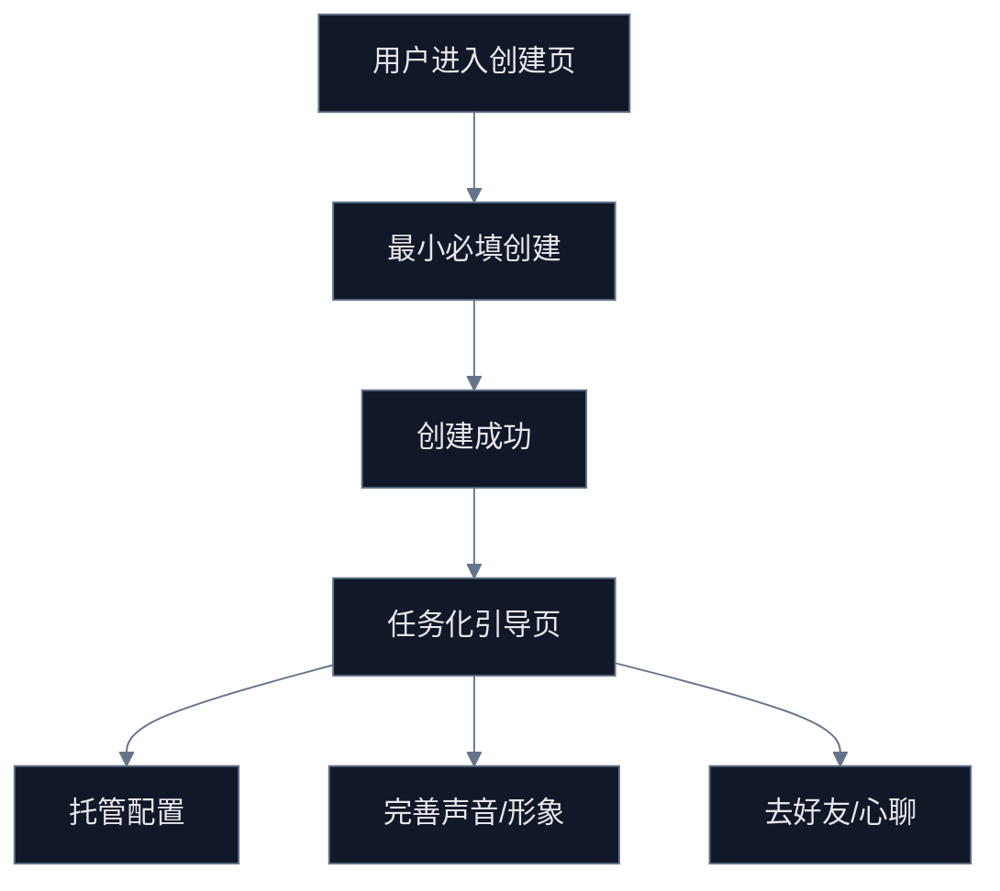

# G-1 创建流程优化任务包

## Premise

- 现状：创建分身链路已可用，但仍是“强上传照片 -> 多步骤填写 -> 一次性提交”的重流程，创建成功后只回到管理页，缺少任务化 onboarding。
- 目标：把“创建分身”从一次性表单改造成可分批落地的增长任务包，先降低首创成本，再提升创建完成率与创建后激活率。

## Constraints

- 禁止改变现有 `avatarId`、托管字段、订阅权益、页面注册事实源。
- 禁止把创建流程改成新的多主链，仍以 `avatar-create -> avatar-manage -> mind-chat/avatar-friends` 为主链。
- 质量红线：任务必须可直接分配给前后端开发与验证执行，不输出泛建议。

## Boundaries

- 允许覆盖页面：
  - `src/pages/avatar/avatar-create/index.tsx`
  - `src/pages/avatar/avatar-manage/index.tsx`
  - `src/pages/mind-chat/index.tsx`
- 允许覆盖后端域：
  - `server/src/modules/avatar/*`
  - `server/src/modules/subscription/*`
- 暂不处理：
  - 分身生成质量模型
  - 声音克隆算法能力
  - 新支付策略

## Endgame

- 创建流程拆成可执行任务批次。
- 每个任务有阻塞点、影响文件、依赖、验收标准。
- 创建成功后用户立即进入下一步可见价值，而不是只停在“已创建”。

## 当前阻塞点

1. 首步必须上传照片，用户还未感知价值就被迫进入重输入。
2. 声音配置与声音复刻混在创建链路里，失败会拖慢主流程。
3. 缺少草稿/继续创建机制，中断后只能重来。
4. 创建成功后仅跳回管理页，未自动进入“托管配置 / 好友 / 心聊”下一步。
5. 订阅限制只在管理页感知，创建前缺少明确额度提示与升级引导。

## 任务地图

## 可执行任务

### G1-T1 创建入口前置权益告知

- 目标：在进入创建动作前就告知“还可创建几个分身、是否受订阅限制”。
- 现状绑定：
  - `avatar-manage` 已有 `canCreateAvatar/maxAvatars/avatarCount`，但创建页没有延续说明。
- 开发动作：
  - 在 `avatar-manage` 的创建入口旁增加额度提示与升级 CTA。
  - 在 `avatar-create` 顶部透传并展示当前权益摘要。
- 验收：
  - 免费用户、付费用户、额度耗尽三种状态可区分展示。
  - 额度耗尽时给出明确升级入口，不允许静默失败。

### G1-T2 最小创建模式

- 目标：把创建主链收敛为“照片 + 名称”最小完成，其它配置后置。
- 现状绑定：
  - `avatar-create` 当前提交只强校验 `photo/name`，但 UI 仍要求用户走完整三步。
- 开发动作：
  - 将步骤标签重构为“基础创建 / 可选增强”双段式。
  - 在完成 `photo/name` 后允许立即创建。
  - 能力、标签、声音设置转为创建后补充。
- 验收：
  - 新用户 1 次创建不超过 2 个关键决策。
  - 可选配置缺失不阻塞分身创建。

### G1-T3 创建草稿与继续创建

- 目标：用户中断后可以继续，而不是从头填写。
- 开发动作：
  - 本地草稿保存：`photo/photoUrl/name/tags/voice/presetVoiceId/abilities/currentStep`。
  - 再次进入创建页时提示“继续上次创建”或“重新开始”。
- 验收：
  - 刷新、返回、异常退出后数据可恢复。
  - 提交成功后自动清空草稿。

### G1-T4 声音配置后置任务化

- 目标：把声音复刻从创建阻塞项降级为创建后任务项。
- 现状绑定：
  - 当前录音上传与声音复刻在创建流程中执行，失败会拖慢主链。
- 开发动作：
  - 创建成功后在任务卡中给出“去配置声音”。
  - 创建页仅保留“可跳过”能力，不把声音能力当主完成条件。
- 验收：
  - 未配置声音的分身可正常创建、展示、托管。
  - 声音配置失败不影响主链状态。

### G1-T5 创建成功后的任务化 onboarding

- 目标：创建成功后进入“下一步要做什么”的任务卡，而不是只回管理页。
- 开发动作：
  - 在 `avatar-manage` 为新创建分身展示任务卡：
    - 开启托管
    - 完善声音
    - 去交朋友
    - 去心聊体验
  - 对新创建分身打上 `isNew`/本地标记，用于首轮引导。
- 验收：
  - 创建成功后 1 跳内能进入下一步价值动作。
  - 管理页任务卡可关闭、可完成、可回看。

## 开发分配建议

### 前端批次

- 批次 1：`avatar-manage` 额度提示与创建 CTA
- 批次 2：`avatar-create` 最小创建模式 + 草稿恢复
- 批次 3：创建成功 onboarding 任务卡

### 后端批次

- 批次 1：复用现有订阅权益接口，不新增第二套额度口径
- 批次 2：若需要服务端草稿，再补独立草稿接口；否则本阶段先本地草稿

## 验收清单

- 从 `mind-chat` 和 `avatar-manage` 进入创建页，入口说明一致。
- 免费用户能快速完成首个分身创建。
- 额度耗尽时有清晰升级引导。
- 创建成功后不止“返回管理页”，而是进入任务化下一步。
