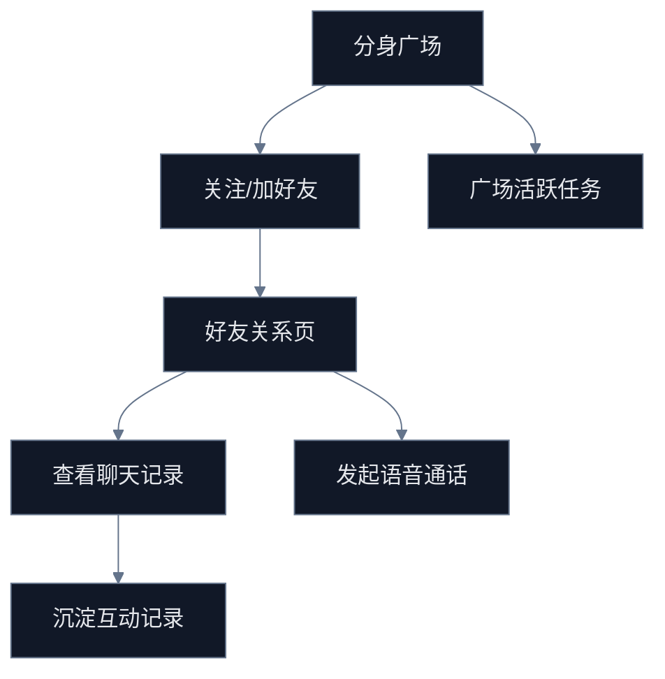

# G-2 心聊与社交体验优化任务包

## Premise

- 现状：`mind-chat` 已具备“我的分身 / 分身广场”双入口，但多数互动仍停留在展示层，关键按钮存在 `toast 占位`、关注未落库、广场活跃度缺少事件闭环。
- 目标：把心聊与社交问题转成一批可以直接开发的体验任务，形成“可浏览 -> 可互动 -> 可沉淀关系”的连续链路。

## Constraints

- 禁止新建第二套社交主链，仍以 `mind-chat -> avatar-friends/friendship-management/voice-call` 为事实入口。
- 禁止引入新的好友字段口径或新的分身上下文参数。
- 质量红线：所有任务必须明确对应页面、接口、验收与依赖。

## Boundaries

- 允许覆盖页面：
  - `src/pages/mind-chat/index.tsx`
  - `src/pages/avatar/avatar-friends/index.tsx`
  - `src/pages/friendship-management/index.tsx`
  - `src/pages/voice-call/index.tsx`
- 允许覆盖后端域：
  - `server/src/modules/avatar/*`
  - `server/src/modules/recommendation/*`
  - `server/src/modules/activities/*`
- 暂不处理：
  - 实时 IM 基础设施重构
  - 复杂社交推荐算法
  - 音视频底层能力替换

## Endgame

- 心聊页不再只是静态卡片页。
- 广场具备基础关注/活跃/推荐反馈闭环。
- 好友、聊天、语音通话形成明确任务批次。

## 当前阻塞点

1. `mind-chat` 的“通话”按钮仍是 `开发中` 占位，主动作缺乏真实目标页。
2. 广场卡片的“+关注”没有绑定真实接口与状态回写。
3. 我的分身卡片缺少“好友 / 心聊 / 最近动态”直接入口。
4. 社交广场没有活跃度指标，只有静态粉丝数展示。
5. 好友关系页与心聊页之间缺少统一任务承接，例如“推荐 3 个可加好友分身”“查看最新互动”。

## 任务地图

## 可执行任务

### G2-T1 心聊主入口收敛

- 目标：把 `mind-chat` 卡片从“信息看板”升级为“操作入口”。
- 开发动作：
  - 我的分身卡片补充二级动作：`好友`、`聊天记录`、`通话`。
  - 把目前 `通话功能开发中` 的占位改成真实跳转，若缺上下文则明确 toast。
- 验收：
  - 进入我的分身列表后，任一分身可在 1 次点击内进入好友页或语音页。

### G2-T2 广场关注动作真实化

- 目标：让广场“+关注”不再是假按钮。
- 开发动作：
  - 对接关注/取消关注接口，补 optimistic update 与失败回滚。
  - 广场卡片展示 `已关注`、`互相关注` 等状态。
- 验收：
  - 关注状态可刷新可回流，离开页面再回来不丢失。

### G2-T3 好友关系任务化

- 目标：把“好友关系管理”从孤立页面变成持续任务。
- 开发动作：
  - 在好友页增加待处理请求、推荐好友、最近新关系三个分组。
  - 补“从分身页进入好友页”的分身上下文说明。
- 验收：
  - 缺少 `avatarId` 时明确回到分身管理或用户级好友页。
  - 接受/拒绝好友后当前页即时刷新。

### G2-T4 社交广场活跃度任务

- 目标：补齐广场的内容活跃度和推荐反馈。
- 开发动作：
  - 给广场卡片增加可消费指标：最近活跃、最近互动、推荐理由。
  - 接入 `activities/recommendation` 结果，不再只显示静态粉丝数。
- 验收：
  - 广场排序与卡片标签具备“为什么推荐我看这个分身”的说明。

### G2-T5 语音与聊天降级策略

- 目标：把语音/聊天从“要么成功要么 toast”改成可降级任务。
- 开发动作：
  - 语音页不可用时，引导查看聊天记录或发起好友请求。
  - 聊天记录为空时，引导去建立关系、去心聊触发第一轮互动。
- 验收：
  - 任何失败状态都有下一步行动，不允许纯占位。

## 开发分配建议

### 前端批次

- 批次 1：`mind-chat` 操作入口收敛
- 批次 2：广场关注与回流
- 批次 3：好友页任务分组与降级指引

### 后端批次

- 批次 1：关注状态查询/写入接口
- 批次 2：广场活跃度与推荐理由聚合接口
- 批次 3：关系页所需待处理/最近互动 DTO

## 验收清单

- 广场卡片的“关注”是真实动作，不是静态 UI。
- 我的分身卡片的“通话”不再只有 `toast`。
- 好友页、语音页、心聊页之间有连续可执行链路。
- 社交广场有基础活跃度与推荐原因说明。
