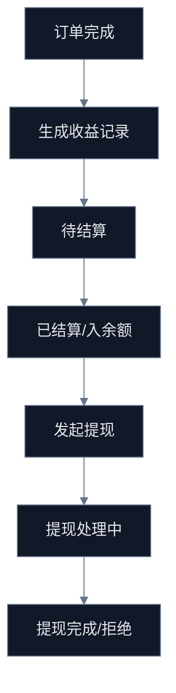

# G-3 收益体系透明化任务包

## Premise

- 现状：收益域已有“收益中心”“收益榜”“提现”页面与接口，但前后端仍存在双轨服务、DTO 口径不一、部分页面依赖 mock/fallback 的问题。
- 目标：把收益域从“能展示一部分数字”升级为“用户能理解收益从哪里来、何时结算、为什么能提现/不能提现”的透明闭环。

## Constraints

- 禁止新增第二套收益口径，必须收敛到单一收益事实源。
- 禁止页面继续使用 mock 数据兜底掩盖后端缺口。
- 禁止把“余额”“累计收益”“待结算”“提现中”混成一个数字解释。

## Boundaries

- 允许覆盖页面：
  - `src/pages/earning-center/index.tsx`
  - `src/pages/earnings-wall/index.tsx`
- 允许覆盖后端域：
  - `server/src/modules/earning/*`
  - `server/src/modules/earnings/*`
  - `server/src/modules/admin/*` 中收益相关聚合
- 暂不处理：
  - 财务对账系统
  - 发票与税务
  - 自动打款渠道扩展

## Endgame

- 收益中心解释清楚“收入来源、结算状态、提现状态、分身贡献”。
- 收益榜只展示真实数据，不再 fallback mock。
- 收益域形成一套前后端都能直接执行的需求包。

## 当前阻塞点

1. `earning` 与 `earnings` 两套模块并存，接口职责分裂。
2. `earnings-wall` 在接口失败时直接使用 mock 排行榜，用户无法区分真实与演示数据。
3. `earning-center` 依赖 `/api/earnings/avatars-stats`，但当前收益控制器未显式暴露对应统一接口。
4. 收益概览、收益记录、排行榜三处 DTO 口径不一致。
5. 用户看不到“订单 -> 待结算 -> 可提现 -> 提现中/已完成”的清晰解释链路。

## 任务地图

## 可执行任务

### G3-T1 收益事实源收敛

- 目标：统一 `earning` / `earnings` 两套模块的职责。
- 开发动作：
  - 明确唯一控制器与唯一服务。
  - 把 `overview/list/leaderboard/withdraw/avatar-stats` 收敛到同一套 DTO 口径。
- 验收：
  - 页面不再需要区分调用哪个收益模块。
  - 仓库内不再长期保留两套同名域逻辑并行演进。

### G3-T2 收益概览解释化

- 目标：让用户看懂钱的状态，而不是只看数字。
- 开发动作：
  - 概览区拆成：
    - 可提现余额
    - 累计收益
    - 待结算
    - 提现中
  - 每个数字补说明文案和来源说明。
- 验收：
  - 用户能理解为什么“累计收益不等于余额”。

### G3-T3 分身收益归因

- 目标：把收益归因到具体分身、具体订单、具体来源。
- 开发动作：
  - 统一 `avatarStats` DTO：分身名、订单数、待结算、已结算、累计收益、最近收益时间。
  - 收益记录补来源字段：订单、邀请、活动、提现。
- 验收：
  - 用户能看到“哪个分身赚的钱最多、哪些收益还没结算”。

### G3-T4 收益榜真实化

- 目标：收益榜不再用 mock 数据掩盖真实缺口。
- 开发动作：
  - 接口失败时展示“暂无真实数据”而不是随机榜单。
  - 排行榜卡片补时间范围、统计口径、是否仅统计已结算。
- 验收：
  - 线上环境不出现随机收益榜。
  - 榜单展示范围和统计口径可解释。

### G3-T5 提现透明化

- 目标：把提现前后状态解释清楚。
- 开发动作：
  - 在收益中心补提现规则说明、最小提现门槛、处理中状态、失败/拒绝原因。
  - 后端补齐提现列表查询与状态流转说明 DTO。
- 验收：
  - 用户知道为什么不能提现、提现吗、提现去哪了。

## 开发分配建议

### 后端批次

- 批次 1：统一收益控制器与服务边界
- 批次 2：补 `avatar-stats`、提现列表、排行榜真实聚合
- 批次 3：补收益状态字典与文案映射

### 前端批次

- 批次 1：收益中心概览解释化
- 批次 2：分身收益归因卡片
- 批次 3：收益榜真实数据化与空态治理

## 验收清单

- 收益中心不再只展示数字，还能解释状态。
- 收益榜失败时不再生成 mock 数据。
- 分身收益、订单收益、提现状态能串成一条用户可理解的链路。
- 收益域接口口径统一，可直接进入下一轮代码实施。
