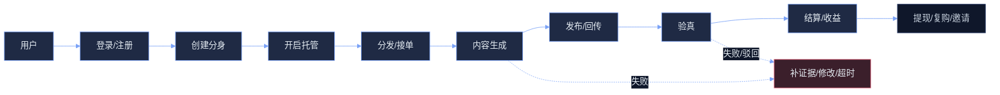

# Morena 产品规划与路线图 Spec

## Why
当前项目已具备“分身资产 + 订单广场 + AI 内容生成 + 发布回传验真 + 收益/邀请 + 运营后台”的雏形，但产品口径、主线叙事、目标用户、商业模式与阶段里程碑尚未被统一沉淀，导致研发与运营易在多链路上分散投入，无法形成可规模化的增长与收入闭环。

本 Spec 将把现有能力“收敛成一个可解释、可衡量、可迭代”的产品规划：明确面向谁解决什么问题、核心闭环如何跑通、指标如何验收、路线图如何分期落地，并输出与现有代码边界一致的能力地图和增量演进方向。

## What Changes
- 明确产品定位、目标用户分层与 Jobs-to-be-done（JTBD），统一“分身”与“订单履约”的产品口径。
- 定义北极星指标与 KPI Tree，建立从“获客→激活→履约→验真→结算→复购/裂变”的可衡量闭环。
- 输出端到端主链用户旅程（创作/接单两条），并给出关键断点与 P0/P1 优先级。
- 定义商业模式（订阅/抽成/增值）与定价策略（含平台差异与风险对冲）。
- 给出分期路线图（Phase 0/1/2/3）与每期“可验收”的能力清单、指标门槛与运营动作。
- 给出后台与数据埋点需求清单，确保能闭环验证“订单效率、验真通过率、收益、留存与增长”。
- 标注现有代码能力覆盖与缺口（需要补齐/收敛/下线的功能口径），避免继续在“未形成闭环的副线”上扩张。

## Impact
- Affected specs: 分身生命周期、托管运营、订单广场与匹配、内容生成与发布验真、收益/提现、邀请返利、活动与通知、运营后台看板
- Affected code:
  - 前端：`src/pages/index/*`、`src/pages/mind-chat/*`、`src/pages/profile/*`、`src/package-avatar/pages/*`、`src/package-order/pages/*`、`src/package-profile/pages/*`、`src/package-admin/pages/*`
  - 后端：`server/src/modules/avatar/*`、`server/src/modules/order/*`、`server/src/modules/order-dispatch/*`、`server/src/modules/order-processing/*`、`server/src/modules/content-generation/*`、`server/src/modules/subscription/*`、`server/src/modules/earnings/*`、`server/src/modules/referral/*`、`server/src/modules/activities/*`、`server/src/modules/notification/*`、`server/src/modules/admin/*`

## 产品定位（草案）
### Premise
- 产品形态：面向内容平台的“AI 分身接单与内容交付系统”，核心资产是“可托管的分身”，核心交易是“订单任务”。
- 核心价值：将“找单→理解需求→产出内容→发布→回传验真→结算”从高不确定的人工执行，压缩为可规模化的流水线，提升交付成功率与单位时间收益。

### Constraints
- 内容平台强约束：平台账号绑定、发布形式差异、作品链接/截图验真、风控与合规成本。
- 业务链路强依赖状态一致性：订单/分发/履约/验真的状态口径不一致会直接破坏用户信任。
- 供给侧与需求侧两边同时要成立：分身供给不足会导致订单无法分发；订单质量不足会导致供给留存差。

### Boundaries
- 本规划聚焦“跑通可规模化收入闭环”的主线（分身托管接单交付），不把“分身社交/语音通话/泛聊天”作为近期增长主引擎。
- 不在本规划中重新设计 UI 视觉；仅定义信息架构与流程口径，交互细化按迭代任务拆分。

### Endgame
- 单一主链：所有用户与运营行为都围绕同一条“订单履约主链”运转，形成明确的指标与收益归因。
- 单一状态源：订单状态、分发状态、履约状态、验真状态各自唯一维护者与唯一对外口径。
- 可规模化：单位运营/研发投入带来可预测的 GMV/毛利增长，且通过后台数据闭环持续优化。

## 目标用户与 JTBD
### 用户分层
- **A 类：内容接单型个人/工作室**：有时间与能力发布内容，但缺稳定任务与“产出效率”工具。
- **B 类：跨境/品牌商内容需求方**：有持续内容需求，追求“确定性交付与可验真”，愿意为效率与可控付费。
- **C 类：平台运营/代理商**：需要规模化管理供给与交付过程（偏 B2B2C），更看重看板与合规能力。

### JTBD（优先级）
1. **“让我稳定接到能交付的单”**：订单质量、匹配效率、分发可控、接单后不翻车。
2. **“让我更快把内容做出来并过验真”**：生成质量、修改闭环、平台适配、一键发布与证据回传。
3. **“让我清楚赚了多少、怎么提现、怎么放大”**：收益透明、结算确定、提现稳定、邀请/活动带来增量。

## 核心闭环与指标
### 北极星指标（建议）
- **Verified GMV**：通过验真并完成结算的订单金额（或毛利），作为“真实价值交付”的唯一口径。

### KPI Tree（建议）
- 获客：新增注册、激活率（注册→创建分身/首次接单）
- 供给：活跃分身数、托管开启率、可接单分身覆盖度
- 需求：有效订单数、订单通过率（可分发/不违规/预算合理）
- 分发：分发成功率、平均接单时间、拒单率、超时率
- 履约：生成成功率、修改次数、平均交付时长、失败率
- 验真：验真提交率、验真通过率、被驳回原因分布
- 结算：结算完成率、提现成功率、结算周期
- 留存：7/30 日留存、复购率（接单/发单复用）
- 增长：邀请转化率、活动点击→下单转化

## 端到端主链（用户旅程）
### 旅程 1：供给侧（分身托管接单）
- 进入应用 → 登录 → 创建分身 → 绑定平台账号（可延后） → 开启托管 → 等待分发 → 接单 → 生成内容 → 发布/回传 → 验真 → 结算 → 收益提现 → 邀请/复购

### 旅程 2：需求侧（发单交付验收）
- 进入应用 → 登录 → 创建订单（需求/平台/预算） → 支付/发布 → 等待分发 → 查看进度 → 收到内容预览 → 要求修改/确认发布 → 验真 → 验收/争议 → 完成/结算

## Task 1：现状能力与主链对齐（产品侧）
- 核心概念词典与状态口径（订单/分发/履约/验真/结算）：见 [task1-appendix.md](./task1-appendix.md)
- 两条用户旅程与 P0/P1 关键断点：见 [task1-appendix.md](./task1-appendix.md)
- 现有能力覆盖 vs 规划缺口清单：见 [task1-appendix.md](./task1-appendix.md)

## Task 2：指标体系与数据闭环（可衡量）
- 北极星指标与 KPI Tree（含公式/口径/数据源/归因维度）：见 [task2-appendix.md](./task2-appendix.md)
- 关键漏斗与失败原因分类（分发/履约/验真/结算）：见 [task2-appendix.md](./task2-appendix.md)
- 最小可用后台看板需求（支持从指标下钻到订单/分身/用户）：见 [task2-appendix.md](./task2-appendix.md)

## Task 3：商业模式与定价策略（可赚钱）
- 订阅/抽成/增值组合策略与用户侧心智：见 [task3-appendix.md](./task3-appendix.md)
- 定价分层与权益（含风控约束与成本项）：见 [task3-appendix.md](./task3-appendix.md)
- 单位经济模型框架（收入、毛利、现金流）：见 [task3-appendix.md](./task3-appendix.md)

## Task 4：路线图分期与验收门槛（可迭代）
- Phase 0/1/2/3 能力清单与依赖关系：见 [task4-appendix.md](./task4-appendix.md)
- 每期验收门槛与回滚策略：见 [task4-appendix.md](./task4-appendix.md)
- 风险清单（平台合规/风控/供需失衡/状态口径等）：见 [task4-appendix.md](./task4-appendix.md)

## 现有能力覆盖（对齐代码现实）
### 已具备的主线能力（基于代码）
- 分身：创建/管理、托管开关、部分平台账号与发布入口。
- 订单：广场/列表/详情、接单分发、执行状态查询。
- 内容：生成与轮询、发布回传与验真（链接校验/截图/凭证）。
- 交易：订阅/支付入口（现有 `/subscription/*` 与支付模块并存）。
- 收益与增长：收益概览/提现、邀请返利、活动曝光/点击、通知中心。
- 后台：用户/分身/订单/财务/内容/邀请/活动等管理入口。

### 需要产品规划显式决策的缺口
- “供给侧增长”策略：托管开启的激励机制与风控策略（避免低质分身破坏交付）。
- “订单质量”治理：订单准入、预算下限、平台规则差异化校验与违规处理。
- “验真口径”统一：验真字段、失败原因分类、可解释的申诉/修改闭环。
- “价格与毛利模型”统一：订阅与订单抽成的组合策略（避免双收费导致转化下降）。
- “副线功能”取舍：社交/语音/泛聊天在短期是否继续投入，避免稀释主链。

## 分期路线图（建议）
### Phase 0：口径收敛与可衡量（“能跑通且能算账”）
- 统一核心口径：订单/分发/履约/验真状态与失败原因枚举，确保前后端一致展示。
- KPI Tree 数据可得：后台/埋点能产出核心漏斗与失败分布。
- P0 断点修复：缺参/回流/错误跳转/关键页阻塞（以主链为准）。

### Phase 1：提升履约成功率（“把成功率打上去”）
- 分发策略：推荐分身质量排序、超时/拒单/重分发策略可控。
- 生成质量与修改闭环：明确“预览→修改→发布”的次数与时限规则。
- 验真体验：一键发布/回传流程打磨，驳回原因可解释可修正。

### Phase 2：扩大供需与商业化（“把规模做上来”）
- 订单供给扩张：订单侧模板化、行业/平台任务包、风控准入。
- 供给扩张：分身创建引导、技能商店/能力包、托管激励与等级体系。
- 商业化：订阅分层/抽成策略 A/B，结合收益透明与提现稳定提升转化。

### Phase 3：平台化与组织化交付（“从产品到系统”）
- B2B2C：工作室/代理商多分身管理、团队协作与结算。
- 合规与风控体系：违规识别、黑白名单、申诉、证据链。
- 运营自动化：活动编排、召回、反作弊、增长实验平台化。

## ADDED Requirements
### Requirement: 产品规划统一口径
系统 SHALL 输出可执行的产品规划，统一核心概念、状态口径与阶段目标，确保研发/运营/商业对“主链是什么、成功如何定义、下一步做什么”达成一致。

#### Scenario: 核心概念一致
- **WHEN** 讨论“分身、托管、订单、分发、履约、验真、结算”
- **THEN** 所有人使用同一套定义与状态枚举解释业务

### Requirement: 指标体系与验收门槛
系统 SHALL 给出北极星指标与 KPI Tree，并为每个 Phase 定义可量化的验收门槛。

#### Scenario: 指标可落地
- **WHEN** 查看规划
- **THEN** 能明确每个指标的数据来源、计算口径与目标阈值

### Requirement: 路线图分期与依赖
系统 SHALL 输出 Phase 0/1/2/3 的能力清单、依赖关系与风险清单，确保增量落地。

#### Scenario: 路线图可执行
- **WHEN** 选择某个 Phase
- **THEN** 能明确必须先完成的前置条件、不可并行的依赖与交付物

## MODIFIED Requirements
### Requirement: 分身模块的产品主线定位
分身模块的近期演进 SHALL 以“托管接单与交付”作为主线驱动，社交/语音/泛聊天能力仅在不影响主链质量与指标闭环的前提下增量迭代。<mccoremem id="03g3uvp5irfejizsr1nztltta" />

## REMOVED Requirements
### Requirement: 将分身社交作为短期增长主引擎
**Reason**: 现阶段项目的可规模化价值主要来自订单履约与验真结算闭环，社交链路投入会稀释主链资源且难以直接归因到收入。
**Migration**: 社交/语音能力后续以“提升托管分身可用性与互动体验”的方式保留，优先保证主链指标闭环与后台可衡量。
