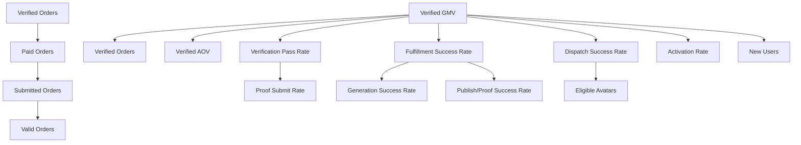

# Task2 附录：北极星指标、KPI Tree、关键漏斗、失败原因分类与最小后台看板

## 1. 北极星指标（North Star）
### 1.1 指标选择
- **北极星指标：Verified GMV**（已验真并具备结算资格的订单金额）
- **选择理由**：把“真实交付价值”作为唯一口径，天然排除草稿、未分发、未履约、未回传、验真未通过、取消/退款等噪音；可直接承接商业化（抽成/订阅）与供给侧收益归因。

### 1.2 口径与公式
#### 指标：Verified GMV
- **统计粒度**：按日（也可按周/月聚合），可下钻到订单
- **记账时点（推荐）**：`verification.approved_at`（验真通过时点）
- **公式**：
  - `VerifiedGMV = SUM(order.pay_amount)`
  - 过滤条件：
    - `order.status NOT IN ('cancelled', 'rejected')`
    - `verification.status = 'approved'`
    - `settlement.status IN ('eligible', 'settled')`
- **常见拆分维度**：
  - 平台（platform）
  - 订单类型/交付物类型（order_type）
  - 价格带（price_tier）
  - 用户分层（供给侧/需求侧、A/B/C 类）
  - 渠道（channel）
  - 履约方式（托管/半托管/手动回传）

#### 指标：Verified Gross Profit（可选，商业化阶段用）
- **定义**：验真通过后，平台可归因毛利（抽成/订阅摊销 - 支付通道成本 - 运营补贴等）
- **公式（示例，实际以财务科目为准）**：
  - `VerifiedGrossProfit = VerifiedGMV * take_rate - payout_amount - payment_fee - subsidy_amount`

### 1.3 数据源（最小可落地）
最小可用版本允许直接从 MySQL 订单链路表聚合，无需引入数仓。

- **订单事实表**：`orders`
  - 字段参考：`id`, `user_id`(需求侧), `pay_amount`, `platform`, `status`, `created_at`, `paid_at`
- **分发事实表**：`order_dispatches`（或对应分发模块表）
  - 字段参考：`order_id`, `avatar_id`, `status`, `dispatched_at`, `accepted_at`, `rejected_at`, `expired_at`, `failed_reason`
- **履约事实表**：`order_fulfillments` / `order_processings`
  - 字段参考：`order_id`, `status`, `generation_status`, `publish_status`, `started_at`, `delivered_at`, `failed_reason`
- **验真事实表**：`verifications`（或对应验真/回传表）
  - 字段参考：`order_id`, `status`, `submitted_at`, `approved_at`, `rejected_at`, `rejected_reason`
- **结算/收益事实表**：`settlements`, `earnings`, `withdrawals`
  - 字段参考：`order_id`, `status`, `eligible_at`, `settled_at`; `withdrawal.status`, `withdrawal.failed_reason`
- **用户/分身维表**：`users`, `avatars`
  - 用于分层、渠道、托管开关、平台绑定状态等维度分析

## 2. KPI Tree（含公式、归因与数据源）
### 2.1 树结构（从北极星向下拆解）

### 2.2 指标字典（最小必须覆盖）
下表用于后台看板与埋点设计：每个指标必须能被查询、可下钻、可按维度过滤。

| 指标 | 定义/口径 | 公式（示例） | 数据源（最小） |
| --- | --- | --- | --- |
| New Users | 新注册用户数 | `COUNT(DISTINCT user.id)`（按注册日） | `users.created_at` |
| Activation Rate | 注册后在 N 天内完成关键动作的比例 | `ActivatedUsers / NewUsers`；Activated=创建分身或首次接单/发单（择一做主口径） | `avatars.created_at`、`order_dispatches.accepted_at`、`orders.submitted_at` |
| Eligible Avatars | 可被分发的分身数 | `COUNT(DISTINCT avatar.id)` where `managed_on=1` and `eligible=1` | `avatars` + 风控/绑定状态 |
| Valid Orders | 满足准入规则的订单数 | `COUNT(order.id)` where `order.status IN (...)` and `risk_pass=1` | `orders` + 风控审核结果 |
| Dispatch Success Rate | 订单进入分发后被成功指派且有人响应的比例 | `AcceptedDispatches / Dispatches` | `order_dispatches.status` |
| Accept Rate | 被指派后被接单的比例 | `accepted / (accepted + rejected + expired)` | `order_dispatches` |
| Avg Time To Accept | 指派到接单耗时 | `AVG(accepted_at - dispatched_at)` | `order_dispatches` |
| Fulfillment Success Rate | 接单后最终完成“发布/回传”的比例 | `FulfilledOrders / AcceptedOrders` | `order_fulfillments.status` + `verifications.submitted_at` |
| Avg Delivery Time | 接单到回传耗时 | `AVG(submitted_at - accepted_at)` | `order_dispatches.accepted_at` + `verifications.submitted_at` |
| Proof Submit Rate | 履约中产生回传的比例 | `OrdersWithProof / AcceptedOrders` | `verifications.submitted_at` |
| Verification Pass Rate | 已提交回传中验真通过比例 | `approved / (approved + rejected)` | `verifications.status` |
| Verified Orders | 验真通过且具备结算资格的订单数 | `COUNT(order.id)` where verification approved and settlement eligible | `orders` + `verifications` + `settlements` |
| Verified AOV | 验真通过订单客单价 | `VerifiedGMV / VerifiedOrders` | 同上 |
| Settlement Completion Rate | 可结算订单完成入账比例 | `settled / eligible` | `settlements.status` |
| Withdrawal Success Rate | 提现成功比例 | `success / (success + failed)` | `withdrawals.status` |
| Referral Conversion Rate（可选） | 邀请到激活/交易转化 | `InvitedActivated / Invited` 或 `InvitedVerifiedOrders / InvitedActivated` | `referrals` + 用户/订单表 |

### 2.3 归因规则（避免“同一指标多口径”）
- **时间归因**：
  - `Submitted Orders` 归因到 `orders.submitted_at`
  - `Accepted Orders` 归因到 `order_dispatches.accepted_at`
  - `Proof Submitted` 归因到 `verifications.submitted_at`
  - `Verified GMV / Verified Orders` 归因到 `verifications.approved_at`
  - `Settled Amount` 归因到 `settlements.settled_at`
- **口径优先级**：只要涉及收入/返利/运营结算，统一以 `Verified GMV` 作为最终归因口径。

## 3. 关键漏斗（Funnel）定义
### 3.1 漏斗 A：供给侧（托管接单到收益）
1. 注册/登录
2. 创建分身
3. 开启托管（Managed On）
4. 收到分发（Dispatched）
5. 接单（Accepted）
6. 回传凭证（Proof Submitted）
7. 验真通过（Verified）
8. 结算入账（Settled）
9. 发起提现（Withdrawal Requested）
10. 提现成功（Withdrawal Success）

### 3.2 漏斗 B：需求侧（发单到验真结算）
1. 注册/登录
2. 创建订单草稿（Draft）
3. 提交订单（Submitted）
4. 订单通过准入/风控（Valid）
5. 分发成功并被接单（Accepted）
6. 回传/发布完成（Proof Submitted）
7. 验真通过（Verified）
8. 结算完成/订单完成（Settled/Completed）

### 3.3 漏斗 C：平台绑定（降低履约与验真失败）
1. 分身创建
2. 绑定平台账号
3. 发布授权/有效性校验通过
4. 首次发布成功
5. 首次验真通过

## 4. 失败原因分类（用于枚举、统计、可修复）
### 4.1 分类维度（统一标签）
每条失败/驳回建议同时具备以下字段，便于看板聚合与责任归因：
- `stage`：dispatch / fulfillment / verification / settlement / withdrawal
- `reason_code`：枚举值（可统计）
- `reason_group`：归类（用户问题/平台问题/系统问题/风控问题/需求质量问题）
- `actionable`：是否可修复（true/false）
- `suggested_action`：建议动作（文案/引导/申诉/重试/联系客服）

### 4.2 分发失败（Dispatch）
#### 分发失败原因（DispatchFailedReason）
| reason_code | 含义 | reason_group | actionable |
| --- | --- | --- | --- |
| no_eligible_avatar | 无可用分身（托管关闭/不可接单/能力不匹配） | 供给侧/系统 | true |
| all_rejected | 被指派分身全部拒单 | 供给侧 | true |
| dispatch_timeout | 指派后超时未响应 | 供给侧/系统 | true |
| risk_blocked | 风控拦截（账号异常/黑名单/规则命中） | 风控 | false |
| system_error | 系统异常导致分发失败 | 系统 | true |

#### 拒单原因（DispatchRejectedReason）
| reason_code | 含义 | reason_group | actionable |
| --- | --- | --- | --- |
| budget_too_low | 预算过低 | 需求质量 | true |
| requirements_unclear | 需求不清/缺少素材 | 需求质量 | true |
| platform_not_ready | 平台账号未绑定/授权过期 | 供给侧/平台 | true |
| schedule_conflict | 时间冲突/无空档 | 供给侧 | true |
| other | 其他（需填写备注） | 供给侧 | true |

### 4.3 履约失败（Fulfillment）
| reason_code | 含义 | reason_group | actionable |
| --- | --- | --- | --- |
| generation_failed | 内容生成失败/超时 | 系统 | true |
| revision_over_limit | 修改次数超限/规则不满足 | 规则/需求质量 | true |
| publish_failed | 发布失败（接口/权限/素材规格） | 平台/系统 | true |
| account_expired | 平台账号登录/授权过期 | 平台/供给侧 | true |
| user_no_response | 关键节点用户未确认导致超时 | 供给侧 | true |
| policy_violation | 触发平台合规/敏感内容 | 风控/平台 | false |
| cancelled | 订单取消导致终止 | 需求侧 | false |

### 4.4 验真驳回（Verification）
| reason_code | 含义 | reason_group | actionable |
| --- | --- | --- | --- |
| invalid_link | 链接无效/不可访问/不在白名单域 | 平台/用户 | true |
| post_deleted | 作品被删/不可见 | 平台 | true |
| screenshot_invalid | 截图不清晰/缺少关键字段 | 用户 | true |
| content_mismatch | 内容与需求不匹配/关键词缺失 | 需求质量/供给侧 | true |
| time_window_exceeded | 超过回传/补证时限 | 规则 | false |
| suspected_fraud | 疑似作弊/复用凭证/非本人账号 | 风控 | false |
| other | 其他（需填写备注） | 其他 | true |

### 4.5 结算/提现失败（Settlement / Withdrawal）
| stage | reason_code | 含义 | reason_group | actionable |
| --- | --- | --- | --- | --- |
| settlement | payout_failed | 通道失败/入账失败 | 系统/通道 | true |
| settlement | risk_hold | 风控冻结（审计中） | 风控 | false |
| withdrawal | kyc_missing | 未完成实名/收款信息缺失 | 用户 | true |
| withdrawal | channel_error | 提现通道异常 | 通道 | true |
| withdrawal | insufficient_balance | 可提现余额不足 | 用户 | true |

## 5. 最小可用后台看板需求（MVP）
### 5.1 目标与范围
- **目标**：用最小看板闭环验证“主链是否跑通、哪里掉、为什么掉、怎么修”，支持运营/产品/研发统一对齐。
- **范围**：只做“可观测 + 可下钻 + 可导出”，不包含复杂 BI 自助建模与实验平台。

### 5.2 角色与权限（最小）
- **Admin**：全量访问与配置
- **Ops（运营）**：看板 + 订单/分身/验真下钻 + 失败原因标注
- **Finance（财务）**：结算/提现面板 + 导出
- **Auditor（风控/审核）**：验真驳回与风控拦截列表

### 5.3 信息架构（页面/模块）
1. **总览（Overview）**
   - 指标卡：Verified GMV、Verified Orders、Verification Pass Rate、Fulfillment Success Rate、Dispatch Success Rate
   - 趋势图：近 7/30 天 Verified GMV 与 Verified Orders
   - Top 分布：平台/渠道/价格带
2. **漏斗（Funnel）**
   - 支持切换漏斗 A/B/C
   - 每一步人数/订单数、转化率、掉落量
   - 点击任一步可下钻到订单/用户列表
3. **失败分析（Failures）**
   - 分阶段（dispatch/fulfillment/verification/settlement/withdrawal）失败量与占比
   - 失败原因 TopN（reason_code + reason_group）
   - 支持按平台/日期/渠道过滤，支持下钻明细
4. **订单明细（Orders）**
   - 列表字段：订单号、平台、金额、状态（订单/分发/履约/验真/结算）、创建/接单/回传/验真/结算时间、失败原因、责任归类
   - 操作：导出 CSV；跳转到订单详情页
5. **供给侧（Supply）**
   - 分身列表：托管开关、可接单状态、近 7 天接单数/验真通过数、失败原因分布、风险标记
6. **验真审核（Verification）**
   - 待验真队列、驳回队列、驳回原因分布
   - SLA：平均验真时长、积压量
7. **结算与提现（Finance）**
   - 可结算/已结算金额、结算失败原因
   - 提现申请列表、成功/失败率、失败原因分布

### 5.4 全局筛选与刷新频率
- **全局筛选**：日期范围、平台、渠道、用户分层、订单类型、价格带
- **刷新频率（最小）**：
  - 总览/漏斗/失败分析：T+1 日报 + 近 24 小时准实时（可选）
  - 验真队列/订单列表：准实时
- **导出**：订单/提现/失败明细支持 CSV 导出（按筛选条件）

## 6. Task2 交付物对照（用于 tasks.md 勾选）
- SubTask 2.1：已定义北极星指标与 KPI Tree（含公式、口径、数据源、归因维度）
- SubTask 2.2：已定义关键漏斗与失败原因分类（分发/履约/验真/结算/提现）
- SubTask 2.3：已输出最小可用后台看板需求（页面/模块/权限/筛选/导出/刷新）
