# Morena 系统架构说明

> 本文档描述当前仓库的系统架构、模块关系、请求流程、数据关系、调用关系、权限、缓存、日志、文件上传和消息流。后续架构调整应同步更新本文档。

## 1. 架构总览

Morena 是一个前后端分离的 AI 分身平台：

- 前端：Taro + React + TypeScript，支持 H5、微信小程序、抖音小程序，按主包和多个分包组织。
- 后端：NestJS + TypeScript，统一 `/api` 前缀，按业务模块拆分 Controller / Service。
- 数据：当前运行代码主要通过 MySQL client 访问 MySQL；仓库仍保留 Drizzle/PostgreSQL schema 和 Supabase 兼容代码。
- 存储：图片、音频、视频、ZIP 解析结果等走火山引擎 TOS/ImageX 或本地 `/uploads` 静态目录。
- 缓存：Redis 用于计数器、锁、ZIP 进度、部分运行态状态。
- 外部服务：微信登录/支付/公众号、阿里云短信、火山 Ark/ImageX/TOS、TikHub、飞书/企微、AI 图片/视频/语音服务。

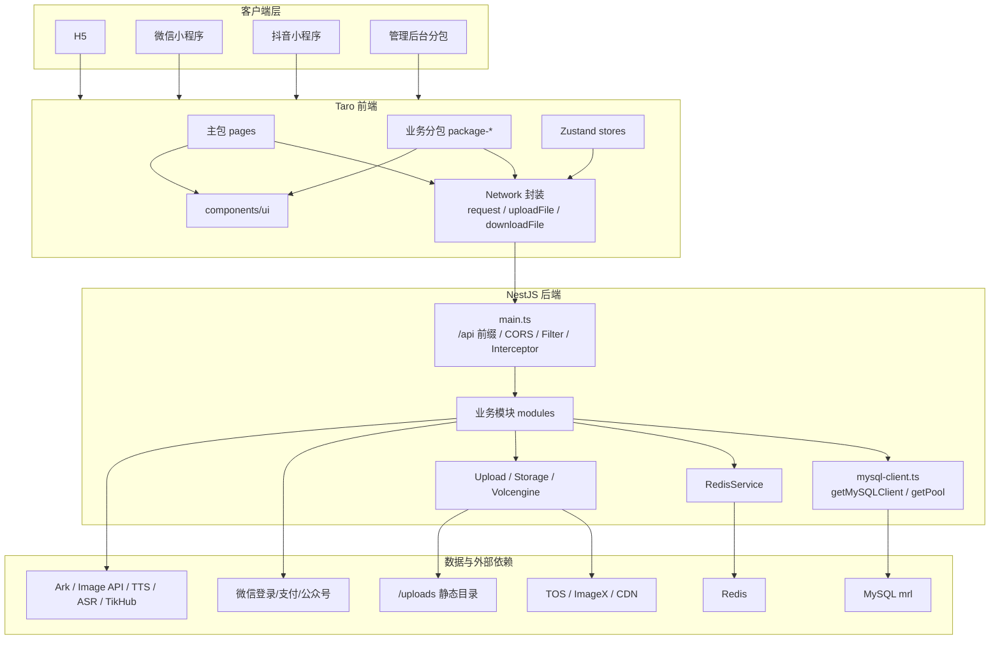

## 2. 目录与边界

| 目录 | 职责 |
| --- | --- |
| `src/` | 前端源码，Taro 主包、分包、组件、状态、网络层。 |
| `src/pages/` | 主包页面：首页、分身聊天、个人中心、登录、协议、隐私、webview、发布跳转。 |
| `src/package-order/` | 订单分包：发布、列表、详情、匹配、处理、素材等待、验收、反馈、统计。 |
| `src/package-avatar/` | 分身分包：创建、管理、详情、账号配置、好友、订阅、语音通话、生成内容。 |
| `src/package-profile/` | 个人中心分包：收益、推广、通知、设置、安全、帮助、反馈。 |
| `src/package-skill/` | 技能分包：技能广场、创建、训练、试用、AI 技能页。 |
| `src/package-admin/` | 后台分包：仪表盘、用户、分身、订单、财务、内容、推广、设置。 |
| `src/package-coin/` | 金币分包：余额、充值、交易明细。 |
| `src/package-group-bot/` | 群机器人前端页面。 |
| `src/network.ts` | 前端网络请求唯一封装。 |
| `src/components/ui/` | 通用 UI 组件库。 |
| `server/src/modules/` | 后端业务模块。 |
| `server/src/storage/database/` | 数据库客户端、schema、迁移和兼容层。 |
| `api-tests/` | API 冒烟和回归测试。 |
| `config/` | Taro/Vite/weapp-tailwindcss 构建配置。 |
| `compose.yaml` | MySQL、server、server-dev、web-dev、api-tests 编排。 |

## 3. 前端架构

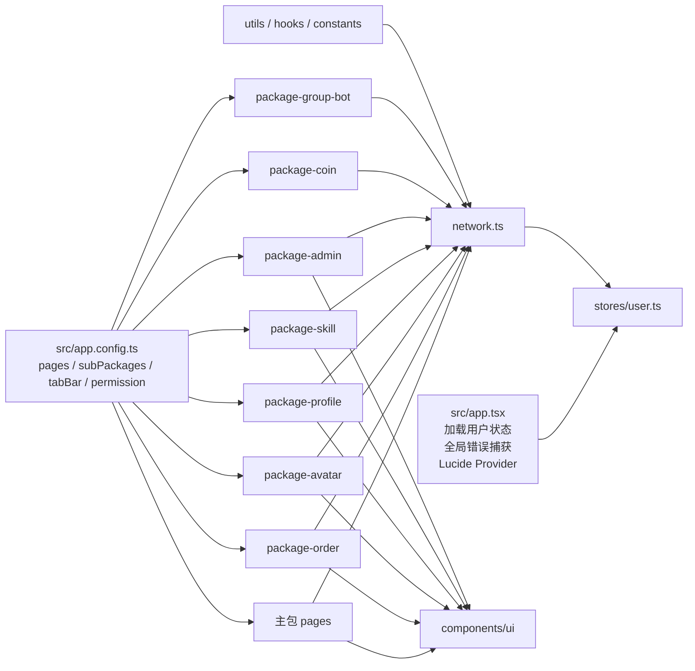

前端关键规则：

- 所有业务请求必须走 `Network`，禁止直接 `Taro.request/uploadFile/downloadFile`。
- 通用按钮、输入、弹窗、卡片、表格、Tabs 等必须优先用 `@/components/ui`。
- H5 开发环境使用 `/api` 相对路径，由 Vite/Taro proxy 转发到后端。
- 小程序端通过 `PROJECT_DOMAIN` 拼接生产 API 域名。
- 登录态存在 Taro Storage：普通用户 `token` / `userInfo`，管理员 `admin_token` / `admin_info`。

## 4. 后端模块关系图

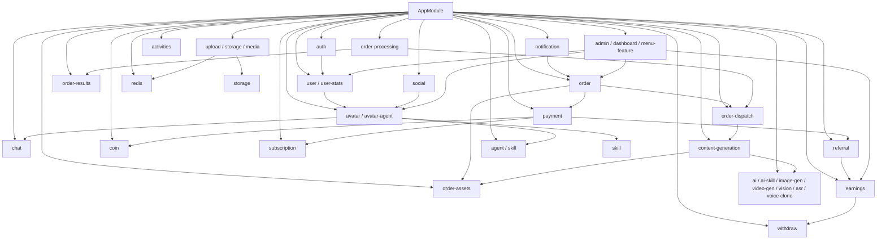

模块职责：

- `auth`：手机号验证码、微信登录、微信手机号授权、自定义 token、注册风控、推荐码处理。
- `user` / `user-stats`：用户资料、openid、安全状态、学习进度、订单/内容/收益统计。
- `avatar`：分身 CRUD、技能、记忆、托管、账号配置、公众号草稿发布、逆地理编码。
- `avatar-agent`：分身 Agent 配置、记忆、偏好、学习、能力、个性化。
- `chat`：会话和消息。
- `order`：订单创建、更新、列表、详情、开放订单、价格配置、取消、删除、补付。
- `order-dispatch`：派单、推荐、分身接单、拒单、超时检查、重新分配、时间线。
- `order-processing`：订单处理态、链接校验、确认、发布、反馈、争议、催验收。
- `order-assets`：订单素材生成、上传、ZIP、批量、排序、摘要。
- `content-generation`：文案/图片/视频生成、发布反馈、发布校验、历史、重试。
- `payment`：微信支付下单、回调、订单状态、会员计划、订阅、金币充值、发货信息上报。
- `coin`：金币余额、价格、消费、赠送、交易、充值包。
- `subscription`：订阅计划、权益、接单资格、技能使用限制、订单收益计算。
- `earnings` / `withdraw`：收益概览、收益记录、提现申请、自动提现、打款状态。
- `referral`：邀请码、推广关系、佣金、风控、二维码、折扣。
- `social`：帖子、评论、点赞、关注、分享、动态统计。
- `notification`：通知列表、未读数、设置、已读、催验收、订阅消息。
- `admin`：后台登录、用户、分身、订单、技能、内容、财务、推广、活动、系统配置。
- `upload` / `storage` / `media`：文件上传、签名 URL、TOS/ImageX、ZIP 进度。
- `agent` / `skill` / `ai-skill`：平台配置、工具调用、技能广场、AI 技能生成和试用。
- `ai` / `image-gen` / `video-gen` / `vision` / `asr` / `voice-clone`：AI 文本、图片、视频、视觉、语音识别和克隆。

## 5. 请求流程

### 5.1 普通 API 请求

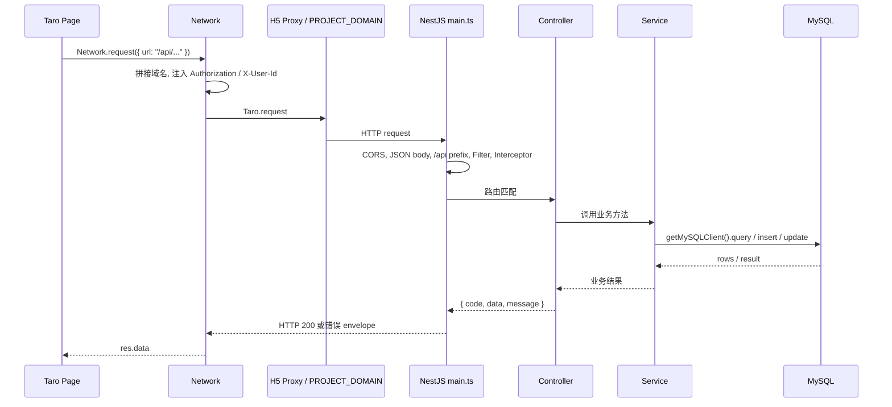

注意：

- `Network.request` 返回的是 Taro request 结果，业务对象通常在 `res.data.data`。
- 后端 `HttpStatusInterceptor` 会把部分默认 201 成功响应统一为 200。
- 后端异常由 `HttpExceptionFilter` 包装为 `{ code, data, message }`。

### 5.2 上传请求

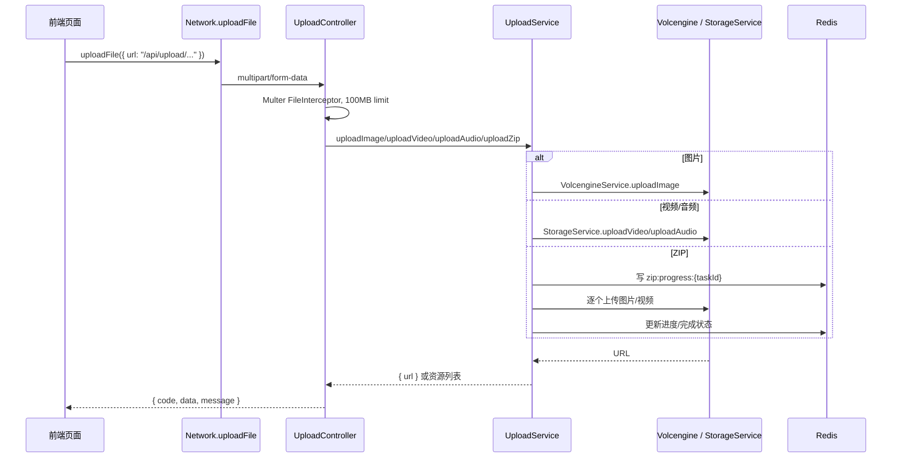

## 6. 核心业务消息流

### 6.1 登录与会话

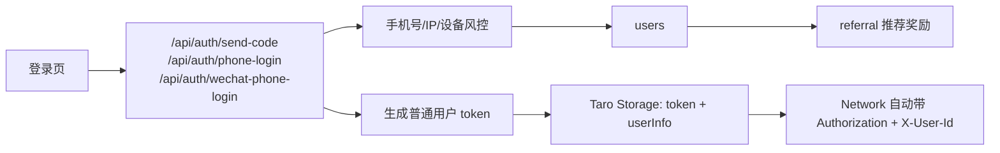

### 6.2 订单发布与支付

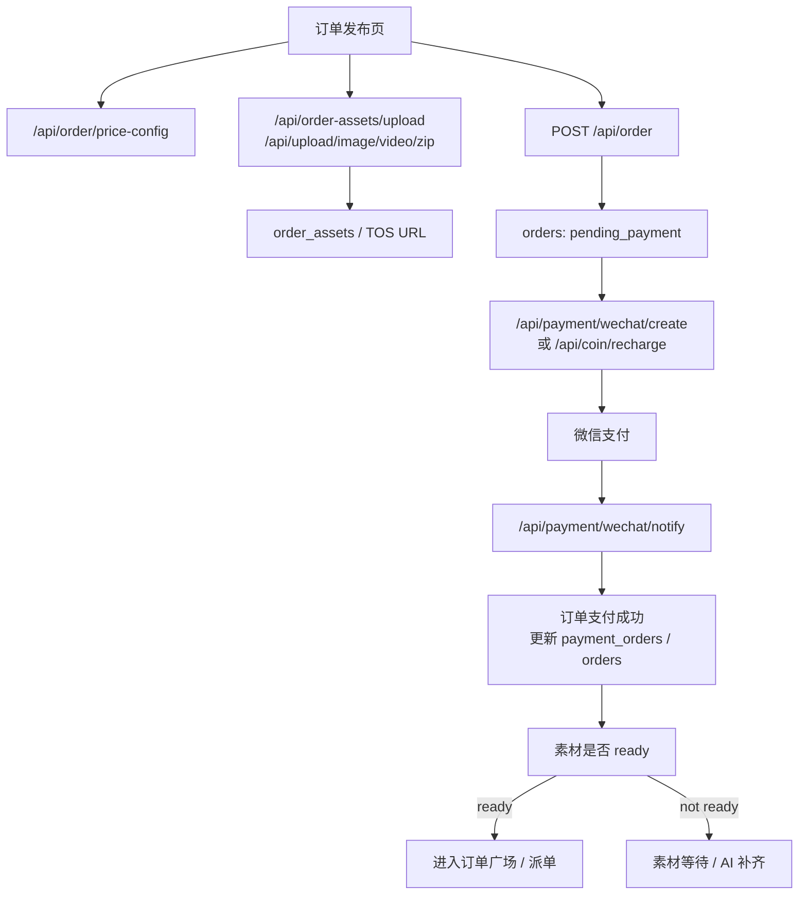

### 6.3 派单、接单与内容生成

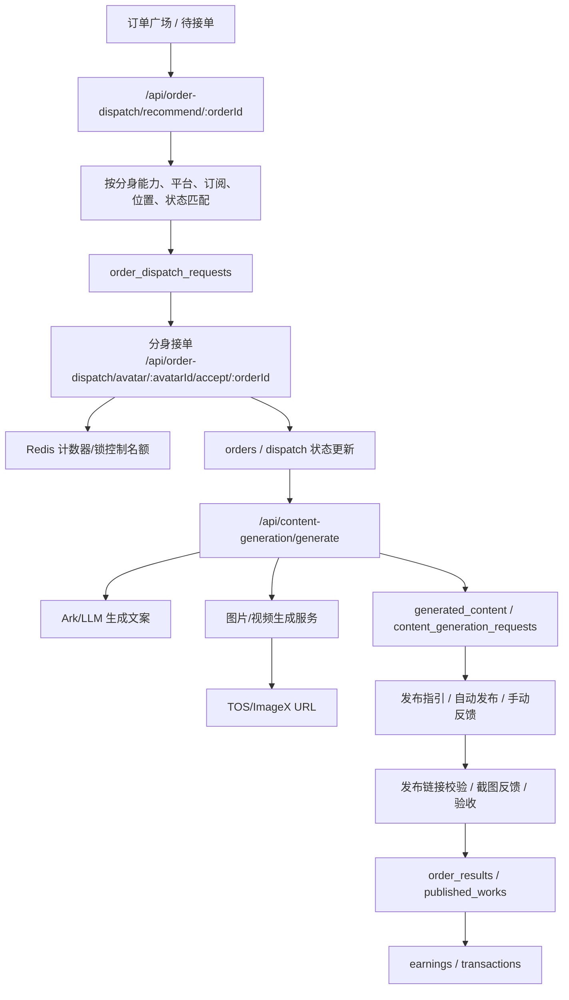

### 6.4 收益、提现与佣金

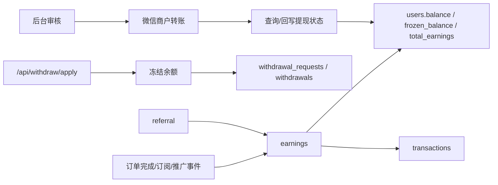

## 7. 数据库关系

当前核心数据关系：

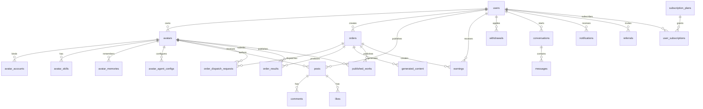

主要表分类：

| 分类 | 表 |
| --- | --- |
| 用户 | `users`, `verification_codes`, `admin_users`, `system_config` |
| 分身 | `avatars`, `avatar_accounts`, `avatar_skills`, `avatar_memories`, `avatar_contexts`, `avatar_agent_configs`, `avatar_learning_records`, `avatar_friends`, `avatar_follows`, `avatar_affinity`, `avatar_blocks` |
| 订单 | `orders`, `order_dispatch_requests`, `order_executions`, `order_results`, `order_assets`, `generated_content`, `published_works` |
| 内容社交 | `posts`, `comments`, `likes`, `follows`, `conversations`, `messages`, `notifications` |
| 支付收益 | `payment_orders`, `transactions`, `earnings`, `withdrawals`, `withdrawal_requests`, `coin_*` 相关表/字段 |
| 订阅 | `subscription_plans`, `user_subscriptions`, `avatar_subscriptions`, 技能使用记录 |
| 推广活动 | `referrals`, `referral_tiers`, `growth_campaigns`, `growth_campaign_events` |
| 任务工具 | `tasks`, `agent_task_logs`, `platform_configs`, `skills` |

数据库注意事项：

- 运行代码主要使用 MySQL。
- `shared/schema.ts` 是 Drizzle/PostgreSQL 风格的生成文件，不等于运行时唯一事实源。
- `mysql-client.ts` 会在对象读写时做 camelCase 和 snake_case 转换。
- `db.query()` 返回形态在代码中存在数组和 `result.data` 两种读法，新增代码需先确认调用方式。
- 修改数据库必须基于当前环境实际表结构和迁移脚本，不能只改 TS 类型。

## 8. 服务调用关系

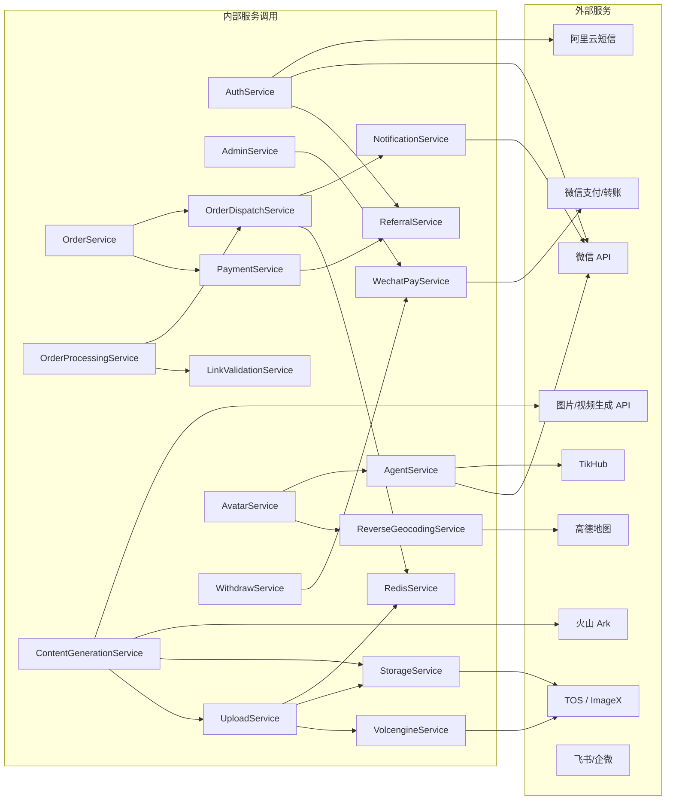

高耦合调用链：

- 订单链路：`order` + `payment` + `order-dispatch` + `order-processing` + `order-assets` + `content-generation` + `earnings` + `notification`。
- 资金链路：`payment` + `coin` + `subscription` + `withdraw` + `earnings` + `referral`。
- 分身智能体：`avatar` + `avatar-agent` + `agent` + `skill` + `ai-skill` + `chat` + `content-generation`。
- 后台聚合：`admin.service.ts` 直接查询和修改大量业务表，是后台操作中心。

## 9. 权限关系

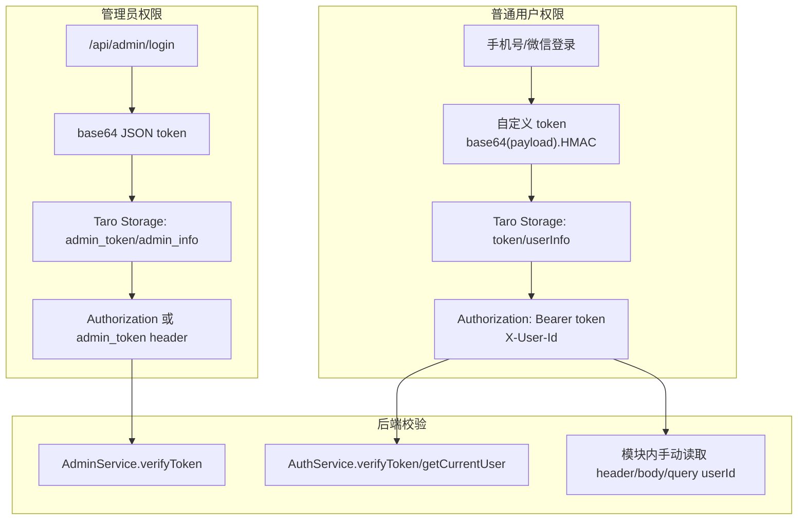

权限事实：

- 普通用户 token 不是标准 JWT，格式为 `base64(payload).signature`，默认 7 天有效。
- 管理员 token 是 base64 JSON，包含 `id`、`username`、`exp`，后端再查 `admin_users`。
- 后端没有统一全局 Auth Guard；管理员接口多为 Controller 内手动 `verifyToken`。
- 部分普通业务接口依赖 `Authorization`，部分兼容 `X-User-Id` 或直接传 `userId`。
- `Network` 会对 `/api/admin` 选择管理员 token，对其他接口选择用户 token。

权限风险：

- 管理员密码当前按数据库明文字段校验。
- 接口鉴权风格不统一，新增接口必须明确 token 来源和用户身份校验方式。
- 不允许页面局部自创认证协议。

## 10. 缓存与运行态状态

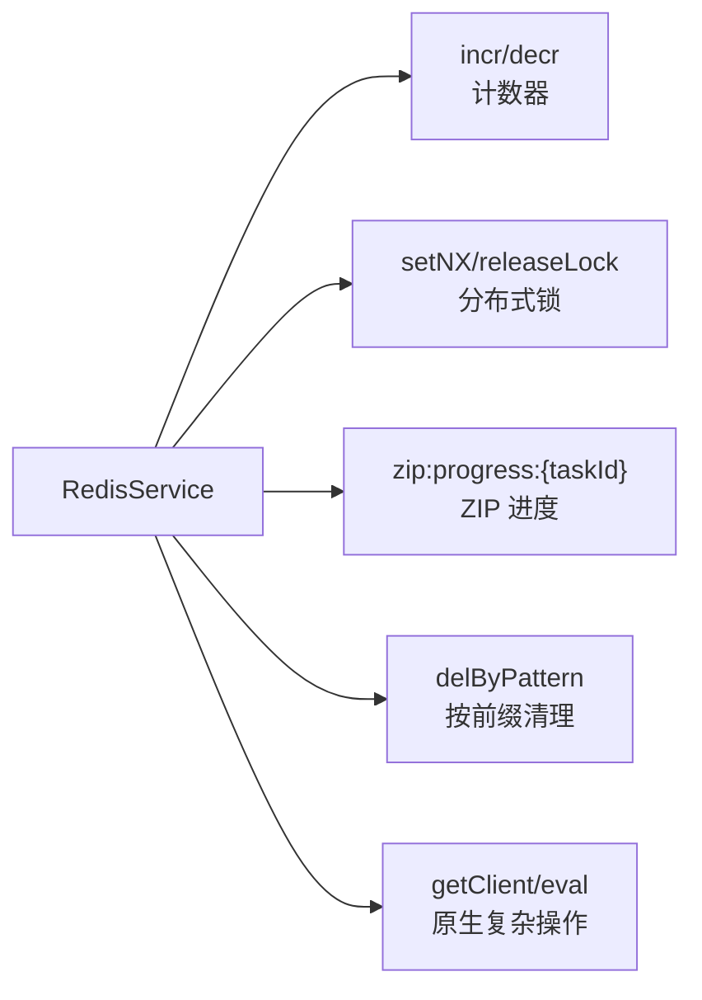

Redis 配置：

- `REDIS_HOST`，默认 `127.0.0.1`
- `REDIS_PORT`，默认 `6379`
- `REDIS_PASSWORD`
- `REDIS_DB`，默认 `0`
- `maxRetriesPerRequest: 3`
- `lazyConnect: true`

当前用途：

- 派单/接单名额计数。
- 分布式锁，避免并发接单或并发状态变更。
- ZIP 上传解析进度，key 前缀为 `zip:progress:`，TTL 约 600 秒。
- 复杂业务可通过原生 Redis client 或 Lua `eval` 完成原子操作。

前端缓存：

- Taro Storage：`token`、`userInfo`、`admin_token`、`admin_info`、草稿、暗色模式、引导状态、订单 dismiss 状态等。
- `Network` 内部有 inflight request 去重 map，用于同 key 请求复用 Promise。

内存缓存：

- `AuthService` 验证码缓存：手机号 -> code / expiresAt。
- `AuthService` 微信 access_token 缓存。
- 频控 map：IP/手机号验证码、登录频率。

## 11. 日志与错误处理

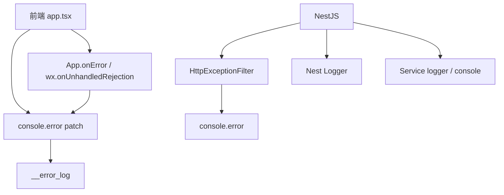

前端日志：

- `src/app.tsx` 重写 `console.error`，把错误追加到 Taro Storage 的 `__error_log`。
- `App.onError` 捕获 Taro App 全局错误。
- 微信环境尝试监听 `wx.onUnhandledRejection`。

后端日志：

- `main.ts` Nest logger 使用 `['error', 'warn', 'log']`。
- `HttpExceptionFilter` 捕获 HTTP 异常和未处理异常，输出 path、method、status、message、stack。
- `RedisService`、`UploadService` 等使用 Nest `Logger`。
- 许多历史模块仍使用 `console.error`。

日志注意：

- 网络层已刻意避免输出敏感请求日志。
- 禁止在日志中输出 token、手机号完整明文、支付密钥、证书、微信 secret、外部 API key。
- 上传日志中会截断 URL 前缀，避免过长日志，但仍应避免记录临时凭证。

## 12. 文件上传与资源存储

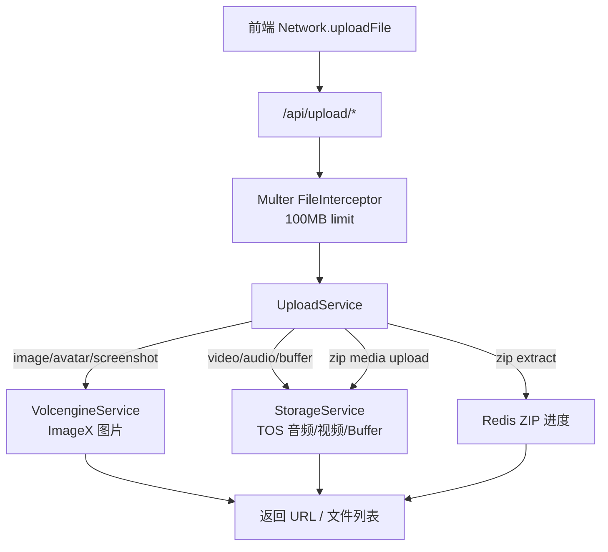

上传接口：

- `POST /api/upload/order-screenshot`
- `POST /api/upload/avatar-image`
- `POST /api/upload/image`
- `POST /api/upload/audio`
- `POST /api/upload/video`
- `POST /api/upload/zip`
- `GET /api/upload/zip-progress/:taskId`
- `POST /api/upload`

上传约束：

- Controller 层 Multer 限制单文件 100MB。
- 图片扩展：`.jpg`, `.jpeg`, `.png`, `.gif`, `.webp`, `.bmp`, `.svg`。
- 视频扩展：`.mp4`, `.mov`, `.avi`, `.mkv`, `.webm`, `.flv`, `.wmv`, `.3gp`。
- ZIP 会跳过目录、隐藏文件、`__MACOSX` 等无效条目。
- ZIP 进度包含 `extracting`、`uploading`、`completed`、`failed`。

资源规范：

- 新增业务图片/视频必须使用 TOS/ImageX 返回 URL。
- 禁止新增占位图服务 URL、`example.com`、虚构路径。
- TabBar 图标是微信小程序例外，可本地 PNG。

## 13. 接口分组

| 分组 | 路由 |
| --- | --- |
| 基础 | `GET /api/hello`, `GET /api/health` |
| 认证 | `/api/auth/*`, `/api/sms/*` |
| 用户 | `/api/user/*`, `/api/user-stats/*` |
| 分身 | `/api/avatar/*`, `/api/avatar-agent/*` |
| 聊天 | `/api/chat/*` |
| 订单 | `/api/order/*`, `/api/order-dispatch/*`, `/api/order-processing/*`, `/api/order-results/*`, `/api/order-assets/*` |
| 内容生成 | `/api/content-generation/*`, `/api/ai/*`, `/api/ai-skill/*` |
| AI 媒体 | `/api/image-gen/*`, `/api/video-gen/*`, `/api/vision/*`, `/api/asr/*`, `/api/audio/*`, `/api/voice-clone/*`, `/api/palm-reading/*` |
| 上传存储 | `/api/upload/*`, `/api/media/*` |
| 支付与权益 | `/api/payment/*`, `/api/coin/*`, `/api/subscription/*` |
| 收益提现 | `/api/earnings/*`, `/api/withdraw/*` |
| 社交通知 | `/api/social/*`, `/api/notifications/*` |
| 推广活动 | `/api/referral/*`, `/api/activities/*` |
| 技能与 Agent | `/api/skills/*`, `/api/agent/*`, `/api/analyze/*` |
| 后台 | `/api/admin/*`, `/api/dashboard/*`, `/api/menu-feature/*` |
| 外部平台辅助 | `/api/tikhub/*`, `/api/group-bot/*` |

注意：

- `AppModule` 当前注册的模块决定接口是否实际生效。
- 仓库中存在未注册或疑似历史模块，例如 `group-bot`、`post`、`earning`/`earnings` 重叠，需要改动前核实。

## 14. 部署与运行架构

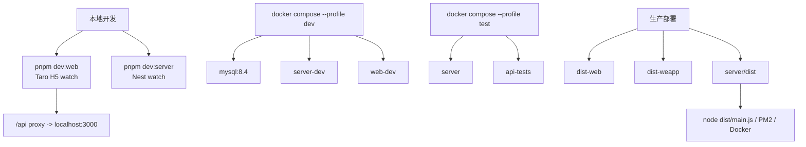

常用命令：

```bash
pnpm dev
pnpm dev:web
pnpm dev:server
pnpm build:web
pnpm build:weapp
pnpm build:server
pnpm validate
pnpm test:smoke
pnpm test:api:regression
pnpm test:docker
pnpm release:check
```

## 15. 架构风险与改造建议

高风险点：

- 数据访问层 SQL 分散，`getMySQLClient().query()` 使用形态不统一。
- MySQL、Drizzle/PostgreSQL、Supabase 兼容代码共存，事实源容易混淆。
- 鉴权缺少统一 Guard，用户身份来源分散。
- 订单状态字段跨前端页面、后端服务、后台、收益、通知，多处耦合。
- 资金链路涉及余额、冻结余额、交易记录、佣金、微信支付/转账，必须保持事务一致。
- 上传资源规范与历史占位 URL 共存，新增时容易复制错误示例。
- 部分中文注释或历史文档存在编码错乱，不能单靠注释判断业务。

建议：

- 为订单状态机建立统一枚举、状态迁移表和回归用例。
- 为资金链路建立统一交易服务，所有余额变动都落交易记录。
- 把管理员鉴权抽成 Nest Guard，把普通用户鉴权抽成统一装饰器/工具。
- 为高频表访问建立 Repository/DAO，减少散落 SQL。
- 明确当前数据库基线，标记历史 schema，避免误用。
- 上传、AI 生成、外部发布统一返回 TOS/ImageX URL，不再引入本地业务资源。
- 每次架构变动同步更新 `PROJECT.md` 和本文件。
