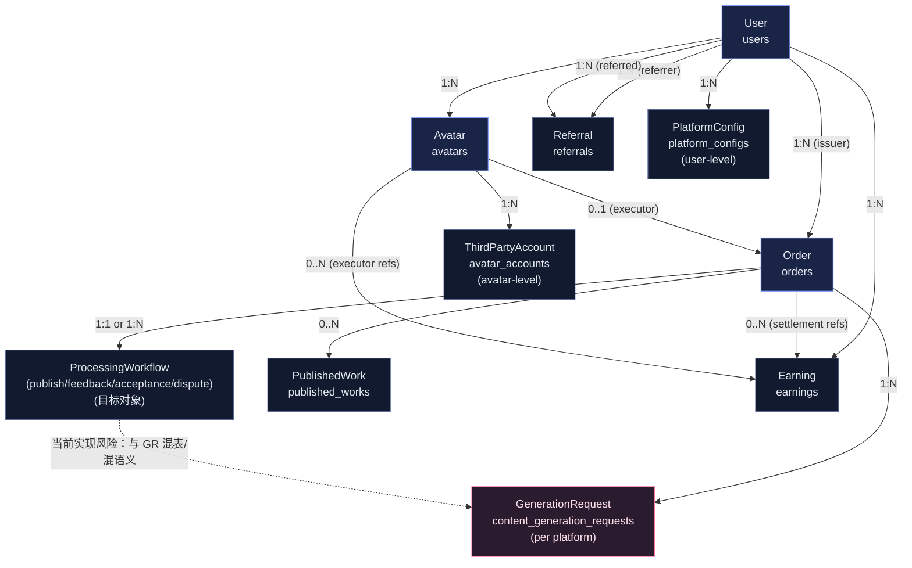
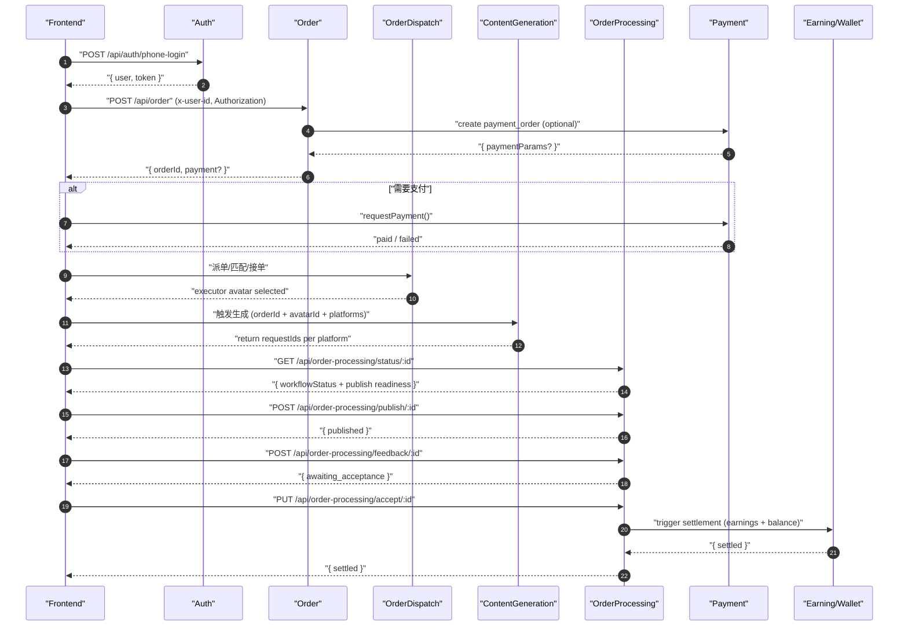
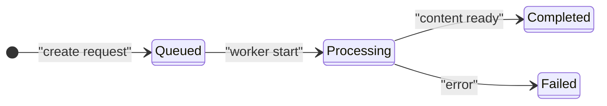
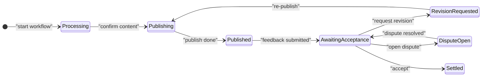

# ARCH-002 账号与核心链路产品化建模（领域模型 / 主链时序 / 状态机 / 治理 Backlog）

## Premise / Constraints / Boundaries / Endgame
- Premise（现状）
  - 账号主实体为 `users`；“分身”作为业务执行主体为 `avatars`（user 1:N avatar）。
  - 核心交易主链围绕：下单（orders）→ 内容生成（content_generation_requests）→ 发布与反馈（order-processing）→ 验收 → 结算（earnings/balance）。
  - 增长侧围绕邀请码与邀请关系（referrals）与奖励（earnings）。
- Constraints（约束）
  - 前端 Network 已统一注入 `Authorization` 与 `X-User-Id`；后端多处接口直接依赖 `x-user-id`。
  - 当前数据库与代码存在“同一张表承载两类语义对象”的情况，需要治理但必须兼容现有线上链路。
- Boundaries（边界）
  - 本文档仅定义“产品化业务建模的标准口径”，以及与账号系统的关联规则；不展开 UI/运营策略/模型提示词。
- Endgame（终局）
  - 明确“身份模型 + 主体(Actor)模型 + 关键业务对象边界 + 状态机口径 + 账号绑定生命周期”，使主链可治理、可扩展、可审计。

## 1. 核心术语（统一口径）
- Identity（身份）
  - "User"：登录账号主体，对应 `users.id`。
  - "Token"：用户认证凭证，应由服务端验证并解析出 userId。
- Actor（业务行为主体）
  - "IssuerUser"：发单用户（需求方），等同 "User" 但在订单语境中强调角色。
  - "ExecutorAvatar"：接单执行主体，对应 `avatars.id`。
  - "ExecutorUser"：执行分身所属用户，对应 `avatars.user_id`。
- Work（工作产物）
  - "GenerationRequest"：一次“按平台生成”的内容生成请求（per platform），与订单为 1:N。
  - "ProcessingWorkflow"：围绕“发布/反馈/验收/争议”的订单处理工作流（跨平台聚合），与订单为 1:1 或 1:N（按业务选择）。
  - "PublishedWork"：已发布作品的存档（链接、截图、平台信息等）。

## 2. 账号系统与核心模块关联总览（产品化视角）
### 2.1 账号主线
- 注册/登录：`users` 创建与 token 生成（Auth）。
- 用户资料：`users` 基础信息（User）。
- 用户资产：余额与收益：`users.balance/total_earnings` 与 `earnings`（Earning）。
- 增长关系：邀请人/被邀请人：`referrals.referrer_id/referred_id`（Referral）。

### 2.2 业务主体主线
- "User" 拥有多个 "Avatar"：`avatars.user_id -> users.id`。
- "Avatar" 可能绑定多个 "ThirdPartyAccount"：`avatar_accounts.avatar_id -> avatars.id`。
- "User" 可能配置多个 "PlatformConfig"（凭证/配置）：`platform_configs.user_id -> users.id`。

## 3. 核心领域模型图（产品化对象边界）

### 3.1 当前实现对照（用于治理落地）
- "User"：`users`
- "Avatar"：`avatars`
- "Order"：`orders`
- "GenerationRequest"：当前写入点至少两类
  - 内容生成模块写入（每平台一条，可能缺失 `user_id`）：[content-generation.service.ts](file:///Users/aiden/Projects/morena/server/src/modules/content-generation/content-generation.service.ts#L73-L113)
  - 订单处理模块写入（承载 workflow 语义，包含 `user_id/config/publish_status/publish_feedback` 等）：[order-processing.service.ts](file:///Users/aiden/Projects/morena/server/src/modules/order-processing/order-processing.service.ts#L330-L371)
- "ProcessingWorkflow"：目标产品对象，但当前主要落在 `content_generation_requests` 的扩展字段上（需要治理拆分或语义分区）
- "ThirdPartyAccount"：`avatar_accounts`（分身在平台的账号档案）
- "PlatformConfig"：`platform_configs`（用户级配置/凭证容器）

## 4. 主链时序图（下单→生成→发布→反馈→验收→结算）

## 5. 状态机定义（产品化标准口径）
### 5.1 订单状态机（Order）

```mermaid
%%{init: {'theme': 'base', 'themeVariables': { 'background': '#0B1020', 'primaryColor': '#111A2E', 'primaryTextColor': '#E6E9F2', 'primaryBorderColor': '#2C3757', 'lineColor': '#5C6B9A', 'fontFamily': 'ui-monospace, SFMono-Regular, Menlo, Monaco, Consolas, "Liberation Mono", "Courier New", monospace'}}}%%
stateDiagram-v2
  direction LR
  classDef s fill:#111A2E,stroke:#5C6B9A,color:#E6E9F2
  classDef t fill:#192447,stroke:#8AA4FF,color:#E6E9F2
  classDef f fill:#2B1B2E,stroke:#FF7AA2,color:#FFE3EC

  state "Created" as Created:::s
  state "PendingPayment" as PendingPayment:::s
  state "Paid" as Paid:::t
  state "Dispatching" as Dispatching:::s
  state "Processing" as Processing:::s
  state "Publishing" as Publishing:::s
  state "AwaitingAcceptance" as AwaitingAcceptance:::s
  state "Settled" as Settled:::t
  state "Cancelled" as Cancelled:::f
  state "Expired" as Expired:::f

  [*] --> Created: "create order"
  Created --> PendingPayment: "need payment"
  PendingPayment --> Paid: "pay success"
  Created --> Paid: "free order"

  Paid --> Dispatching: "start matching"
  Dispatching --> Processing: "executor assigned"
  Processing --> Publishing: "generation confirmed"
  Publishing --> AwaitingAcceptance: "publish feedback submitted"
  AwaitingAcceptance --> Settled: "accept"

  Created --> Cancelled: "cancel"
  PendingPayment --> Cancelled: "cancel"
  Paid --> Cancelled: "cancel policy"
  Dispatching --> Expired: "timeout"
```

### 5.2 生成请求状态机（GenerationRequest，per platform）

### 5.3 发布与验收工作流（ProcessingWorkflow，跨平台聚合）

## 6. 账号绑定产品模型（PlatformConfig vs ThirdPartyAccount）
### 6.1 设计原则（产品化）
- "PlatformConfig"（user-level）解决“如何发/如何接入/凭证如何管理”的问题，归属 User。
- "ThirdPartyAccount"（avatar-level）解决“在哪个账号发/账号表现数据/账号档案”的问题，归属 Avatar。
- "Avatar 发布到某平台" 必须可解释为：
  - "ExecutorAvatar" 在该平台存在或可创建绑定的 "ThirdPartyAccount"；
  - 且 "ExecutorUser" 对应平台存在可用的 "PlatformConfig"（凭证有效）。

### 6.2 生命周期（建议口径）
- BindingStatus：`unbound | bound | invalid | refresh_required`
- 关键约束：任何发布动作必须同时满足
  - "bindingStatus == bound"
  - "configStatus == active"

## 7. 治理 Backlog（P0 / P1 / P2）
### P0（阻塞主线可治理/可审计）
- "服务端身份闭环"
  - 目标：后端不再信任 `x-user-id` 作为唯一身份来源；以 token 解析出的 userId 为准，并校验 header 一致性（如保留兼容）。
  - 验收：任意接口在缺 token 或 token 无效时无法通过仅伪造 `x-user-id` 访问他人数据。
- "明确 GenerationRequest 与 ProcessingWorkflow 对象边界"
  - 目标：`content_generation_requests` 仅表达 "GenerationRequest"（per platform），或通过明确字段区分两类记录并保证 `user_id`/归属一致。
  - 验收：同一订单下可稳定查询到“生成请求列表（平台维度）”与“工作流状态（聚合维度）”，且统计/权限不依赖猜测字段。
- "Actor 模型固化（禁止 userId 兜底充当 avatarId）"
  - 目标：订单执行侧必须显式传入 `executor_avatar_id`；服务端从 avatar 反查 executor_user_id。
  - 验收：`acceptOrder` 等执行侧接口不再接受 `avatarId || userId` 的混用参数。

### P1（提升产品化一致性与可扩展）
- "状态机口径统一"
  - 目标：Order / GenerationRequest / Workflow 三套状态有明确边界与映射关系，避免“completed 既是预览又是终态”的语义冲突。
  - 验收：前端时间线、后台统计与结算触发的条件一致且可测试。
- "账号绑定生命周期产品化"
  - 目标：在接口层输出 bindingStatus/configStatus，前端无需通过零散字段推断“是否需要绑定/是否可发布”。
  - 验收：发布引导页能稳定显示“可发布/需绑定/绑定失效/需刷新”四态，并且与服务端校验一致。

### P2（完善体验与运营可观测）
- "全链路可观测字段"
  - 目标：为订单/生成/发布/验收/结算补齐统一 traceId 与关键时间戳（create/pay/assign/generate/publish/feedback/accept/settle）。
  - 验收：可按订单维度输出一条完整时间线并用于排障与报表。
- "增长与交易归因"
  - 目标：Referral 奖励与订单收益形成统一资金流水口径（同一 earnings schema，区分 source）。
  - 验收：用户账单可按来源拆分（邀请奖励/订单收益/退款扣减等）。

## 8. 当前代码热点（用于快速定位治理切入点）
- 订单接口使用 `x-user-id`： [order.controller.ts](file:///Users/aiden/Projects/morena/server/src/modules/order/order.controller.ts)
- 生成请求写入（可能缺 user_id）：[content-generation.service.ts](file:///Users/aiden/Projects/morena/server/src/modules/content-generation/content-generation.service.ts#L73-L113)
- 工作流记录 normalize（承载 publish/feedback 状态）：[order-processing.service.ts](file:///Users/aiden/Projects/morena/server/src/modules/order-processing/order-processing.service.ts#L330-L371)

