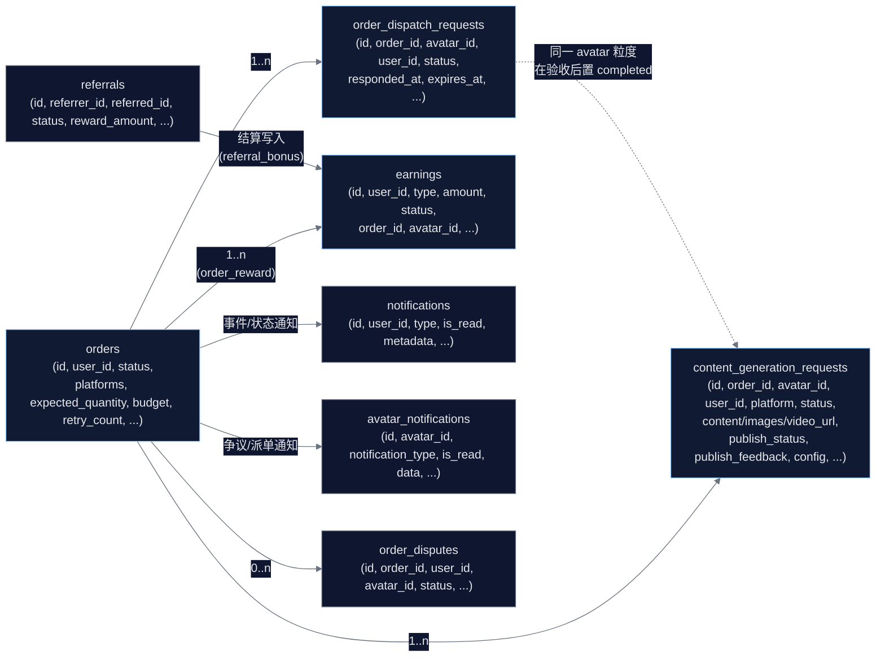
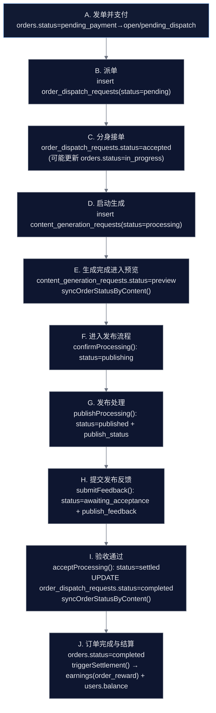
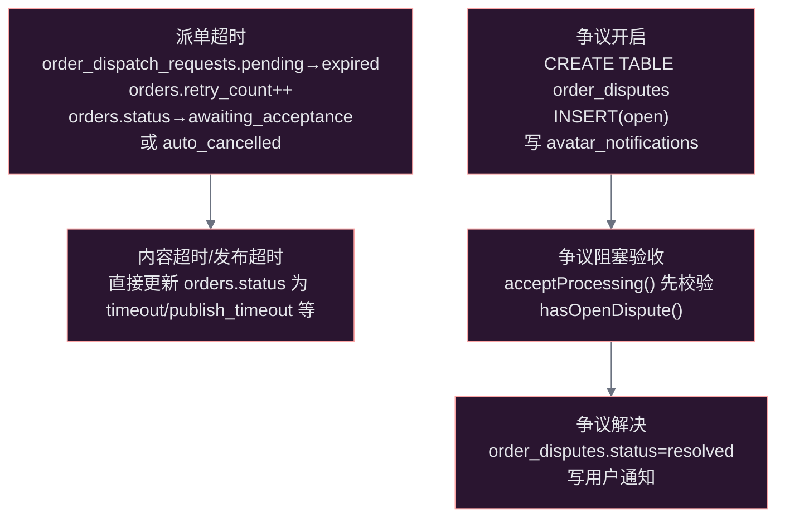
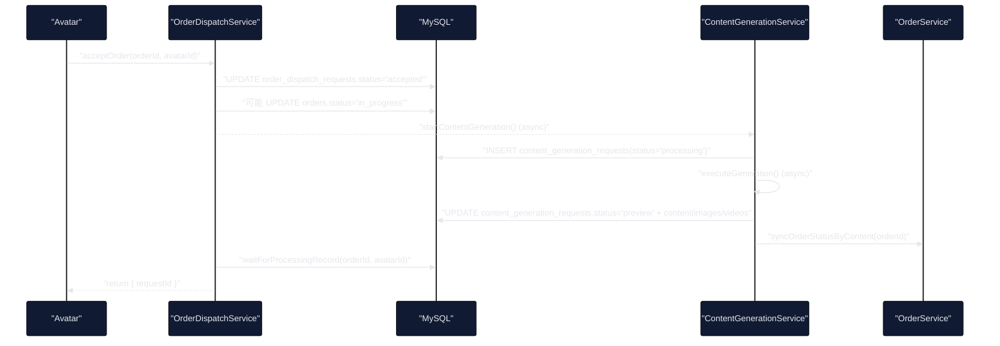
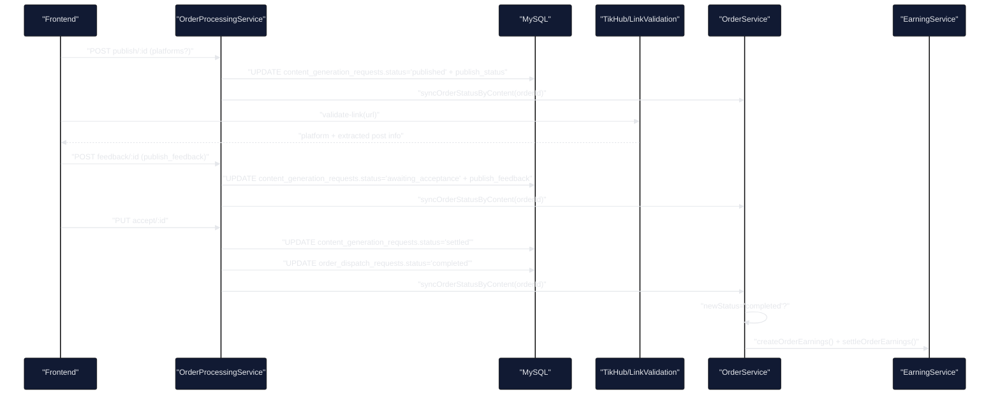
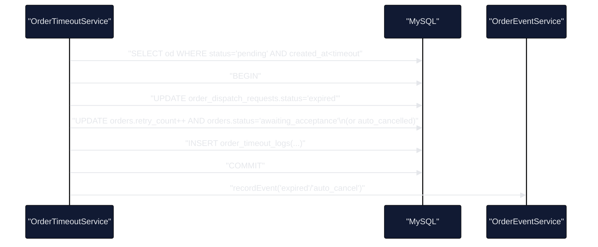

# ARCH-003 订单发布域业务流与数据链路审计

## Premise / Constraints / Boundaries / Endgame

- Premise：发布域要把“订单 → 派单/接单 → 内容生成（预览）→ 多平台发布 → 提交发布凭证/数据 → 验收 → 结算入账”收敛为可复用主链，并保证状态、平台键、数据模型一致可追溯。
- Constraints：
  - 前端：Taro 小程序/H5，网络请求必须使用 `Network`，平台词表定义于 `src/constants/publish-platform.ts`。
  - 后端：NestJS，自研 MySQL Client；主数据表为 `orders` / `order_dispatch_requests` / `content_generation_requests`。
  - 状态机与平台 canonical key 在产品文档中已有冻结口径（见引用）。
- Boundaries：本审计覆盖“订单发布域 + 上下游链路（派单、内容生成、验收结算、通知、争议、超时）”，不覆盖支付/发单策略/技能生成质量本身。
- Endgame：
  - 单一平台 canonical 真源；多平台分桶的 publishStatus/publishFeedback 结构一致。
  - 动态变更（状态推进、超时补偿、验收结算）触发点完整，时序正确，且不会出现“状态已完成但证据缺失/结算不一致”。

## 引用文档（期望口径）

- 发布域通用模型与状态机：[PRD-发布能力全平台通用模型.md](file:///Users/aiden/Projects/morena/docs/PRD-发布能力全平台通用模型.md)
- 订单发布增长主链梳理与历史问题修复记录：[产品逻辑梳理-分身订单发布增长.md](file:///Users/aiden/Projects/morena/docs/产品逻辑梳理-分身订单发布增长.md)
- 内测验收清单（阻断/严重/优化）：[acceptance-checklist.md](file:///Users/aiden/Projects/morena/docs/internal-test/acceptance-checklist.md)

## 术语与口径（以代码现状为准）

- 订单主状态（`orders.status`）：面向发单方与系统聚合展示的主状态。
- 派单状态（`order_dispatch_requests.status`）：面向“分身是否接单/是否完成”的履约参与者状态。
- 履约/发布状态（`content_generation_requests.status`）：面向“内容生成/预览/发布/反馈/验收”的子状态。
- 发布状态（`content_generation_requests.publish_status`）：多平台维度的发布结果结构化分桶。
- 发布反馈（`content_generation_requests.publish_feedback`）：多平台维度的凭证/指标/验证结果分桶。

## 核心模块边界与职责

### 后端模块（写入点与职责）

- 订单聚合与结算：`OrderService`
  - 聚合订单主状态：`syncOrderStatusByContent()`（[order.service.ts](file:///Users/aiden/Projects/morena/server/src/modules/order/order.service.ts#L69-L150)）
  - 订单达成后触发结算：`triggerSettlement()`（[order.service.ts](file:///Users/aiden/Projects/morena/server/src/modules/order/order.service.ts#L1032-L1059)）
- 派单/接单编排：`OrderDispatchService`
  - 派单：`dispatchOrder()` / `dispatchToAllAvatars()`（[order-dispatch.service.ts](file:///Users/aiden/Projects/morena/server/src/modules/order-dispatch/order-dispatch.service.ts#L394-L660)）
  - 接单：`acceptOrder()`（接单后自动启动内容生成）（[order-dispatch.service.ts](file:///Users/aiden/Projects/morena/server/src/modules/order-dispatch/order-dispatch.service.ts#L663-L849)）
- 内容生成：`ContentGenerationService`
  - 创建生成请求：`generateContent()`（写入 `content_generation_requests(status=processing)`）（[content-generation.service.ts](file:///Users/aiden/Projects/morena/server/src/modules/content-generation/content-generation.service.ts#L132-L214)）
  - 生成结束：`updateStatus(..., 'preview', ...)` 并同步订单状态（[content-generation.service.ts](file:///Users/aiden/Projects/morena/server/src/modules/content-generation/content-generation.service.ts#L353-L367)）
- 发布/反馈/验收：`OrderProcessingService`
  - 进入发布流程：`confirmProcessing(status=publishing)`（[order-processing.service.ts](file:///Users/aiden/Projects/morena/server/src/modules/order-processing/order-processing.service.ts#L486-L498)）
  - 发布处理：`publishProcessing(status=published + publish_status)`（当前实现写死 success）（[order-processing.service.ts](file:///Users/aiden/Projects/morena/server/src/modules/order-processing/order-processing.service.ts#L500-L543)）
  - 提交反馈：`submitFeedback(status=awaiting_acceptance + publish_feedback)`（[order-processing.service.ts](file:///Users/aiden/Projects/morena/server/src/modules/order-processing/order-processing.service.ts#L546-L565)）
  - 验收通过：`acceptProcessing(status=settled)` 并将对应派单记录置 `completed`，再触发订单聚合（[order-processing.service.ts](file:///Users/aiden/Projects/morena/server/src/modules/order-processing/order-processing.service.ts#L624-L653)）
  - 争议：运行时建表 `order_disputes`，阻塞验收（[order-processing.service.ts](file:///Users/aiden/Projects/morena/server/src/modules/order-processing/order-processing.service.ts#L23-L56)）
- 超时补偿：`OrderTimeoutService`
  - 派单超时、内容超时、发布超时：直接更新 `order_dispatch_requests` / `orders` 并写 `order_timeout_logs`（[order-timeout.service.ts](file:///Users/aiden/Projects/morena/server/src/modules/order-dispatch/order-timeout.service.ts#L104-L205)）
- 链接校验：`TikHubService` 与 `LinkValidationService`
  - 发布链接验证（平台识别/信息抽取）：[tikhub.service.ts](file:///Users/aiden/Projects/morena/server/src/modules/tikhub/tikhub.service.ts#L226-L299)
- 收益：`EarningService`
  - 订单收益创建：`createOrderEarnings()`（[earning.service.ts](file:///Users/aiden/Projects/morena/server/src/modules/earning/earning.service.ts#L125-L158)）
  - 订单收益结算：`settleOrderEarnings()`（将 earnings.status 从 pending 改为 settled，并更新用户余额）（[earning.service.ts](file:///Users/aiden/Projects/morena/server/src/modules/earning/earning.service.ts#L160-L178)）
- 增长邀请：`ReferralService`
  - 使用邀请码：写 `referrals(status=pending)`（[referral.service.ts](file:///Users/aiden/Projects/morena/server/src/modules/referral/referral.service.ts#L56-L101)）
  - 首次创建分身后结算邀请奖励：写 `earnings(type=referral_bonus, status=completed)` 并更新余额（[referral.service.ts](file:///Users/aiden/Projects/morena/server/src/modules/referral/referral.service.ts#L131-L178)）

### 前端页面（关键入口）

- 发布引导页（触发 publish）：[order-publish-guide/index.tsx](file:///Users/aiden/Projects/morena/src/package-order/pages/order-publish-guide/index.tsx)
- 发布反馈页（提交凭证 + 校验）：[order-publish-feedback/index.tsx](file:///Users/aiden/Projects/morena/src/package-order/pages/order-publish-feedback/index.tsx)
- 平台词表与别名映射（canonical 真源之一）：[publish-platform.ts](file:///Users/aiden/Projects/morena/src/constants/publish-platform.ts)

## 核心模型与关联关系（数据链路）

### 主数据表（Schema）

- `orders`：订单主记录（预算、期望分身数 expected_quantity、平台 platforms、主状态 status 等）
  - schema: [order_tables.sql](file:///Users/aiden/Projects/morena/server/src/storage/database/schema/order_tables.sql#L1-L33)
- `order_dispatch_requests`：派单记录（每个订单对应多条，按分身粒度）
  - schema: [order_tables.sql](file:///Users/aiden/Projects/morena/server/src/storage/database/schema/order_tables.sql#L34-L48)
- `content_generation_requests`：内容生成与发布履约记录（按订单 + 分身 + 平台维度可多条）
  - schema: [order_tables.sql](file:///Users/aiden/Projects/morena/server/src/storage/database/schema/order_tables.sql#L50-L70)
- `earnings`：收益记录（订单收益 `order_reward`、邀请奖励 `referral_bonus`）
  - schema: [order_tables.sql](file:///Users/aiden/Projects/morena/server/src/storage/database/schema/order_tables.sql#L88-L105)
- `referrals`：邀请关系（pending/completed）
  - 项目规则表结构定义见工作区规则；代码按 `referrer_id/referred_id` 写入。
- `notifications` / `avatar_notifications`：用户通知与分身通知
  - `notifications` schema: [mysql-schema.sql](file:///Users/aiden/Projects/morena/mysql-schema.sql#L273-L286)
  - `avatar_notifications` schema: [order_tables.sql](file:///Users/aiden/Projects/morena/server/src/storage/database/schema/order_tables.sql#L137-L150)
- `order_disputes`：订单争议表（运行时 `CREATE TABLE IF NOT EXISTS` 创建，不在 schema 文件中）
  - 创建与字段定义：[order-processing.service.ts](file:///Users/aiden/Projects/morena/server/src/modules/order-processing/order-processing.service.ts#L23-L45)

### 关系图（ER 近似）

## 状态机与平台口径（Single Source of Truth 对比）

### 规范化函数（代码中存在多处“真源”）

- 建议的统一真源：`server/src/modules/order/order-status.ts`
  - `normalizeDispatchStatus()` / `normalizeFulfillmentStatus()` / `deriveOrderStatusFromWorkflowDetailed()`（[order-status.ts](file:///Users/aiden/Projects/morena/server/src/modules/order/order-status.ts#L49-L155)）
- 现状存在重复实现：
  - `OrderProcessingService.normalizeWorkflowStatus()`（[order-processing.service.ts](file:///Users/aiden/Projects/morena/server/src/modules/order-processing/order-processing.service.ts#L202-L213)）
  - `OrderService.normalizeContentStatus()`（[order.service.ts](file:///Users/aiden/Projects/morena/server/src/modules/order/order.service.ts#L59-L67)）

### 平台 canonical key 与别名映射（前后端冲突点）

- 前端 alias 映射：`wechat -> wechat_mp`（[publish-platform.ts](file:///Users/aiden/Projects/morena/src/constants/publish-platform.ts#L37-L54)）
- 后端 alias 映射：`wechat -> wechat_channel`（[order-processing.service.ts](file:///Users/aiden/Projects/morena/server/src/modules/order-processing/order-processing.service.ts#L166-L187)）
- 派单侧还有隐式映射：`general -> wechat`（[order-dispatch.service.ts](file:///Users/aiden/Projects/morena/server/src/modules/order-dispatch/order-dispatch.service.ts#L930-L932)）

结论：平台键目前没有单一真源，且存在“同一别名落到不同 canonical”的确定性风险。

## 端到端业务流（业务流 + 数据写入点）

### 主链路（Happy Path）

### 动态变更（补偿/争议/超时）扩展链路

## 关键时序审计（动态变更是否完整、时序是否正确）

### S1：接单后自动生成（派单 → 生成记录 → 返回 requestId）

审计结论（时序风险）：

- `acceptOrder()` 返回 requestId 依赖 `waitForProcessingRecord()` 轮询 DB（最多 5 次 * 150ms），若生成记录写入慢，可能返回空 requestId（[order-dispatch.service.ts](file:///Users/aiden/Projects/morena/server/src/modules/order-dispatch/order-dispatch.service.ts#L851-L873)）。
- `startContentGeneration()` 中把 `orders.platforms` 默认 `['wechat']`，并将 `general -> wechat`（[order-dispatch.service.ts](file:///Users/aiden/Projects/morena/server/src/modules/order-dispatch/order-dispatch.service.ts#L930-L932)），平台别名语义不清会传导到 `content_generation_requests.platform`。

### S2：发布与反馈（发布状态、反馈证据、验收结算的闭环）

审计结论（闭环完整性风险）：

- `publishProcessing()` 当前实现会直接将每个平台写成 `success/发布成功`，缺失真实发布动作或失败分支（[order-processing.service.ts](file:///Users/aiden/Projects/morena/server/src/modules/order-processing/order-processing.service.ts#L500-L543)）。这会导致“未提交任何凭证也进入 published”，进而影响订单聚合进入 `submitted/awaiting_acceptance` 的判断。
- `submitFeedback()` 只做 JSON 合并与状态推进，未验证 publish_feedback 的完整性（例如链接/截图是否必填、是否与 publish_status.platforms 对齐）（[order-processing.service.ts](file:///Users/aiden/Projects/morena/server/src/modules/order-processing/order-processing.service.ts#L546-L565)）。
- 结算触发依赖 `orders.status` 被推到 `completed`，而 `orders.status` 的推进依赖派单完成数与履约状态组合逻辑（[order.service.ts](file:///Users/aiden/Projects/morena/server/src/modules/order/order.service.ts#L69-L150)）。若 `order_dispatch_requests` 未被置为 completed 或 expected_quantity 口径不一致，会导致“已验收但不结算”或“误结算”。

### S3：派单超时补偿（状态机覆盖是否完整、是否绕过了单一真源）

审计结论（时序与口径风险）：

- 超时服务直接写 `orders.status`（例如 `awaiting_acceptance`、`auto_cancelled`），绕过 `OrderService.statusTransitions` 校验与通知编排（[order-timeout.service.ts](file:///Users/aiden/Projects/morena/server/src/modules/order-dispatch/order-timeout.service.ts#L104-L205)；[order.service.ts](file:///Users/aiden/Projects/morena/server/src/modules/order/order.service.ts#L152-L169)）。
- 超时服务使用的状态值包含 `auto_cancelled/publish_timeout` 等，而 `order-status.ts` 的 `OrderStatus` 联合类型未覆盖这些值（[order-status.ts](file:///Users/aiden/Projects/morena/server/src/modules/order/order-status.ts#L14-L26)），会导致“类型口径与数据库真实值分裂”，前端/统计/管理端容易漏分支。

## 关键问题清单（按影响排序）

### P0（阻断一致性/结算风险）

- 平台 alias → canonical 映射前后端冲突：`wechat` 在前端归为 `wechat_mp`，在后端归为 `wechat_channel`，派单侧还可能产生 `wechat` 原始值；会导致 publishStatus/publishFeedback 分桶错位与验收口径不一致。
  - 前端：[publish-platform.ts](file:///Users/aiden/Projects/morena/src/constants/publish-platform.ts#L37-L54)
  - 后端：[order-processing.service.ts](file:///Users/aiden/Projects/morena/server/src/modules/order-processing/order-processing.service.ts#L166-L187)
- 发布处理“写死成功”：`publishProcessing()` 将平台发布结果强制 success，不与证据/校验联动，容易形成“状态已发布但没有凭证”的假完成。
  - [order-processing.service.ts](file:///Users/aiden/Projects/morena/server/src/modules/order-processing/order-processing.service.ts#L500-L543)
- 状态机真源分裂：`order-status.ts` 存在统一推导器，但 `OrderService.syncOrderStatusByContent()` 自己实现了一套归一与推导，`OrderProcessingService` 又实现另一套归一，动态补偿服务又绕开推导直接写库。
  - 统一推导器：[order-status.ts](file:///Users/aiden/Projects/morena/server/src/modules/order/order-status.ts#L49-L155)
  - 聚合推进：[order.service.ts](file:///Users/aiden/Projects/morena/server/src/modules/order/order.service.ts#L69-L150)
  - 发布推进：[order-processing.service.ts](file:///Users/aiden/Projects/morena/server/src/modules/order-processing/order-processing.service.ts#L202-L213)
  - 超时绕开：[order-timeout.service.ts](file:///Users/aiden/Projects/morena/server/src/modules/order-dispatch/order-timeout.service.ts#L104-L205)

### P1（链路不完整/体验与运营风险）

- 接单后返回 requestId 依赖轮询 DB，可能返回空 requestId，前端跳转/后续动作丢锚点。
- 发布反馈缺少后端校验规则：缺少“平台集合对齐、链接/截图必填、manual_pending 与人工核验入口”的统一策略，导致验收端承担风险。
- 争议表为运行时建表：生产库 schema 演进不透明，迁移/备份/审计成本高，且未纳入 schema 文件。
- 通知与状态字典不一致：`notifyStatusChange()` 有 `content_generated/published/publish_failed` 等文案映射，但主状态机中未必存在这些状态，容易出现“通知正确但状态不可达/不可推导”。
  - [order.service.ts](file:///Users/aiden/Projects/morena/server/src/modules/order/order.service.ts#L1001-L1030)

### P2（财务口径一致性风险）

- 订单收益状态字典存在分裂：
  - `EarningService.settleOrderEarnings()` 将 `earnings.status` 从 pending 改为 `settled`（[earning.service.ts](file:///Users/aiden/Projects/morena/server/src/modules/earning/earning.service.ts#L160-L178)）
  - `ReferralService` 写入 `earnings.status='completed'`（[referral.service.ts](file:///Users/aiden/Projects/morena/server/src/modules/referral/referral.service.ts#L149-L166)）
  - 结果：同一字段在不同业务线使用不同枚举值，统计/管理端极易漏算或重复算。

## 建议的治理收敛（按“先保口径一致，再补能力”）

### 1）平台 canonical 单一真源（立即）

- 禁止使用歧义 alias：`wechat/general` 必须在入口显式决定 `wechat_mp` 或 `wechat_channel`，并统一落库存储 canonical。
- 将后端 `platformAliasMap` 与前端 `ALIAS_TO_CANONICAL` 对齐，且补齐“输入兼容，但存储只用 canonical”的规则。

### 2）发布状态改为“证据驱动”（立即）

- `publishProcessing()` 不应直接写 success，至少需要区分：
  - `publishing`：等待用户在平台侧发布/生成草稿
  - `published`：平台侧凭证已提交（link/screenshot）且校验通过（auto_verified）或待人工核验（manual_pending）
- 后端在 `submitFeedback()` 时做结构校验：
  - `publish_status.platforms` 与 `publish_feedback` 分桶 key 必须一致
  - 每个平台至少需要 link 或 screenshot（按平台配置可细化）

### 3）状态机真源统一（短期）

- 将订单聚合推进逻辑收敛到 `order-status.ts` 的 `deriveOrderStatusFromWorkflowDetailed()`，减少 `OrderService` 自建推导。
- 超时补偿不要直接写 `orders.status`，改为写“事件/信号”，由统一推导器吸收；至少要在写库后调用一次 `syncOrderStatusByContent()` 并统一通知策略。

### 4）财务枚举统一（短期）

- `earnings.status` 统一枚举：建议仅保留 `pending/settled/rejected`（或 `pending/completed` 二选一），并将 Referral 与 OrderReward 统一写同一套值。

## 附：实现入口与接口清单

- 订单发布域 API（后端 Controller）：[order-processing.controller.ts](file:///Users/aiden/Projects/morena/server/src/modules/order-processing/order-processing.controller.ts)
  - `GET /api/order-processing/status/:id`
  - `POST /api/order-processing/confirm/:id`
  - `POST /api/order-processing/publish/:id`
  - `POST /api/order-processing/feedback/:id`
  - `PUT /api/order-processing/accept/:id`
  - `POST /api/order-processing/dispute/:id`
  - `POST /api/order-processing/validate-link`

