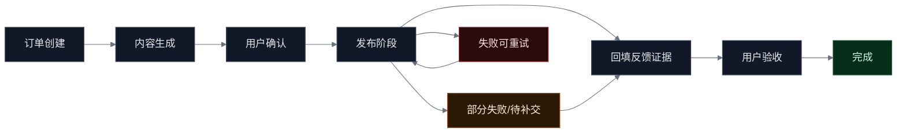
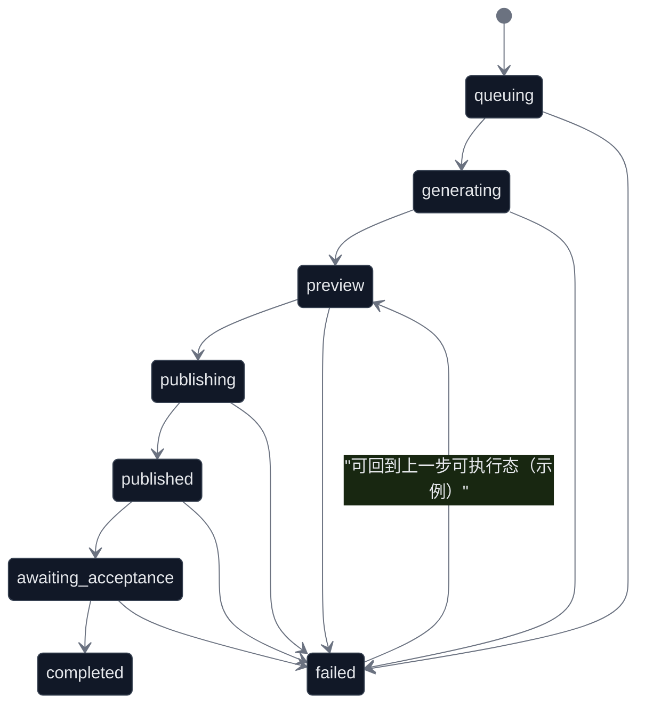

# 发布能力全平台通用模型（PRD）

## 0. 文档信息

- 适用范围：订单驱动的内容生产与平台发布（C 端发单 + 分身执行 + 用户验收）
- 一期验收目标：完成“发布域模型统一 + 多平台可闭环 + 可重试可审计”的可交付版本
- 本文不包含：订单创建/支付结算/分身培养等域的重写；运营后台细节；具体代码实现细节

## 1. Premise / Constraints / Boundaries / Endgame

### Premise（前提）
- 当前系统已具备主链路：`status -> confirm -> publish -> feedback -> accept`。
- 平台能力天然不一致，必须允许自动/半自动/手动混合发布模式。
- 现状存在平台枚举分散、命名不一、策略分裂，导致前后端语义漂移与验收不稳定。

### Constraints（约束）
- 接口兼容性：保持现有主链接口兼容 ` /api/order-processing/* `（字段允许扩展但不可破坏现有调用）。
- 可用性优先：一期以“闭环 + 稳定性 + 可观测性”为硬门槛，不以增长指标作为一期验收门槛。
- 证据合规：反馈凭证必须可被验收方理解与复核（链接/截图等）。

### Boundaries（边界）
- 覆盖发布能力域：平台目标、发布引导、发布状态、反馈凭证、验收聚合。
- 不覆盖：平台自动发布能力的全面接入（仅提供策略容器与最小闭环）。

### Endgame（终局）
- 建立可扩展的“全平台通用发布模型”，新平台接入从“改页面”升级为“配置 + 适配”。
- 任一订单在多平台场景下可追踪、可回退、可验收、可审计；支持部分成功与补交。

## 2. 背景与问题陈述

### 2.1 现状问题
- 平台枚举多源：多个页面/接口各自维护平台列表，存在 `wechat`/`wechat_mp`/`wechat_moments` 等口径不一致。
- 平台策略碎片化：发布模式、是否绑定、最小证据校验散落在页面逻辑，难以扩展与复用。
- 证据标准不统一：同样是“发布完成”，不同平台/页面对链接与截图要求不同，导致验收与追责成本高。
- 多平台订单难闭环：允许部分成功，但缺少统一的平台级状态表达与聚合规则，导致“订单完成”判定不稳定。

### 2.2 一期目标（可验收）
- 统一平台命名：输入可兼容别名，存储与返回统一 canonical key。
- 统一发布域模型：任务、平台目标、内容产物、发布状态、反馈证据、效果指标（一期选填）。
- 统一状态机：任务级 + 平台级均可表达“待确认/发布中/已发布待补证/待验收/已完成/失败可重试”。
- 统一异常策略：未绑定、发布中断、凭证不完整、多平台部分成功等场景有明确规则与提示口径。

### 2.3 非目标（一期不做）
- 不追求所有平台自动发布（只保证手动/半自动流程闭环）。
- 不引入复杂推荐/质量评分/商业化定价策略（留接口与数据结构扩展点）。

## 3. 角色、权限与责任边界

### 3.1 角色定义
- 发单用户：创建订单、确认内容、查看发布进展、验收通过/驳回。
- 执行分身：生成内容、执行发布（自动/手动）、回填反馈证据、补交。
- 测试/运营：复核链路、抽检证据有效性、定位问题（一期以“可观测 + 可回放”为目标，不做后台工具细节）。

### 3.2 责任边界（一期口径）
- 平台发布动作：由分身执行（自动/手动），系统提供引导与最小校验。
- 证据有效性：由发单用户最终验收判定；系统负责“最小证据完整性校验”和“可追溯记录”。
- 争议处理：一期仅提供驳回/补交机制，不做复杂仲裁流程。

## 4. 平台统一口径

### 4.1 Canonical Platform Key（统一平台主键）
- `wechat_mp`：微信公众号
- `wechat_moments`：朋友圈
- `wechat_channel`：视频号
- `douyin`：抖音
- `xiaohongshu`：小红书
- `weibo`：微博
- `bilibili`：B站
- `kuaishou`：快手
- `zhihu`：知乎
- `toutiao`：今日头条

### 4.2 别名兼容映射（输入可接收，存储与返回统一 canonical）
- `wechat` -> `wechat_channel`（默认视频号语义）
- `bili` -> `bilibili`
- `xhs` -> `xiaohongshu`

### 4.3 统一原则
- 所有接口入参/出参：平台均使用 canonical key；仅在输入时做别名兼容。
- 所有平台级数据：以 `platformKey` 作为唯一键，严禁同一订单内出现多种口径混用。

## 5. 通用发布域模型（数据口径）

### 5.1 PublishTask（任务）
- 任务维度：一个订单对应一个或多个发布任务（对应 `requestId`/`taskId`），任务内部可含多个平台目标。
- 字段（一期最小集）
  - `taskId`：任务唯一标识（与主链 requestId 对齐）
  - `orderId`：订单 ID
  - `avatarId`：执行分身 ID
  - `status`：任务状态（见 6）
  - `contentType`：内容类型（`image_text` / `video` / `article` / `mixed`）

### 5.2 PlatformTarget（平台目标）
- 字段（一期最小集）
  - `platformKey`：平台 canonical key
  - `publishMode`：`auto` / `semi_auto` / `manual`
  - `bindingRequired`：是否强依赖账号绑定
  - `requirements`：平台特定要求（如认证、格式、时长、分辨率等；一期可选填结构）

### 5.3 PublishArtifact（内容产物）
- 字段（一期最小集）
  - `title`：标题（可选）
  - `content`：正文（可选）
  - `images[]`：图片 URL 列表（可选）
  - `videos[]`：视频 URL 列表（可选）

### 5.4 PublishEvidence（反馈证据）
- 字段（一期最小集）
  - `link`：发布链接（可选，但与 `screenshots[]` 至少满足一个）
  - `screenshots[]`：截图证据 URL 列表（可选，但与 `link` 至少满足一个）
  - `submitTime`：提交时间
  - `operator`：提交方（`avatar` / `user`）
  - `note`：补充说明（可选）

### 5.5 PublishMetrics（效果指标，一期选填）
- 字段建议：`views`、`likes`、`comments`、`shares`
- 一期策略：默认选填；二期可按平台策略升级为必填/半必填。

## 6. 状态机与聚合规则

### 6.1 任务状态（taskStatus）
- `queuing`：排队中（等待资源/分身接单）
- `generating`：生成中（内容生产中）
- `preview`：待确认（用户可确认/修订）
- `publishing`：发布中（自动发布或进入手动引导阶段）
- `published`：已发布（待补充反馈证据或待验收）
- `awaiting_acceptance`：待验收（反馈已提交，等待用户验收）
- `completed`：已完成（验收通过）
- `failed`：失败（可重试到上一步可执行态）

### 6.2 平台状态（platformStatus）
- 平台状态与任务状态并行存在，用于多平台“部分成功/部分失败/部分待补交”的表达。
- 平台状态最小集（一期建议与任务一致语义）：`pending` / `publishing` / `published` / `awaiting_feedback` / `awaiting_acceptance` / `completed` / `failed`

### 6.3 关键迁移规则（一期硬约束）
- `preview -> publishing`：用户确认内容成功。
- `publishing -> published`：平台发布动作完成（自动发布成功或已完成手动发布步骤确认）。
- `published -> awaiting_acceptance`：该平台反馈证据校验通过并写入。
- `awaiting_acceptance -> completed`：用户验收通过。
- 任意中间态 -> `failed`：记录原因与可重试点；重试不得覆盖已有效证据（见 8.3）。

### 6.4 聚合规则（订单级 completed 判定）
- 订单下所有任务均为 `completed` 时，订单状态同步为 `completed`。
- 多平台任务内：允许 A 平台已完成、B 平台失败或待补交；订单不因部分失败直接完成。
- 允许平台级补交：平台完成后不影响其他平台状态与证据。

### 6.5 流程可视化





## 7. 平台策略矩阵（一期）

| 平台 | canonical key | 发布模式 | 是否需绑定 | 支持内容 | 最小反馈凭证 |
|---|---|---|---|---|---|
| 小红书 | `xiaohongshu` | `semi_auto` / `manual` | 否 | 图文 / 短视频 | 链接或截图 |
| 抖音 | `douyin` | `manual` | 否 | 短视频 | 链接或截图 |
| 公众号 | `wechat_mp` | `manual` | 是 | 文章 / 图文 | 链接或截图（建议双证据） |
| 朋友圈 | `wechat_moments` | `manual` | 否 | 图文 | 截图 |
| 微博 | `weibo` | `manual` | 否 | 图文 / 视频 | 链接或截图 |
| B站 | `bilibili` | `manual` | 否 | 视频 | 链接或截图 |
| 快手 | `kuaishou` | `manual` | 否 | 视频 | 链接或截图 |
| 知乎 | `zhihu` | `manual` | 否 | 文章 | 链接 |
| 今日头条 | `toutiao` | `manual` | 否 | 图文 / 视频 | 链接或截图 |

说明：
- 一期默认“证据最小满足”原则：`link` 与 `screenshots[]` 至少满足一个。
- 对高风险平台（如 `wechat_mp`）建议策略：默认引导用户补齐“链接 + 截图”双证据，但仍遵守“一期最小满足”以确保闭环稳定。

## 8. 功能需求（FR）与验收口径

### FR-1 平台统一与兼容映射
- 需求
  - 接口入参允许使用别名；存储与返回必须为 canonical key。
  - 前端展示与后端数据口径一致：平台名称、平台图标、引导文案均以 canonical key 为主键索引。
- 验收
  - 任意接口提交 `wechat/xhs/bili` 时，返回数据中的平台 key 为 `wechat_channel/xiaohongshu/bilibili`。
  - 同一订单的 `publishStatus` 与 `publishFeedback` 不出现混用 key。

### FR-2 发布引导生成（按平台策略）
- 需求
  - 系统根据平台策略矩阵给出对应的发布引导（步骤、注意事项、证据要求）。
  - `bindingRequired = true` 且未绑定时，必须阻断进入发布动作并提供绑定引导入口。
- 验收
  - 公众号未绑定账号时，发布按钮不可用或请求返回明确错误；页面提示包含平台名与绑定引导。
  - 不同平台展示不同证据要求（如朋友圈提示“截图必填”）。

### FR-3 发布执行（自动/半自动/手动的统一表达）
- 需求
  - 支持按平台执行发布：同一任务可只发布 `platforms[]` 子集。
  - 平台级执行结果必须落库为平台状态，支持“部分成功/部分失败”。
- 验收
  - 多平台任务中，选择发布其中一个平台不会影响其他平台状态；状态查询能看到平台级清单。

### FR-4 反馈回填（平台级）
- 需求
  - 支持按平台逐个提交反馈对象；允许补交（多次提交）但不得覆盖已有效证据（除非显式替换策略）。
  - 最小证据校验：`link` 与 `screenshots[]` 至少满足一个；平台策略若要求“截图必填”则必须满足（如朋友圈）。
- 验收
  - 提交反馈缺少必要证据时被阻止，错误提示明确缺少项。
  - 已提交的平台证据不会被空提交覆盖；补交只做追加或替换（按明确规则）。

### FR-5 验收与状态同步（任务级与订单级）
- 需求
  - 验收通过：平台/任务进入 `completed`，并触发订单聚合同步。
  - 验收驳回：允许回到可补交态（建议回到 `published` 或平台级 `awaiting_feedback`）。
- 验收
  - 单平台订单：从生成到验收完成闭环可走通。
  - 多平台订单：允许先验收一个平台并补齐其他平台；最终全完成后订单状态同步为完成。

### FR-6 幂等、重试与脏数据防护
- 需求
  - `publish/feedback/accept` 必须支持幂等：重复点击不产生重复记录、不回退状态、不覆盖证据。
  - 失败后允许重试，重试应回到“上一步可执行态”，且保留已有产物与证据。
- 验收
  - 连续多次点击“提交反馈/验收”不产生重复脏数据。
  - 发布中断后再次发起发布可成功，且之前已填写内容仍可用。

### FR-7 可观测性与审计（一期最小集）
- 需求
  - 关键节点记录操作日志：确认、发布、反馈提交、验收；日志至少包含 `orderId/taskId/platformKey/operator/time/result`。
  - 状态查询接口可返回平台级状态清单与失败原因（若有）。
- 验收
  - 能区分“平台成功/失败/待补证/待验收”的平台级状态；失败时至少有可用于排障的原因字符串。

## 9. 接口契约（产品口径）

说明：本文仅定义口径与字段要求；具体实现可在现有接口基础上扩展字段，但不得破坏兼容性。

### 9.1 状态查询
- `GET /api/order-processing/status/:id`
- 需求
  - 支持 `orderId` / `requestId(taskId)` 双查询。
  - 返回包含：`generatedContent`、`publishStatus`、`publishFeedback`（字段命名以现有主链为准，但语义需满足本 PRD）。
- 最小返回示例（示意）

```json
{
  "orderId": "xxx",
  "taskId": "yyy",
  "status": "published",
  "generatedContent": { "title": "示例", "content": "示例", "images": [], "videos": [] },
  "publishStatus": {
    "platforms": [
      { "platformKey": "xiaohongshu", "status": "awaiting_acceptance", "reason": null },
      { "platformKey": "douyin", "status": "failed", "reason": "xxx" }
    ]
  },
  "publishFeedback": {
    "platforms": [
      {
        "platformKey": "xiaohongshu",
        "evidence": { "link": "https://...", "screenshots": ["https://..."], "submitTime": "2026-01-01T00:00:00Z", "operator": "avatar" },
        "metrics": { "views": 0, "likes": 0, "comments": 0, "shares": 0 }
      }
    ]
  }
}
```

### 9.2 内容确认
- `POST /api/order-processing/confirm/:id`
- 需求
  - 允许携带内容修订（可选）。
  - 成功后进入 `publishing` 或可进入发布准备态（最终对外仍归一到本 PRD 的状态语义）。

### 9.3 发布执行
- `POST /api/order-processing/publish/:id`
- 需求
  - 支持可选 `platforms[]` 参数（canonical key）；为空则按订单/任务默认平台集合执行。
  - 成功后写入平台发布状态（支持部分成功/失败）。

### 9.4 反馈提交
- `POST /api/order-processing/feedback/:id`
- 需求
  - 支持按平台提交反馈对象；平台 key 需 canonical。
  - 后端做最小证据校验（对应平台策略），成功后平台进入 `awaiting_acceptance`（或任务进入 `awaiting_acceptance`，取决于聚合策略，但必须能表达平台维度）。

### 9.5 验收完成
- `PUT /api/order-processing/accept/:id`
- 需求
  - 支持对任务/平台执行验收（具体参数形式不限定，但必须能覆盖多平台逐个验收/驳回的需求）。
  - 触发订单状态聚合同步（见 6.4）。

### 9.6 错误口径（建议）
- `ACCOUNT_BINDING_REQUIRED`：平台需绑定但未绑定
- `EVIDENCE_INCOMPLETE`：缺少必要证据
- `INVALID_PLATFORM_KEY`：平台 key 不合法或未映射
- `INVALID_STATE_TRANSITION`：非法状态跳转
- `IDEMPOTENT_CONFLICT`：幂等冲突（重复请求但参数不一致）

## 10. 异常与失败策略（面向用户可理解）

### E-1 未绑定账号
- 行为：阻断发布动作（前端禁用 + 后端校验兜底）。
- 提示：明确平台名与绑定入口；提供“稍后绑定”但保持任务可继续（不丢内容）。

### E-2 发布中断/失败
- 行为：保持任务/平台在可重试状态；重试回到上一步可执行态。
- 提示：保留已填写内容与已上传证据，避免二次录入；失败原因可读且可用于排障。

### E-3 凭证不完整
- 行为：阻止提交反馈；不改变状态。
- 提示：明确指出缺少“链接/截图”中的哪一项（及平台是否要求截图必填）。

### E-4 多平台部分成功
- 行为：允许分平台补交，不强制一次性全成功；订单未完成前保持进展可见。
- 提示：展示平台级清单与下一步动作（去补交/去重试/去验收）。

## 11. 非功能需求（NFR）

### NFR-1 一致性
- 平台 key、状态 key、字段 key 在前后端一致；以 canonical key 为唯一真相源。

### NFR-2 稳定性
- 主链关键接口支持失败重试；错误信息可定位且可提示用户下一步。

### NFR-3 性能（一期最低要求）
- 状态查询：满足页面轮询/刷新场景的稳定性（避免抖动与超时）；返回结构在多平台场景下可控增长。

### NFR-4 可观测性
- 关键节点有审计日志；能快速定位“卡在哪个平台、哪个阶段、由谁操作、何时发生”。

## 12. 数据一致性与幂等规则（一期硬门槛）

### 12.1 幂等原则
- 幂等对象：`publish`、`feedback`、`accept`。
- 幂等判定建议：以 `taskId + platformKey + actionType` 为幂等键（实现可不同，但需要等价效果）。

### 12.2 证据不覆盖原则
- 已存在有效证据时：
  - 空字段提交不得覆盖已有字段。
  - 补交默认追加截图或替换链接需显式表达（策略可在二期配置化）。

### 12.3 状态单向性
- 禁止跨越关键节点的“跳跃式完成”（如 `publishing -> completed`）。
- 允许回退的场景必须是“可补交/可重试”语义的回退，且必须保留历史记录用于审计。

## 13. 指标与验收方式

### 13.1 一期上线指标（用于判断是否可交付）
- 闭环成功率：抽样订单中，能完成 `生成 -> 确认 -> 发布 -> 反馈 -> 验收` 的比例达到预期（由项目方设定阈值）。
- 多平台可用性：支持“部分成功 + 分平台补交 + 最终聚合完成”的可用链路。
- 脏数据率：重复点击/重试场景下不产生重复证据与错误状态（以 UAT 用例通过为准）。
- 可观测性：出现失败能定位到平台/阶段/原因，能指导用户下一步动作。

### 13.2 UAT 用例（可直接用于验收清单）
- 用例 1：单平台订单从生成走到验收完成。
- 用例 2：多平台订单先完成其中一个平台反馈并验收，通过后补齐其他平台。
- 用例 3：平台要求绑定但未绑定时，发布被阻断且提示清晰。
- 用例 4：朋友圈反馈不提供截图时被阻止（截图必填）。
- 用例 5：重复提交反馈不产生重复记录，不覆盖已有效证据。
- 用例 6：接口失败后重试可成功，且不丢失先前证据。
- 用例 7：平台别名输入时，返回统一 canonical key。
- 用例 8：状态迁移不允许跳过关键节点（如直接 `publishing -> completed`）。
- 用例 9：多平台部分失败时，平台级状态清单清晰且可操作（补交/重试）。

## 14. 版本规划与时间安排（建议）

### V1（一期：闭环 + 稳定性）
- 交付物
  - 平台 canonical key 与别名映射生效（全链路一致）。
  - 平台策略矩阵生效（发布引导 + 最小证据校验）。
  - 平台级状态表达与多平台补交闭环。
  - 幂等与证据不覆盖规则生效；审计日志最小集可用。
- 时间节奏（建议以“周”为粒度）
  - 第 1 周：口径冻结（平台 key/状态/字段/策略矩阵）+ 现状差异盘点 + 风险清单
  - 第 2 周：接口口径对齐（status/publish/feedback/accept）+ 前端链路打通
  - 第 3 周：幂等/重试/证据不覆盖 + 日志与可观测性补齐
  - 第 4 周：UAT 全量用例跑通 + 回归 + 上线检查清单

### V1.5（二期：配置化与模板化）
- 平台插件化策略配置（新平台接入尽量不改页面）。
- 平台差异化指标模板（按平台动态字段，逐步引入必填策略）。

### V2（远期：自动发布编排）
- 引入自动发布能力编排（具备权限与风控前提的平台）。
- 引入发布效果质量评分与推荐回路。

## 15. 风险与待确认项

### 15.1 已知风险
- 平台能力差异大：部分平台只能手动发布，用户体验与证据质量依赖引导。
- 证据真实性：一期只做“最小完整性”，不做真实性校验（需要风控/平台能力支持）。
- 多平台聚合复杂度：任务级与平台级状态并存，需防止口径漂移。

### 15.2 待确认问题（建议在一期冻结）
- 验收粒度：是否支持“平台级验收/驳回”还是“任务级一次性验收”为主？
- 证据替换策略：补交是“追加”为主还是允许“替换”？替换是否保留历史？
- `wechat -> wechat_channel` 的默认语义是否长期成立，还是需要在创建入口显式区分？

## 16. 事实溯源（代码参考）
- `src/pages/order/order-create/index.tsx`
- `src/pages/order/order-content-creation/index.tsx`
- `src/pages/order/order-publish-guide/index.tsx`
- `src/pages/order-publish-feedback/index.tsx`
- `server/src/modules/order-processing/order-processing.controller.ts`
- `server/src/modules/order-processing/order-processing.service.ts`
