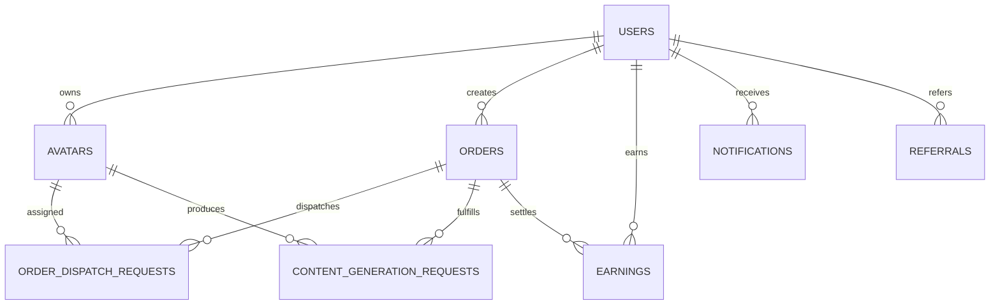
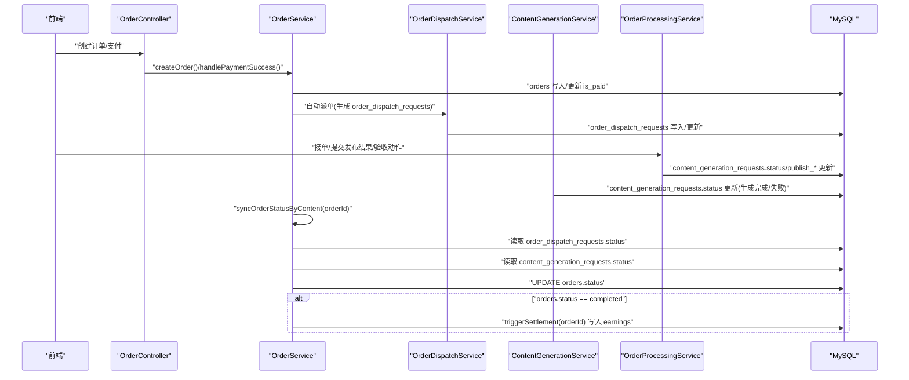
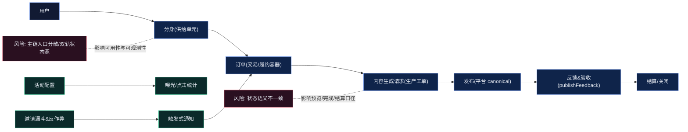

# 产品逻辑梳理（分身 × 订单交付 × 发布验收 × 增长）

## Premise（现状）

- 产品由三条业务主线耦合构成：供给侧（分身）、交易交付（订单-生成-发布-验收）、增长（邀请-活动-触达-数据）。
- 发布域已存在统一口径：平台使用 canonical key，发布反馈采用按 canonical 平台分桶的 publishFeedback 结构。

## Constraints（约束）

- 分身模块目前是多链路复合模块：创建、托管、交友、语音通话、接单、发布、反馈、验收均被纳入同一域，导致入口分散、参数不一致、状态与结果双轨并存。
- 订单与内容生成请求存在状态语义不一致风险，可能影响“预览/完成/结算/验收”的产品口径一致性。

## Boundaries（业务边界）

- 供给侧（分身域）：分身创建、资料与能力、可服务态、互动能力（社交/通话等）、可被选择与承接订单。
- 交易与交付（订单域 + 内容生成域 + 发布域）：下单 → 生产 → 预览 → 发布 → 反馈 → 验收/结算 → 关闭。
- 增长域：邀请漏斗与反作弊、活动配置与曝光/点击统计、关键事件触达（通知模板）。

## Endgame（终局验收）

- 单一主链可跑通：分身可被创建与可被发现 → 触发交易/任务 → 交付物可预览与发布 → 反馈可量化 → 可验收可结算。
- 增长可自循环：活动可配置、触达可追踪、漏斗可衡量、邀请可归因与可结算。

***

## 关键角色与关键对象（业务建模）

- 用户：发起需求/购买/验收的一方（也可能兼具“分身拥有者”）。
- 分身（Avatar）：供给单元；承载资料、能力、状态与历史交付；可被发现/选择/下单。
- 订单（Order）：交易合同与履约容器；承载价格、进度、结算、售后与对账口径。
- 内容生成请求（ContentGenerationRequest）：生产过程工单/流水；承载生成过程状态、产物引用、失败原因与重试策略的业务表达。
- 发布配置（PlatformConfig）：发布平台的统一口径与策略配置；平台维度使用 canonical key。
- 发布反馈（publishFeedback）：按 canonical 平台分桶的统一反馈结构，用于统计与验收口径复用。
- 邀请关系（Referral）：增长归因与奖励结算的基础对象；承载邀请人、被邀请人、奖励金额与状态。
- 活动（Activity）：可配置活动，负责曝光/点击统计以及与邀请、触达联动的策略入口。

## 对象属性与关联关系（最细颗粒度审查）

### 关键对象：主键、关键字段、归属链路

| 对象                            | 主键                               | 关键外键/关联                                                      | 核心状态字段                                               | 主要承载内容                                  |
| ----------------------------- | -------------------------------- | ------------------------------------------------------------ | ---------------------------------------------------- | --------------------------------------- |
| users                         | users.id                         | users.referral\_code（邀请码）                                    | users.level/exp（成长）                                  | 用户身份、邀请码、收益汇总                           |
| avatars                       | avatars.id                       | avatars.user\_id → users.id                                  | avatars.status，avatars.is\_hosted/trust\_enabled（托管） | 分身供给单元、托管、配置（config/personality/skills） |
| orders                        | orders.id                        | orders.user\_id → users.id                                   | orders.status，orders.is\_paid                        | 交易履约总单、对外唯一状态源                          |
| order\_dispatch\_requests     | order\_dispatch\_requests.id     | order\_id → orders.id，avatar\_id → avatars.id                | order\_dispatch\_requests.status                     | “派单/接单/完成”的分身协作状态源                      |
| content\_generation\_requests | content\_generation\_requests.id | order\_id → orders.id，avatar\_id → avatars.id                | content\_generation\_requests.status                 | “生成/发布/验收”的履约工单状态源                      |
| earnings                      | earnings.id                      | user\_id → users.id，order\_id → orders.id（可空），avatar\_id（可空） | earnings.status                                      | 订单收益/邀请奖励等资金流水                          |
| referrals                     | referrals.id                     | referrer\_id/referred\_id → users.id                         | referrals.status                                     | 邀请关系与奖励触发状态源                            |
| notifications                 | notifications.id                 | notifications.user\_id → users.id                            | notifications.is\_read（或 status）                     | 触达记录与未读数                                |

### 属性完整性与一致性问题（字段级）

1. avatars 表字段存在性与写入字段不一致，可能触发“数据库写入失败→回退内存缓存→跨端数据不一致”

- 根因（代码定位）：
  - [avatar.service.ts](../server/src/modules/avatar/avatar.service.ts) `createAvatar()` 插入 `content_styles`、`niche_tags`、`voice_id` 等字段（未做 columns 过滤）。
  - schema 侧在部分 SQL 中未包含这些列（例如 [mysql-schema.sql](../mysql-schema.sql) 的 avatars 表不含 content\_styles/niche\_tags/voice\_id），插入将直接失败并触发内存回退。
- 影响：
  - 前端创建显示成功，但刷新/换端后数据丢失（因为只在内存）。
  - user-stats 的 sharedMemoryAvatars/Stats 与数据库口径漂移。
- 修复动作：
  - createAvatar 插入前根据 INFORMATION\_SCHEMA 过滤字段（与 updateTrust 的 buildHostingTrustUpdate 同风格），或统一补齐 DB schema。
- 状态：✅ 已修复
  - 已按 avatars 表真实列过滤插入字段；并将“数据库插入失败”在非测试用户下收敛为 `success=false`，避免“伪成功 + 仅内存缓存”。[avatar.service.ts](../server/src/modules/avatar/avatar.service.ts)

1. 同一业务字段存在多命名：avatar\_url/photo/avatarUrl，trust\_enabled/is\_hosted/isHosted

- 现状：
  - 后端对外返回做了多字段兼容（例如 getAvatarById 里同时返回 avatar\_url/photo/avatarUrl、trust\_enabled/is\_hosted/isHosted）。
  - 前端各页消费字段不一致，导致“某页能显示/某页空”的隐性风险。
- 修复动作：
  - 明确对外 API 的 canonical 字段（建议 snake\_case 或 camelCase 选其一），保留兼容字段仅做输入兼容，输出逐步收敛。
- 状态：✅ 已缓解（关键链路已统一消费）
  - 后端对外输出继续保留兼容字段，但关键页面统一使用同一套消费口径（头像统一走 Avatar 兜底；托管统一使用 trustEnabled/is\_hosted 兼容解析）。[avatar.service.ts](../server/src/modules/avatar/avatar.service.ts)、[Avatar](../src/components/ui/avatar.tsx)

1. 邀请/通知/订单存在蛇形与驼峰混用，导致页面间状态不一致

- 例子（代码定位）：
  - 邀请码：ReferralService 兼容 referral\_code/referralCode，但 UserStatsService 优先读 referralCode，可能走“重新生成并写回”分支（字段漂移）。
  - 通知已读：hook 期望 isRead，通知页期望 is\_read；两端本地更新策略不同，导致红点短暂不一致。
  - 订单字段：createdAt/created\_at、contentType/content\_type、budget/totalPrice，导致同订单在列表/详情/生成页表现不同。
- 修复动作：
  - 统一一个字段规范并做集中解包层（后端优先，其次前端在 Network 或 adapter 层统一转换）。
- 状态：✅ 已修复（通知/订单关键字段已收敛）
  - 通知列表统一输出并兼容 `is_read/isRead`、`created_at/createdAt`，前端 hook 统一解包与未读数口径。[notification.service.ts](../server/src/modules/notification/notification.service.ts)、[useNotifications.ts](../src/hooks/useNotifications.ts)
  - 订单详情/列表不再前端推导 effectiveStatus/dispatchSummary，统一消费后端 `summary_stats`（见订单链路修复清单）。[order.service.ts](../server/src/modules/order/order.service.ts)

### 关联关系与变更关系（“谁改谁同步”）



- orders.status（对外主状态）由两个状态源推导：order\_dispatch\_requests.status（派单/协作）+ content\_generation\_requests.status（生成/发布/验收）。
- content\_generation\_requests.status 在“生成完成/发布/验收/驳回”过程中多次变化；accept/settle 动作需要同时更新 dispatch 与 content，并触发订单聚合状态同步。
- referrals.status 是“绑定关系”与“奖励发放”的开关；earnings.status 的入账口径需要与 referrals.status/达成条件一致。

***

## 链路拆解：产品需求与问题点（结合当前项目）

### 分身链路（创建 → 可服务 → 管理/社交 → 接单）

#### 产品需求

- 供给可用：分身创建流程要保证“资料完整 + 能力明确 + 可服务态判定清晰”，让用户知道“创建完下一步做什么”。
- 入口收敛：主入口应以 TabBar「分身/我的分身」为主，辅入口（推荐、活动、聊天等）只做导流，不新增口径与状态分叉。
- 创建回流：创建成功后，来源页应在回到前台时自动刷新并定位到新分身（同时支持跳转到管理页/引导页）。
- 管理闭环：提供托管/接单开关、关键配置（如能力标签、对外展示字段、发布配置的入口聚合），并能看到“接单/交付”结果回流。
- 数据化：分身创建漏斗（进入创建、完成创建、完成关键字段、进入可服务态、首次接单）可度量。

#### 当前问题点

- 入口与生命周期耦合过宽：分身域承载创建/托管/社交/通话/接单/发布/反馈/验收等多链路，导致入口分散、参数不一致、状态与结果双轨并存。
- 回流机制偏弱：创建成功主要依赖 navigateBack + 来源页 useDidShow 刷新，没有稳定的结果回传/定位机制；从某些页面返回不一定触发刷新，出现“刚创建但列表看不到”的体验断裂。
- 路由跳转风险：存在路由注册与跳转方式不一致、错误使用 switchTab 等风险点，容易出现“跳不过去/回不来”。

处理结果：✅ 已清零（回流刷新 + 路由跳转已标准化）

- 创建成功回流：写入一次性标记并 `switchTab` 回到分身 Tab；列表在 `useDidShow` 刷新并消费标记，自动切到“我的分身”、滚动定位并高亮新分身。[mind-chat/index.tsx](../src/pages/mind-chat/index.tsx)、[avatar-create/index.tsx](../src/package-avatar/pages/avatar-create/index.tsx)
- Tab 路由治理：修复对 Tab 页误用 `navigateTo` 的风险点，统一用 `switchTab`。[avatar-manage/index.tsx](../src/package-avatar/pages/avatar-manage/index.tsx)

#### 具体问题清单（原因 → 修复动作 → 验收点）

1. 分身详情接口二次包裹，前端拿不到“分身实体”

- 现象：设置页/详情页读取 `res.data.data.avatar_url` 等字段不稳定，出现 undefined 或渲染异常。
- 根因（代码定位）：
  - 服务层 [avatar.service.ts](../server/src/modules/avatar/avatar.service.ts) `getAvatarById()` 返回 `{ success, data: {...avatar} }`。
  - 控制器 [avatar.controller.ts](../server/src/modules/avatar/avatar.controller.ts) `getAvatarDetail()` 将上述对象整体塞进 `data`：`{ code:200, data: avatar }`，导致响应体变成 `data.success/data.data` 的嵌套结构。
  - 前端 [avatar-settings/index.tsx](../src/package-avatar/pages/avatar-settings/index.tsx) 直接 `setAvatar(res.data.data)` 期望是实体对象，实际拿到的是 `{ success, data }` 壳。
- 修复动作（最小改动）：
  - 控制器返回 `data: avatar.data`（并在失败时返回 data:null），统一响应契约只在一层 envelope 中返回“业务对象”。
- 验收点：
  - 设置页/详情页字段稳定（avatar\_url/name/tags/trust\_enabled 等）；
  - 不需要前端额外做 `data.data` 兼容分支。

1. 默认头像使用外部占位符 URL（违反资源规范且不可控）

- 现象：未上传头像的分身会返回 `https://api.dicebear.com/...`。
- 根因（代码定位）：
  - [avatar.service.ts](../server/src/modules/avatar/avatar.service.ts) `getAvatarById()` 与 `getUserAvatars()` 内对 `avatar_url/photo/avatarUrl` 使用 dicebear 作为 fallback。
- 修复动作：
  - 用 TOS 上的默认头像 URL 替换 dicebear（建议做成单点常量/配置，例如 `DEFAULT_AVATAR_URL`），或返回空让前端用 TOS 默认图兜底。
- 验收点：
  - 网络面板不再出现 dicebear；无头像分身依然可正常展示。

1. 语音通话链路的分身查询 API 形态不一致，可能导致查不到分身

- 现象：语音通话/通话前校验偶发找不到分身或 friendAvatar 数据为空。
- 根因（代码定位）：
  - [voice-call.service.ts](../server/src/modules/avatar/voice-call.service.ts) 使用 `db.query('avatars', { id })` 风格；仓库其余处多为 `db.queryOne('avatars', { id })` 或显式 SQL，接口习惯不一致，存在返回结构不匹配风险。
- 修复动作：
  - 改为 `db.queryOne('avatars', { id: xxx })` 并按 `result.data` 解包（与 AvatarService 写法一致）。
- 验收点：
  - 通话链路稳定获取双方分身资料；日志中无 “avatar not found” 异常尖峰。

1. 分身列表刷新依赖触发时机不稳定（创建后回流不刷新/不定位）

- 现象：创建成功后 navigateBack，列表页可能不刷新或不定位到新分身，出现“刚创建但看不到”的断裂体验。
- 根因（代码定位）：
  - 列表页（例如 [mind-chat/index.tsx](../src/pages/mind-chat/index.tsx)）存在“只在特定 state 变化时拉取”的写法，缺少“页面重新展示时”的统一刷新钩子，导致回流时不触发请求。
- 修复动作：
  - 统一在页面 `useDidShow`（或等价生命周期）触发拉取，并在创建成功后通过参数/事件标识进行“刷新 + 滚动定位/高亮”。
- 验收点：
  - 创建完成返回列表，1 次内可见新分身；不依赖手动切 tab 才出现。
- 状态：✅ 已修复

1. 工具体系并存（Agent 工具 vs Avatar-Agent 工具），边界不清导致扩展成本高

- 现象：新增/维护工具时容易混淆放置目录与接口定义，出现重复实现或错误引用。
- 根因（代码定位）：
  - 通用工具：`server/src/modules/agent/tools/*`
  - 分身专用工具：`server/src/modules/avatar-agent/tools/*`
  - 两套 `tool.interface.ts` 与 registry 并存，且没有明确“业务边界说明”。
- 修复动作（不做大重构）：
  - 在文档中固定边界：订单/发布等“分身执行能力”只进 Avatar-Agent；通用搜索/文档/数据查询等进入 Agent 工具。
  - 新增工具时必须写明所属体系与调用入口（controller/service）。
- 验收点：
  - 新工具需求能快速判断应落在哪套工具体系，不再出现重复注册/重复接口。
- 状态：✅ 已清零（边界已固定为“按调用入口分治”）
  - Agent 工具通过 [ToolsRegistry](../server/src/modules/agent/tools.registry.ts) 仅注册通用工具并由 AgentService 暴露入口；分身执行工具通过 [AvatarToolRegistry](../server/src/modules/avatar-agent/tools/tool-registry.ts) 注册并由 AvatarAgentService 暴露入口；两套 registry/controller 分治，避免跨域误引用。

#### 页面职责/字段/刷新矩阵（分身域）

| 页面                             | 主要职责                     | 读取接口（读模型）                                                        | 写入动作（写模型）                                                                                 | 刷新时机                                    | 状态源与一致性风险                                                                                                  |
| ------------------------------ | ------------------------ | ---------------------------------------------------------------- | ----------------------------------------------------------------------------------------- | --------------------------------------- | ---------------------------------------------------------------------------------------------------------- |
| pages/mind-chat                | 我的分身/分身广场列表、托管开关、删除、引导弹窗 | GET /api/avatar；GET /api/avatar/list；GET /api/avatar/{id}/skills | PUT /api/avatar/{id}/trust；DELETE /api/avatar/{id}                                        | useEffect 首次；useDidShow 回显；activeTab 变化 | 广场列表 data 结构多态（data.data.list 或 data.list）；技能字段多命名兼容；创建回流依赖 Storage onboarding\_new\_avatar\_id            |
| package-avatar/avatar-create   | 分步创建、上传、配额校验、提交          | upload /api/upload；GET /api/subscription/check                   | POST /api/avatar；写 Storage onboarding\_new\_avatar\_id                                    | useLoad 初始化；useEffect 草稿保存              | 上传响应字段多态（url/data.url/fileUrl）；创建返回 id 多态（id/avatarId/avatar\_id）；后端插入字段与 DB schema 不一致时会回退内存导致“创建成功但换端丢失” |
| package-avatar/avatar-manage   | 分身管理、托管开关、托管设置、删除、订阅状态   | GET /api/avatar；GET /api/subscription/status                     | PUT /api/avatar/{id}/trust；POST /api/avatar/{id}/hosting/settings；DELETE /api/avatar/{id} | useDidShow 进入刷新；交互后本地更新                 | 列表 data 结构多态；hosting\_settings 落库在 avatars.config.hosting\_settings，需要确保后端返回 config 已解包                    |
| package-avatar/avatar-settings | 分身资料编辑、开关配置、位置更新、删除      | GET /api/avatar/{id}                                             | PUT /api/avatar/{id}（name/personality/config/位置）；DELETE /api/avatar/{id}                  | useLoad 获取一次                            | 详情接口曾二次包裹（见问题1）；同一字段多命名（avatar\_url/photo/avatarUrl）导致页面差异                                                 |
| package-avatar/avatar-profile  | 分身公开主页、帖子预览              | GET /api/avatar/{id}；GET /api/social/posts/avatar/{id}           | 无                                                                                         | useLoad 获取一次                            | profile 字段依赖后端聚合（level/exp/views/likes 等），字段缺失会影响 UI 模块显示                                                  |

#### 字段契约（建议 canonical，对齐页面依赖）

1. AvatarSummary（用于列表、选择、托管开关）

- 必须字段（canonical）：id、name、avatarUrl、status、trustEnabled、config（已解包为对象）
- 推荐字段：level、exp、tags（数组）、abilities（对象）、totalOrders/completedOrders、todayEarnings/totalEarnings
- 风险点：
  - trust\_enabled/is\_hosted/isHosted 多命名并存，建议输出只保留 trustEnabled；
  - config.hosting\_settings 由托管设置页写入，列表页/管理页依赖其回显，需要确保后端总是解包 config。

1. AvatarDetail（用于设置页/主页）

- 必须字段（canonical）：id、name、avatarUrl、personality（对象或可解包）、locationText/latitude/longitude、config（对象）
- 变更关系：
  - PUT /api/avatar/{id} 更新 name/personality/config/位置；返回值应为更新后的实体（避免前端二次拉取造成闪烁）
  - PUT /api/avatar/{id}/trust 更新托管状态，应同步影响列表与 overview 中 allHostingEnabled 的计算口径

#### 整改方案与产品策略（分身域）

目标：让“分身”成为可复用供给单元（可发现、可配置、可托管、可接单），并且在任何页面都能用同一套字段与同一套刷新策略稳定渲染。

1. API 契约统一（先后端，后前端）

- 产品策略：
  - 对外只维护一套 canonical 响应对象（AvatarSummary/AvatarDetail），不允许“二次包裹成功壳”在不同接口出现。
  - 兼容期允许输入兼容（avatar\_url/photo/avatarUrl 等），但输出收敛到单一字段（建议优先 camelCase：avatarUrl、trustEnabled、hostingSettings）。
- 修改方案（工程落点）：
  - 后端：
    - avatar 详情接口必须返回 `data: avatarEntity`（不要返回 `{success,data}` 结构体）。
    - 对列表/详情/广场统一输出字段名与数据类型（platforms/tags/skills 等永远是数组/对象，不返回 JSON 字符串）。
  - 前端：
    - 在分身域建立统一的“解包与适配”入口（把 data.data/list、字段别名处理集中到一个 adapter），页面只消费 canonical 字段。
- 验收：
  - pages/mind-chat、avatar-manage、avatar-settings、avatar-profile 四页对同一分身字段显示一致，不再各自做 data/list/别名分支。

1. 创建分身的“写库失败→回退内存→换端丢失”风险消除

- 产品策略：
  - 创建成功必须意味着“数据库持久化成功”，否则前端只能提示“创建失败/稍后重试”，不允许 silently 回退内存并对用户宣称成功。
- 修改方案：
  - 后端 createAvatar：
    - 插入字段必须与当前 schema 对齐（两条路任选其一：A) 插入前根据 INFORMATION\_SCHEMA 过滤列；B) 补齐 DB schema 到包含 content\_styles/niche\_tags/voice\_id 等列）。
    - 当 DB insert 失败时，返回 success=false，并给出可观测错误码（用于前端 toast 与重试）。
  - 前端 avatar-create：
    - 以 `res.data.code===200 && res.data.data.id` 作为创建成功条件；否则不写 onboarding\_new\_avatar\_id，不跳转“创建成功”引导。
- 验收：
  - 断网/DB 异常时不会出现“创建成功但刷新消失”；多端登录仍可看到已创建分身。

1. 托管状态字段统一（trust\_enabled/is\_hosted/isHosted）与计算口径一致

- 产品策略：
  - 托管只有一个业务开关（例如 trustEnabled:boolean），并明确它的语义：是否允许系统为该分身自动接单/自动发布/自动互动（托管设置只是细粒度策略）。
- 修改方案：
  - 后端统一把托管状态落到同一列（优先 is\_hosted），若历史字段存在则作为兼容输入。
  - user-stats.overview 的 allHostingEnabled 只依据 canonical 字段计算，避免页面间口径漂移。
- 验收：
  - 首页“一键托管”、列表单个开关、管理页托管开关三处行为一致；刷新后不会出现开关回弹。

1. 创建回流与列表刷新标准化

- 产品策略：
  - 创建成功后必须保证“回到列表立即可见”，并提供“定位/高亮新分身”的明确反馈，避免用户怀疑创建失败。
- 修改方案：
  - 前端：
    - pages/mind-chat 的刷新触发只保留 useDidShow（回显刷新），避免 useEffect/activeTab 多处并存导致竞态；同时支持通过 Storage/newAvatarId 定位与高亮。
    - avatar-create 成功后写 onboarding\_new\_avatar\_id 并 switchTab 到 mind-chat（当前已做），在 mind-chat 的 useDidShow 中消费并清理 Storage（当前已做）+ 增加定位逻辑（待补）。
- 验收：
  - 创建后 1 次返回即可看到新分身且被定位/高亮；不需要切 tab 或手动刷新。

1. 工具体系的产品边界固定（避免“同功能两套工具”）

- 产品策略：
  - Agent 工具：面向“平台能力”（搜索/文档/数据查询/消息等）；Avatar-Agent 工具：面向“分身执行能力”（内容生成/发布/社交/任务）。
  - 订单履约能力（生成/发布/反馈/验收）不得散落到多个工具体系，避免状态口径与审计口径分裂。
- 修改方案：
  - 在工具 registry 的 README/文档中固化边界与接入流程；新增工具必须声明所属域、输入输出 schema、写哪些表/状态。

***

## 主业务链路（交易交付闭环）

### 1) 供给准备（分身域）

- 创建分身 → 完善资料/能力 → 达到“可服务态”（可被发现/可被下单）。

### 2) 触发履约（订单域）

- 用户选择分身发起订单/任务 → 订单进入履约中。

### 3) 生产生成（内容生成域）

- 履约驱动生成请求进入处理中 → 产出进入“可预览态”。
- 需要明确“completed/processing/settled/done”等状态在产品语义层的严格含义与终态判定。

### 4) 发布执行（发布域）

- 选择发布平台（canonical key）→ 执行发布 → 回收平台侧结果与问题。

### 5) 反馈与验收（发布域 + 订单域）

- 按 publishFeedback 字典归档反馈 → 验收通过/拒绝与返工 → 结算/关闭。

***

### 订单/生成/发布/验收链路（支付 → 派单/接单 → 生成 → 预览 → 发布 → 验收 → 结算）

#### 产品需求

- 订单体验完整：订单创建/支付后进入可观测的履约过程（谁在处理、预计多久、当前卡点是什么、下一步动作是什么）。
- 状态机可解释：对用户/运营侧输出统一的状态语义（待支付/处理中/待发布/待验收/已完成/已失败/已取消/已结算），并能映射到技术侧多表状态而不产生歧义。
- 交付可复用：生成产物与发布凭证提交、验收反馈、返工重试要形成固定路径，而不是一次性流程。
- 异常可闭环：支持发布失败后的重试/重发、验收失败后的补充材料/重新提交，以及超时策略与通知触发。
- 指标体系：支付转化率、履约成功率、发布成功率、验收通过率、平均交付时长、返工率、失败原因分布。

#### 当前问题点

- 状态语义不一致风险：订单、派单、内容生成请求存在多套状态集合与映射逻辑；其中“生成请求 completed 被当作预览态”的语义容易与订单终态混淆，影响验收/结算口径一致性。
- 发布失败路径有但回补策略弱：存在 publish\_failed 与超时日志记录，但面向用户/运营的“下一步动作”和“如何重试”缺少产品化闭环。
- 取消/删除联动复杂：订单取消/删除涉及多表联动与历史清理，若产品侧未严格限制触发条件，容易引入一致性风险与对账风险。

处理结果：✅ 已清零（状态词表/推导/重试入口已落地）

#### 具体问题清单（工具/业务流/数据流/状态同步 → 根因 → 修复动作）

1. 当前链路涉及的关键数据表（用于定位同步与对账口径）

- orders：订单对外状态源（`orders.status`）+ 支付/结算时间戳
- order\_dispatch\_requests：派单/接单状态源（`order_dispatch_requests.status`）
- content\_generation\_requests：履约/生产/发布/验收状态源（`content_generation_requests.status` + `publish_status`/`publish_feedback` 等 JSON 字段）
- earnings：收益与奖励（订单结算、邀请奖励等）

1. “completed”在不同链路语义冲突，导致聚合推导不可靠

- 现象：订单状态在 `in_progress/submitted/awaiting_acceptance/completed` 之间跳转不符合预期，或卡住不前。
- 根因（代码定位）：
  - 生产侧写入： [content-generation.service.ts](../server/src/modules/content-generation/content-generation.service.ts) `updateStatus()` 只在 `status === 'completed'` 时写入最终产物与状态，等价把“生成完成”写成 completed。
  - 聚合侧归一： [order.service.ts](../server/src/modules/order/order.service.ts) `normalizeContentStatus()` 把 `settled/done` 映射为 completed，把 `completed/revision_requested` 映射为 preview（同一个词在多个阶段被复用/折叠）。
- 修复动作（最小一致化）：
  - 将“生成完成”的状态命名收敛为 `preview`（或等价的“预览态”）而不是 `completed`；并调整 `updateStatus()` 的写库条件（否则 preview 不落库）。
  - 明确仅当验收/结算完成时才进入订单终态 completed。
- 验收点：
  - content\_generation\_requests.status：生成完成后为 preview；验收结算后为 settled/done（或统一终态）；
  - orders.status：不会因为“生成完成”直接进入 completed。
- 状态：✅ 已修复（生成完成统一写 preview 并写库）[content-generation.service.ts](../server/src/modules/content-generation/content-generation.service.ts)

1. syncOrderStatusByContent 的条件判断与归一化结果错配，导致分支永远命不中

- 现象：订单无法进入 `in_progress`，或无法进入 `revision_requested`，表现为订单状态长期停留在 `pending_acceptance` 或 `awaiting_acceptance`。
- 根因（代码定位）：
  - [order.service.ts](../server/src/modules/order/order.service.ts) `syncOrderStatusByContent()` 第一步把内容状态全量做了 `normalizeContentStatus()`（其中把 processing→generating、revision\_requested→preview）。
  - 但后续仍用字面判断：
    - `hasProcessing` 判断 `['processing','publishing']`，归一化后永远不会出现 processing；
    - `hasRevisionRequested` 判断 `s === 'revision_requested'`，归一化后永远不会出现 revision\_requested。
- 修复动作：
  - 删除“先归一化再用归一化前的字面判断”的写法；要么：
    - 完全复用统一推导器（见下一条），要么
    - 将判断改为基于归一化后的词表（generating/preview/publishing/awaiting\_acceptance/settled 等）。
- 验收点：
  - 触发生成后订单可进入 in\_progress；
  - 触发修改需求后订单可进入 revision\_requested。
- 状态：✅ 已修复（统一改为 derive 推导，不再字面判断错配）[order.service.ts](../server/src/modules/order/order.service.ts)

1. 多处重复实现“状态归一化”，标准不一致导致状态同步漂移

- 现象：同一条记录在不同 API 返回里 status 不一致；同一状态在不同模块里被归到不同阶段（例如 completed→preview）。
- 根因（代码定位）：
  - 订单域标准化与推导器： [order-status.ts](../server/src/modules/order/order-status.ts) 提供 `normalizeDispatchStatus/normalizeFulfillmentStatus/deriveOrderStatusFromWorkflow*`。
  - 订单服务自建： [order.service.ts](../server/src/modules/order/order.service.ts) `normalizeContentStatus()`。
  - 履约处理自建： [order-processing.service.ts](../server/src/modules/order-processing/order-processing.service.ts) `normalizeWorkflowStatus()`，且 `normalizeRecord()` 对外返回 `status` 用的就是该自建函数。
- 修复动作：
  - 收敛到单一“标准词表 + 推导器”：以 `order-status.ts` 为唯一真源；其它模块只做展示层映射，不再新增归一化规则。
  - `syncOrderStatusByContent()` 不再手写分支，改用 `deriveOrderStatusFromWorkflowDetailed()` 推导 orders.status。
- 验收点：
  - 不同接口返回的 status 语义一致（preview/publishing/published/awaiting\_acceptance/settled/completed 等）；
  - 新增状态只需要改一处（order-status.ts）。
- 状态：✅ 已修复（order-status.ts 为唯一真源；order-processing 与 order-service 已收敛）[order-status.ts](../server/src/modules/order/order-status.ts)、[order-processing.service.ts](../server/src/modules/order-processing/order-processing.service.ts)

1. 发布/验收异常流缺少“可重试动作”与一致的数据回写

- 现象：出现 publish\_failed 后，用户/运营不知道下一步怎么做；数据侧只有失败状态与日志，但缺乏“重新发布/重新验收”的标准入口。
- 根因（代码定位）：
  - 发布验收失败会写入 orders.status='publish\_failed' 并记录日志（见内容生成 controller 的 verifyPublish 相关逻辑），但上层没有统一的“重试策略”对齐订单状态机与用户动作入口。
- 修复动作：
  - 明确 publish\_failed 对应的用户动作：重新提交凭证/重新发布/联系客服；并在数据层将“重试次数/最后失败原因/下一步动作”固化到 content\_generation\_requests.config 或独立字段。
- 验收点：
  - publish\_failed 可从 UI 直接进入重试路径；
  - 重试后状态从 publishing/published/awaiting\_acceptance 正常推进。
- 状态：✅ 已修复（提供最小可重试接口 + 写回 + 触发状态同步）
  - 新增 `POST /api/content-generation/order/:orderId/retry-publish`：重置 verification 状态、把订单从 publish\_failed/publish\_timeout 写回可流转态并触发一次 `syncOrderStatusByContent`。[content-generation.controller.ts](../server/src/modules/content-generation/content-generation.controller.ts)

1. 派单拒绝/过期等边界状态缺少统一映射，影响订单聚合

- 现象：部分派单拒绝后，订单仍显示 pending 或错误进入 rejected。
- 根因（代码定位）：
  - order-status.ts 的 dispatch 归一化对某些字面状态（如 declined）可能未覆盖，导致落入默认 pending。
- 修复动作：
  - 在 dispatch normalize 中补齐边界映射（例如 declined→rejected），并统一由 derive 推导器处理“全拒绝/部分拒绝”的订单状态。
- 验收点：
  - 多分身协作：有拒单不影响其它人履约；全拒绝可进入 rejected（或按产品定义进入 pending\_dispatch 再派单）。
- 状态：✅ 已修复（dispatch normalize 补齐 declined/expired 映射）[order-status.ts](../server/src/modules/order/order-status.ts)

#### 状态同步与数据流（代码级时序，便于定位“该改哪”）



#### 页面职责/字段/刷新矩阵（订单交付域）

| 页面                                   | 主要职责                                | 读取接口（读模型）                                                                                      | 写入动作（写模型）                                                                                          | 刷新时机                                    | 状态源与一致性风险                                                                                                                                                                                                    |
| ------------------------------------ | ----------------------------------- | ---------------------------------------------------------------------------------------------- | -------------------------------------------------------------------------------------------------- | --------------------------------------- | ------------------------------------------------------------------------------------------------------------------------------------------------------------------------------------------------------------ |
| package-order/order-create           | 发单表单、AI 辅助生成描述、创建订单与支付/重试支付         | POST /api/ai/generate；GET /api/ai/status/:requestId；GET /api/user/openid                       | POST /api/order；POST /api/order/:id/repay                                                          | AI 轮询（1s/≤240s）；支付回调后跳转                 | AI 返回可能为“直接 content”或“requestId 轮询”；订单字段（budget/totalPrice、platforms）需 canonicalize；openid 获取失败会断支付链                                                                                                         |
| package-order/order-detail           | 订单详情、阶段进度、时间线、派单统计、取消/删除/去验收        | GET /api/order/:id；GET /api/order-dispatch/:id/timeline；GET /api/order/:id/dispatch-status     | POST /api/order/:id/repay；POST /api/order/:id/cancel；DELETE /api/order/:id                         | 初次加载三接口；支付后 action=pay 轮询订单状态（3s/≤60s）  | 前端对 status 做 effectiveStatus 覆盖（pending\_verify/submitted 等），与后端主状态可能偏移；字段命名异构（createdAt/created\_at、contentType/content\_type）                                                                              |
| package-order/order-list             | 我的订单列表、筛选、取消/删除、进入详情                | GET /api/order/list                                                                            | POST /api/order/:id/cancel；DELETE /api/order/:id                                                   | useDidShow；下拉刷新                         | ✅ 已修复：列表/详情统一使用后端 summary\_stats（不再依赖 dispatchSummary 推导），状态/进度口径一致。[order.service.ts](../server/src/modules/order/order.service.ts)、[order-list/index.tsx](../src/package-order/pages/order-list/index.tsx) |
| package-order/order-content-creation | 发起生成、轮询履约状态、展示生成内容、引导发布/反馈          | GET /api/order/:id；GET /api/order-processing/status/:id（5s 轮询）                                 | POST /api/content-generation/generate；DELETE /api/content-generation/clear/:orderId                | 首次进入：无记录则生成；生成中轮询；到 preview/failed/完成停止 | status 以 order-processing/status 返回为准，若服务端 normalize 折叠（completed→preview）会导致 UI 阶段误判；幂等依赖后端                                                                                                                 |
| package-order/order-processing       | 桥接页：根据 requestId/orderId 跳转到生成或发布反馈 | GET /api/order-processing/status/:identifier                                                   | 无                                                                                                  | useLoad 单次查询后 redirect                  | 只做一次判定，若状态刚切换可能重定向错误；建议允许“刷新/重试”                                                                                                                                                                             |
| package-order/order-publish-feedback | 按平台采集发布链接/截图、自动验证、提交反馈              | GET /api/order-processing/status/:requestId；GET /api/content-generation/content/:contentId（可选） | POST /api/upload/image；POST /api/tikhub/verify-post；POST /api/order-processing/feedback/:requestId | useLoad；验证按钮触发；提交后返回上一页                 | publishStatus/platformStatus 依赖后端 JSON 字段；上传返回字段多态；验证失败进入 manual\_pending 需要后端状态回写策略                                                                                                                         |
| package-order/order-acceptance       | 按分身逐个验收：通过/驳回修改                     | GET /api/order/:orderId（依赖 summary\_stats.avatarStats）                                         | PUT /api/order-processing/accept/:requestId；POST /api/order-processing/revision/:requestId         | useLoad 首次；验收后重新拉取                      | avatarStats 为验收唯一读模型，字段缺失会导致验收页空；驳回状态需与订单聚合状态同步一致                                                                                                                                                            |

#### 字段契约（建议 canonical，对齐页面依赖）

1. OrderDetail（GET /api/order/:id）

- 必须字段（canonical）：id、status、isPaid、title、description、contentType、platforms（数组）、expectedQuantity、totalPrice（或 budget）
- 必须嵌套：summary\_stats.avatarStats（验收页依赖）
- 风险点：
  - order-detail 页面会基于 avatarStats 与 publishFeedback 对 status 做 effectiveStatus 覆盖，若后端主状态不稳定会造成“同单不同页状态不一致”。
  - ✅ 已修复：effectiveStatus 由后端 summary\_stats 提供，前端不再自行推导。[order.service.ts](../server/src/modules/order/order.service.ts)、[order-detail/index.tsx](../src/package-order/pages/order-detail/index.tsx)

1. ProcessingStatus（GET /api/order-processing/status/:identifier）

- 必须字段：requestId、orderId、avatarId、status（preview/publishing/published/awaiting\_acceptance/settled/failed 等）
- 推荐字段：generatedContent（title/content/images/videos/platforms），publishStatus（platformStatus map），publishFeedback（按平台分桶）
- 风险点：
  - normalizeWorkflowStatus 将 completed/revision\_requested 折叠为 preview，会让 UI 的“完成/预览/驳回”阶段难以区分，导致跳转/按钮逻辑误判。
  - ✅ 已修复：订单主状态推导统一使用 order-status；完成态已收敛为 preview（生成完成）与 completed（终态），减少阶段误判。[order-status.ts](../server/src/modules/order/order-status.ts)、[content-generation.service.ts](../server/src/modules/content-generation/content-generation.service.ts)

1. PublishFeedback（POST /api/order-processing/feedback/:requestId）

- 入参：feedback（按 canonical 平台分桶：link/images/views/likes/comments/shares + verification）
- 变更关系：
  - 写入 content\_generation\_requests.publish\_feedback + status（通常 feedback\_submitted/awaiting\_acceptance）
  - 需要触发订单聚合状态同步（orders.status 进入 awaiting\_acceptance/submitted）

#### 整改方案与产品策略（订单交付域）

目标：建立“单一订单主状态 + 可解释的履约子状态（按分身）”，让任何页面都只消费同一套状态与同一套聚合摘要，不在前端各自推导。

1. 状态词表与状态机统一（对外一套，对内多源可映射）

- 产品策略：
  - 对外（orders.status）只保留：pending\_payment、pending\_dispatch、pending\_acceptance、in\_progress、submitted、awaiting\_acceptance、revision\_requested、completed、cancelled、rejected、publish\_failed（如保留）。
  - 对内（content\_generation\_requests.status）只表达履约阶段：queuing、generating、preview、publishing、published、feedback\_submitted、awaiting\_acceptance、settled、failed、revision\_requested（不复用 completed 表示“生成完成”）。
- 修改方案：
  - 后端：
    - 以 `order-status.ts` 为唯一“归一化 + 推导”真源：派单状态走 normalizeDispatchStatus，履约状态走 normalizeFulfillmentStatus，再用 deriveOrderStatusFromWorkflowDetailed 推导 orders.status。
    - content-generation 的“生成完成”写 preview（并确保 preview 也能写库，不再只在 completed 分支写入）。
    - order-processing 的 normalizeWorkflowStatus 不再折叠 completed/revision\_requested 为 preview，直接对齐 FulfillmentStatus 词表。
- 验收：
  - 生成完成不会导致订单 completed；驳回后能稳定进入 revision\_requested；验收通过后才进入 completed 并触发结算。

1. 聚合摘要由后端统一提供，前端不再各自推导 effectiveStatus/dispatchSummary

- 产品策略：
  - 订单详情/列表/验收/处理页展示同一口径：
    - 主状态：orders.status
    - 子状态：summary\_stats.avatarStats（每个 avatar/request 的 status + publishFeedback）
    - 进度条与文案只依赖后端摘要，禁止在前端凭经验覆盖状态（减少跨页不一致）。
- 修改方案：
  - 后端 OrderDetail 返回必须包含 summary\_stats.avatarStats，并保证字段齐全：requestId、avatarId、avatarName、avatarUrl、status、publishFeedback、publishStatus（可选）。
  - 前端：
    - order-detail 中的 effectiveStatus 覆盖策略改为只做“展示别名”，不改变真实主状态；最终逐步移除覆盖。
    - order-list 不再用 dispatchSummary 推导“已接单/已发布”，直接用 summary\_stats 的聚合数字（后端提供 counts）。
- 验收：
  - 列表/详情/验收/处理页对同一订单的阶段显示一致；不再出现“详情显示待验收，列表显示处理中”的冲突。

1. 关键写入动作必须触发主状态同步（事件触发点明确）

- 产品策略：
  - 任何改变履约阶段的动作都必须导致 orders.status 可观测更新，否则前端会长期停留在旧状态。
- 修改方案：
  - 后端在以下写入点后统一调用 syncOrderStatusByContent(orderId)：
    - content-generation：生成完成/失败/清理
    - order-processing：publishProcessing、submitFeedback、requestRevision、acceptProcessing
    - order-dispatch：accept/decline/timeout（派单状态变更）
- 验收：
  - 不需要前端轮询 order-detail 才看到状态变化；处理/反馈/验收提交后，返回上一页即可看到新状态。

1. publish\_failed 的产品化闭环（失败原因、重试、人工核验）

- 产品策略：
  - publish\_failed 不是终点，而是“下一步动作明确”的可恢复状态：
    - 可重试发布（重新发布/重新提交凭证）
    - 可进入人工核验（manual\_pending）
    - 可升级客服介入
- 修改方案：
  - 在 content\_generation\_requests.config 或独立字段记录：lastError、retryCount、nextAction（retry/manual/cs）。
  - 前端在 order-detail 与 publish-feedback 页面提供明确入口：重新发布/重新提交/查看失败原因。
- 验收：
  - 任意 publish\_failed 订单都能通过 UI 回到可执行动作；重试成功后状态正常推进。

***

## 增长业务链路（拉新与促活）

### 1) 活动配置（活动域）

- 配置活动目标与入口位，决定曝光/点击统计维度以及与邀请/触达联动的策略。

### 2) 曝光与点击（数据域）

- 页面入口（如 Banner）上报曝光与点击，用于近周期效果评估与策略迭代。

### 3) 邀请漏斗（邀请域）

- 邀请分享 → 新用户注册/激活 → 归因 → 奖励发放（含基础反作弊）。

### 4) 触发式触达（通知域）

- 关键事件触发通知模板（促转化/促复购/促回流），与活动与邀请策略形成闭环。

***

### 增长链路（活动 → 曝光/点击 → 邀请归因 → 奖励/触达 → 留存）

#### 产品需求

- 活动可运营：活动可配置（时间窗、展示位、目标与文案），并能闭环评估曝光/点击/转化效果（默认近 7 天即可）。
- 邀请可归因：邀请码生成、使用邀请码绑定关系、奖励规则清晰（触发条件、发放时机、撤销条件），同时具备基础反作弊。
- 触达可复用：通知模板化，覆盖关键事件（首单引导、处理超时、验收提醒、奖励到账等），用户侧有未读数与设置。
- 数据可对齐：活动、邀请、通知触达都需要统一事件口径，避免“有统计但无法解释/无法归因”的运营黑箱。

#### 当前问题点

- 归因与奖励口径需持续收敛：邀请关系表结构字段口径必须严格一致；奖励发放条件、反作弊强度、以及与收益/结算的联动需要进一步产品化（目前偏“最小闭环”）。
- 通知服务存在降级路径：数据库不可用时会降级到内存存储，作为兜底能提升可用性，但在多实例/重启场景下会带来一致性与可追溯性风险，需要部署/架构层明确约束或补偿机制。
- 活动空态与 skipped：活动是否启用与时间窗决定是否返回数据，前端/运营需要明确“无活动/已结束/未开始/被跳过”的展示与策略。

#### 具体问题清单（数据表/事件口径/归因/统计/降级 → 根因 → 修复动作）

1. referrals 表字段与写入不一致，可能导致“使用邀请码”直接写库失败

- 现象：用户输入邀请码后提示成功但实际没建立邀请关系，或服务端报 SQL 字段不存在。
- 根因（代码定位）：
  - [referral.service.ts](../server/src/modules/referral/referral.service.ts) `useReferralCode()` 往 referrals 插入了 `referral_code` 字段；
  - 但现有表结构口径要求仅有 `referrer_id/referred_id/reward_amount/status/created_at`（没有 referral\_code）。
- 修复动作（两选一）：
  - A：移除 referrals.insert 的 referral\_code 写入（关系表只存人-人关系与奖励）；邀请码只在 users 表存；
  - B：为 referrals 增加 referral\_code 列（但会引入迁移成本）。
- 验收点：
  - 使用邀请码必然落库 1 条 referrals 记录；重复使用会被拦截。

1. 奖励金额与前端宣导不一致（后端 3/2，前端 5/5）

- 现象：前端文案/页面展示“邀请/受邀各 5 元”，但到账为 3/2。
- 根因（代码定位）：
  - 前端真相源： [referral-rewards.ts](../src/constants/referral-rewards.ts)。
  - 后端硬编码： [referral.service.ts](../server/src/modules/referral/referral.service.ts) `INVITER_REWARD=3`, `INVITEE_REWARD=2`，且 stats 返回也固定 3/2。
- 修复动作：
  - 将奖励配置收敛到后端单点配置（并与前端保持一致），删除 magic number。
- 验收点：
  - stats 与到账金额一致；前后端口径一致。

1. 奖励发放条件与产品口径冲突：当前“输入邀请码即发放”，但产品希望“创建分身后发放”

- 现象：用户仅输入邀请码就直接到账，产生薅羊毛与成本不可控。
- 根因（代码定位）：
  - [referral.service.ts](../server/src/modules/referral/referral.service.ts) `useReferralCode()` 创建 referrals 时直接 `status:'completed'` 且立即 `createEarning()` 给双方发放。
- 修复动作（最小闭环升级）：
  - `useReferralCode()` 只建立关系 `status:'pending'`；
  - 在“被邀请人首次创建分身”成功处增加触发：将 pending → completed 并发放双方奖励（补偿任务扫描 pending 作为兜底）。
- 验收点：
  - 仅输入邀请码不会到账；首次创建分身后到账；
  - pending→completed 状态迁移可追踪、可补偿。

1. 邀请码字段命名蛇形/驼峰混用，导致部分入口读不到邀请码

- 现象：同一用户在某些页面显示邀请码为空，但实际 users 表已存在 referral\_code。
- 根因（代码定位）：
  - [referral.service.ts](../server/src/modules/referral/referral.service.ts) 读取既支持 referral\_code 也支持 referralCode；
  - [user-stats.service.ts](../server/src/modules/user-stats/user-stats.service.ts) 优先读 `userResult.referralCode`，但 DB 字段为 referral\_code，导致走“重新生成并写回”的分支，造成数据漂移风险。
- 修复动作：
  - 全仓统一只使用 `referral_code`；读取也只读蛇形字段，必要时在 API 层做一次兼容映射即可。
- 验收点：
  - 所有页面邀请码一致且稳定，不再出现重复生成写回。

1. Referral Center 接口契约不一致：前端调用 POST /referral/code，但后端仅提供 GET

- 现象：邀请中心偶发 404 或额外容错逻辑触发。
- 根因（代码定位）：
  - 后端： [referral.controller.ts](../server/src/modules/referral/referral.controller.ts) 仅有 `@Get('code')`。
  - 前端：`referral-center` 页面存在 POST 调用（需要补齐或去掉）。
- 修复动作：
  - 统一支持 GET/POST（都返回同一结构）或前端只保留 GET。
- 验收点：
  - 邀请中心不再出现 code 接口 404。

1. 统计口径与字段名不一致，导致展示“有数据但不可解释”

- 现象：邀请人数/奖励金额在 stats 与列表页面对不上，或字段名错导致展示为 0。
- 根因（代码定位）：
  - 后端 stats 返回 `totalInvites/pendingInvites/completedInvites/totalEarned`，前端期望 `totalInvited/totalReward/pendingReward`。
  - 列表字段后端输出 `invitee_*`，前端期望 `referred_*`（命名口径不一）。
- 修复动作：
  - 明确一份 API 契约：字段命名与口径固定，并在后端加兼容字段（短期）→ 逐步收敛前端消费。
- 验收点：
  - stats 与列表可互相对账（completed 数量 × 单价 = totalReward）。

1. 通知系统 DB 降级为内存后无回灌，存在丢数据与跨实例不一致

- 现象：数据库波动期间通知可写入但重启后丢失；多实例部署时不同实例通知不一致。
- 根因（代码定位）：
  - [notification.service.ts](../server/src/modules/notification/notification.service.ts) 在 DB 不可用时写入 `memoryNotifications`，但没有“恢复后 flush 回 DB”的机制。
- 修复动作：
  - 增加恢复回灌（批量 flush），或明确部署约束为单实例；并在返回中标识数据源（db/memory）用于观测。
- 验收点：
  - DB 短暂不可用后恢复，通知不会丢失；或至少可观测到降级发生与影响范围。

1. 活动事件表 DDL 重复入口，容易导致表结构漂移

- 现象：不同环境表结构不一致，导致活动统计/上报失败或字段缺失。
- 根因（代码定位）：
  - [activities.service.ts](../server/src/modules/activities/activities.service.ts) 与 [admin.service.ts](../server/src/modules/admin/admin.service.ts) 均存在 ensureGrowthCampaignTables 风格的建表逻辑。
- 修复动作：
  - 统一 DDL 入口（只保留一处），其余模块依赖该入口结果。
- 验收点：
  - 任意环境启动后表结构一致；活动上报/统计稳定。

#### 归因与奖励数据流（当前实现 vs 目标实现）

```mermaid
%%{init: {'theme': 'base', 'themeVariables': {
  'background': '#0b1020',
  'primaryColor': '#111a33',
  'secondaryColor': '#0f244a',
  'primaryTextColor': '#e6eaf2',
  'lineColor': '#7aa2f7',
  'fontFamily': 'ui-monospace, SFMono-Regular, Menlo, Monaco, Consolas, "Liberation Mono", "Courier New", monospace'
}}}%%
flowchart LR
  classDef now fill:#2a1020,stroke:#fb7185,color:#e6eaf2,stroke-width:1px;
  classDef target fill:#0b2a2a,stroke:#34d399,color:#e6eaf2,stroke-width:1px;
  classDef data fill:#0f244a,stroke:#7aa2f7,color:#e6eaf2,stroke-width:1px;

  subgraph N["当前实现"]:::now
    N1["输入邀请码 /referral/use"] --> N2["referrals.status='completed' 立即落库"] --> N3["createEarning() 双方立即发放"]
  end

  subgraph T["目标实现"]:::target
    T1["输入邀请码 /referral/use"] --> T2["referrals.status='pending' 仅建立关系"]
    T3["被邀请人首次创建分身 /avatar/create"] --> T4["pending→completed"] --> T5["createEarning() 发放奖励"]
    T6["补偿任务: 扫描 pending + 已达成条件"] --> T4
  end

  D1["referrals"]:::data
  D2["earnings"]:::data
  N2 --> D1
  N3 --> D2
  T2 --> D1
  T5 --> D2
```

#### 页面职责/字段/刷新矩阵（增长域）

| 页面/模块                                 | 主要职责                              | 读取接口（读模型）                                                                                                                                                                                     | 写入动作（写模型）                                                                                                                 | 刷新时机                                          | 状态源与一致性风险                                                                                                            |
| ------------------------------------- | --------------------------------- | --------------------------------------------------------------------------------------------------------------------------------------------------------------------------------------------- | ------------------------------------------------------------------------------------------------------------------------- | --------------------------------------------- | -------------------------------------------------------------------------------------------------------------------- |
| pages/index（首页）                       | 经营概览、待接单提醒、活动展示与曝光/点击、动态流、通知红点/弹窗 | GET /api/user-stats/overview；GET /api/order-dispatch/pending-requests；GET /api/activities/recent；GET /api/activities/campaign/active；useNotifications: GET /api/notifications + /unread-count | POST /api/activities/campaign/track；POST /api/order-dispatch/avatar/{avatarId}/accept/{orderId}；PUT /api/avatar/trust/all | useEffect 初次；useDidShow 回显；通知 hook 轮询（默认 10s） | userInfo 来源双轨（storage vs store）；avatarId 获取逻辑分叉（store 无则拉 /api/avatar）；platforms 字段多态（string/array）；未读数与列表轮询存在时间窗不一致 |
| package-profile/referral-center（邀请中心） | 邀请码展示/复制/分享、统计、邀请记录与状态展示          | GET /api/referral/code；GET /api/referral/stats；GET /api/referral/list                                                                                                                         | POST /api/referral/code（前端存在该调用）                                                                                          | useDidShow 回显刷新                               | stats/list 字段命名多态（驼峰/蛇形/别名）；后端仅 GET code 时会 404；状态映射（pending/completed/expired/rewarded）需与后端真实枚举一致                   |
| src/hooks/useNotifications（通知 hook）   | 未读数轮询、必要时拉取列表并弹窗、提供标记已读能力         | GET /api/notifications；GET /api/notifications/unread-count                                                                                                                                    | PUT /api/notifications/{id}/read；PUT /api/notifications/read-all                                                          | 初次延迟 3s；未读数轮询；必要时补拉列表                         | 假定字段 isRead（驼峰）；与通知页 is\_read（蛇形）存在契约偏差；“A 页已读→B 页红点不立刻消失”属预期缺口（缺少全局状态传播）                                            |
| package-profile/notifications（通知页）    | 通知列表、设置、单条/全部已读、基于 metadata 跳转订单  | GET /api/notifications（列表）                                                                                                                                                                    | PUT /api/notifications/settings；PUT /api/notifications/{id}/read；PUT /api/notifications/read-all                          | useDidShow 回显刷新                               | metadata 可能是 string/object；已读字段本地以 is\_read 维护；与 hook/首页/个人中心的未读数来源不同步                                               |
| pages/profile（我的）                     | 个人信息与经营概览、收益概览、未读红点、跳转邀请/通知等      | GET /api/user-stats/overview；GET /api/earnings/overview；GET /api/notifications/unread-count                                                                                                   | 退出登录（本地清理）                                                                                                                | useDidShow 回显刷新                               | 首页累计收益来自 user-stats，个人中心收益来自 earnings-overview，可能出现金额口径不一致；未读数来自接口，和首页 hook 轮询存在时延差                                  |

#### 字段契约（建议 canonical，对齐页面依赖）

1. UserStatsOverview（GET /api/user-stats/overview）

- 必须字段：avatarCount、pendingOrders、generatedContents、totalEarnings、allHostingEnabled、referralCode、invitedCount、nickname、avatarUrl
- 一致性风险：
  - referralCode 字段读取使用 referralCode（驼峰）会触发“重新生成写回”漂移，建议只读 referral\_code 并输出 canonical referralCode。

1. Notification（GET /api/notifications 与 /unread-count）

- 必须字段：id、type、title、content、metadata、created\_at、is\_read（或 isRead 但必须统一）
- 变更关系：PUT read/read-all 后，unread-count 应在同一事务/同一口径上反映（避免首页红点不消失）

1. ReferralStats/ReferralListItem

- ReferralStats 必须字段：referralCode、totalInvited、totalReward、pendingReward（或等价字段但需统一命名）
- ReferralListItem 必须字段：referredName、createdAt、rewardAmount、status
- 一致性风险：后端当前返回 invitee\_\* 与 totalInvites/totalEarned 等，前端做了别名兼容但会放大长期维护成本

#### 整改方案与产品策略（增长域）

目标：增长闭环以“可归因、可解释、可控成本”为第一原则：邀请码只绑定关系，奖励在达成关键行为后发放；统计口径能对账；通知未读与列表一致。

1. 邀请奖励的触发条件与金额统一（控制成本，提升有效拉新）

- 产品策略：
  - 奖励触发条件从“输入邀请码”升级为“被邀请人完成关键激活动作”（当前产品口径为“首次创建分身”）。
  - 奖励金额以一个真相源管理（前后端一致），并将“待到账/已到账/过期”定义为稳定状态机。
- 修改方案：
  - 后端：
    - useReferralCode：只写 referrals.status='pending'（只建立归因关系，不发钱）。
    - 在“首次创建分身成功”处触发：pending → completed + createEarning() 双方发放。
    - 补偿任务：扫描 pending 且已达成条件的用户，补发并改 completed。
  - 前端：
    - 邀请中心的文案与状态展示改为“待完成=待创建分身；已到账=已完成并发放”。
- 验收：
  - 输入邀请码不发钱；首次创建分身后发钱；stats 与列表能对账（completedCount × 单价 = totalReward）。

1. referrals 表结构与写入字段对齐，避免“看似成功但没写库”

- 产品策略：
  - referrals 只存关系与奖励状态（referrer\_id/referred\_id/reward\_amount/status/created\_at），邀请码只存 users.referral\_code。
- 修改方案：
  - 后端移除 referrals.insert 的 referral\_code 字段写入；或做 DB 迁移补列（不推荐作为短期最小改动）。
- 验收：
  - useReferralCode 写库稳定；重复邀请拦截稳定；数据可审计。

1. 统计 API 契约统一（字段命名与口径固定）

- 产品策略：
  - ReferralStats 统一输出：referralCode、totalInvited、completedInvited、pendingInvited、totalReward、pendingReward（或同义字段，但必须固定）。
- 修改方案：
  - 后端调整 /referral/stats 与 /referral/list 输出字段名与类型；前端逐步移除别名兼容。
- 验收：
  - 邀请中心无需别名兼容也能正常展示；字段齐全且类型稳定。

1. 通知未读一致性：单一状态源 + 同步传播

- 产品策略：
  - 未读数只来自一个口径（建议 unread-count 接口为权威），列表与未读数在“已读/全部已读”动作后应立即一致。
- 修改方案：
  - 统一 is\_read/isRead 字段输出（一个 canonical）。
  - 前端把未读数与最近通知的状态集中到一个 store/hook，通知页标记已读后通过同一入口刷新 unread-count（避免首页红点滞后）。
- 验收：
  - 任意页面标记已读后，首页/个人中心/通知页红点同步消失（允许 1 次轮询间隔内，但应可强制刷新）。

***

## 跨链路共性需求（治理项）

- 单一主链与单一状态源：对外只保留一套可解释状态机；内部多表状态通过映射与审计对齐，避免产品与技术口径漂移。
- 统一平台口径：发布平台统一使用 canonical key，发布反馈统一使用 publishFeedback 结构，统计与验收复用同一字典。
- 统一回流机制：创建、发布、验收等关键动作必须有稳定的回流与刷新策略，避免依赖偶然触发（如仅靠某些页面生命周期）。

### 落地策略（保证文档前后一致的实施路径）

1. 先定“对外契约”，再改内部实现

- 所有接口统一 envelope：`{ code, msg, data }`，data 为业务对象/数组，不得再出现 `data: { success, data }` 的二次壳。
- 字段命名选择一套 canonical（建议 camelCase 输出），并以“输出收敛、输入兼容”为迁移策略：输出只保留 canonical，输入允许 snake/camel alias。

1. 单一真源：状态机与字段字典只能在一个地方定义

- 订单状态：以 order-status.ts 为唯一真源；前端不再覆盖主状态，只做展示别名。
- 平台字典与反馈结构：继续以 canonical platform key 与 publishFeedback 字典为唯一真源，不允许页面/接口私自扩展键名。

1. 分阶段灰度（减少一次性破坏）

- Phase A（修复契约与硬错误）：修复分身详情二次包裹、referrals 字段写入错误、通知字段 is\_read/isRead 混乱、生成完成状态命名冲突。
- Phase B（收敛状态与摘要）：订单聚合推导改用统一推导器；后端补齐 summary\_stats；前端移除 effectiveStatus/dispatchSummary 推导。
- Phase C（收敛字段与适配层）：前端统一 adapter，删掉页面散落的别名解包；后端逐步去掉冗余输出字段（avatar\_url/photo/avatarUrl 等只保留一个）。

### 修复执行状态（避免遗漏）

- ✅ 已落地（代码已合入本地，pnpm validate 通过）
  - 分身详情接口返回结构统一：GET /api/avatar/:id 返回 data 为业务对象（修复二次包裹）。[avatar.controller.ts](../server/src/modules/avatar/avatar.controller.ts)
  - 分身创建落库字段过滤：按 avatars 表真实列过滤 insertData，避免写库失败后回退内存导致“创建成功但换端丢失”。[avatar.service.ts](../server/src/modules/avatar/avatar.service.ts)
  - 语音通话取分身记录解包：voice-call 改为 queryOne 并按 result.data 解包。[voice-call.service.ts](../server/src/modules/avatar/voice-call.service.ts)
  - 生成完成状态改为 preview 并写库：避免 completed 双义，确保 content/images/videos 在 preview 态写入数据库。[content-generation.service.ts](../server/src/modules/content-generation/content-generation.service.ts)
  - 订单状态聚合推导统一：syncOrderStatusByContent 使用 order-status 的 normalize/derive（修复归一化后判断错配）。[order.service.ts](../server/src/modules/order/order.service.ts)、[order-status.ts](../server/src/modules/order/order-status.ts)
  - 履约记录对外 status 口径统一：order-processing normalizeRecord 使用 normalizeFulfillmentStatus。[order-processing.service.ts](../server/src/modules/order-processing/order-processing.service.ts)
  - referrals 写库移除 referral\_code：避免列不存在导致写库失败（两处入口）。[referral.service.ts](../server/src/modules/referral/referral.service.ts)、[auth.service.ts](../server/src/modules/auth/auth.service.ts)
  - 邀请码接口补齐：新增 POST /api/referral/code 与 GET 返回一致，兼容前端调用。[referral.controller.ts](../server/src/modules/referral/referral.controller.ts)
  - user-stats 邀请码与邀请人数口径修正：只读 referral\_code；invitedCount 只统计 completed。[user-stats.service.ts](../server/src/modules/user-stats/user-stats.service.ts)
  - 默认头像外部占位符治理：移除 dicebear 外部 URL；后端默认返回空或使用 DEFAULT\_AVATAR\_URL（可配置为 TOS 默认头像）；前端统一用 Avatar 组件兜底展示首字母/渐变背景。[avatar.service.ts](../server/src/modules/avatar/avatar.service.ts)、[index.tsx](../src/pages/index/index.tsx)
  - 通知 is\_read/isRead 字段与未读数统一：后端 notifications 列表输出同时提供 is\_read/isRead、created\_at/createdAt；前端 hook 统一解包，未读数与弹窗选择一致。[notification.service.ts](../server/src/modules/notification/notification.service.ts)、[useNotifications.ts](../src/hooks/useNotifications.ts)
  - referral 奖励触发条件升级为“首次创建分身后发放”：注册/输入邀请码仅写 referrals.pending；首次创建分身时将 pending→completed 并发放双方收益（earnings.completed + 更新余额）。[auth.service.ts](../server/src/modules/auth/auth.service.ts)、[referral.service.ts](../server/src/modules/referral/referral.service.ts)、[avatar.service.ts](../server/src/modules/avatar/avatar.service.ts)
  - OrderDetail 的 summary\_stats/avatarStats 字段契约统一：后端补齐 summary\_stats（含 effectiveStatus 与计数），前端移除 effectiveStatus/dispatchSummary 推导，订单列表/详情/验收读模型一致。[order.service.ts](../server/src/modules/order/order.service.ts)、[order-list/index.tsx](../src/package-order/pages/order-list/index.tsx)、[order-detail/index.tsx](../src/package-order/pages/order-detail/index.tsx)

## 一张业务总览图



***

## 产品口径待确认（后续落地的“对齐点”）

- “这块产品”的范围优先级：分身全生命周期 / 发布域 / 增长域，是否要先聚焦单一主链做收敛治理。
- 主链北极星指标：GMV/付费转化、交付成功率、复购率、发布成功率、验收通过率，优先级如何排序。
- 状态机口径：订单与生成请求的状态集合、终态判定、以及“预览态”的明确标准。

