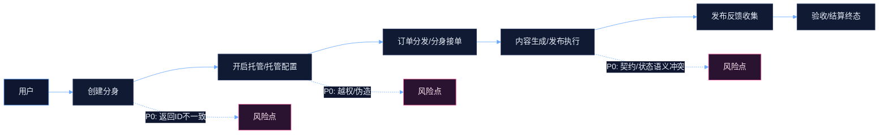

# 分身（Avatar）模块质量审计与专题优化

## Premise
- 分身是项目的核心供给侧资产，承载创建、托管、接单、发布、反馈、验收等多链路入口。
- 当前分身域存在“契约不收敛 + 安全与一致性缺口”，导致上线风险、迭代效率下降与排障成本高。

## Constraints
- 必须优先止血 P0：越权/伪造、创建返回不可用、前端崩溃、上传可滥用。
- 只做“最小可控改动”，避免无关重构与大面积格式化噪音。
- 前后端契约必须可被验证：接口返回结构、字段命名、状态语义需要收敛到单一口径。

## Boundaries
- 前端关键入口：分身 Tab 主入口（mind-chat）、创建（avatar-create）、管理托管（avatar-manage）、设置/资料（avatar-settings）、公开主页（avatar-profile）
- 后端关键模块：Avatar（供给/托管）、Avatar-Agent（分身执行/工具）、Upload（资源上传）
- 交叉域：Order-Dispatch（分发/接单）、Order-Processing（生成/发布/反馈/验收）

## Endgame
- P0 风险清零：身份可信、资源授权完整、创建返回可用、前端不崩溃、上传不可滥用。
- 契约收敛：Avatar 对外输出固定 DTO，personality 语义单一且可演进。
- 提效：减少 N+1、提升可观测性、补齐最小回归保护。

---

## 范围定义（代码入口）

### 前端
- `src/pages/mind-chat/index.tsx`
- `src/package-avatar/pages/avatar-create/index.tsx`
- `src/package-avatar/pages/avatar-manage/index.tsx`
- `src/package-avatar/pages/avatar-settings/index.tsx`
- `src/package-avatar/pages/avatar-profile/index.tsx`

### 后端
- `server/src/modules/avatar/avatar.controller.ts`
- `server/src/modules/avatar/avatar.service.ts`
- `server/src/modules/avatar-agent/avatar-agent.controller.ts`
- `server/src/modules/upload/upload.controller.ts`
- `server/src/modules/order-dispatch/order-dispatch.controller.ts`
- `server/src/modules/order-processing/order-processing.controller.ts`

---

## 架构视图

### 业务主链（创建 → 托管 → 接单 → 发布 → 反馈 → 验收）



### 组件边界（责任切面）

```mermaid
%%{init: {'theme': 'base', 'themeVariables': { 'background': '#0b1020', 'primaryColor': '#111a33', 'primaryTextColor': '#e6edf7', 'primaryBorderColor': '#2b3a67', 'lineColor': '#6aa9ff', 'secondaryColor': '#0f1730', 'tertiaryColor': '#0b1020', 'fontFamily': 'ui-monospace, SFMono-Regular, Menlo, Monaco, Consolas, \"Liberation Mono\", \"Courier New\", monospace'}}}%%
flowchart TB
classDef fe fill:#0f1730,stroke:#6aa9ff,color:#e6edf7;
classDef be fill:#111a33,stroke:#2b3a67,color:#e6edf7;
classDef db fill:#0b1020,stroke:#6aa9ff,color:#e6edf7,stroke-dasharray: 4 3;
classDef risk fill:#2a1331,stroke:#ff6aa9,color:#ffe6f1;

subgraph FE["前端（Taro）"]:::fe
  FE1["\"mind-chat（分身列表/托管开关）\""]:::fe
  FE2["\"avatar-create（创建）\""]:::fe
  FE3["\"avatar-manage（托管配置）\""]:::fe
  FE4["\"avatar-settings/profile（资料/公开页）\""]:::fe
end

subgraph BE["后端（NestJS）"]:::be
  BE1["\"Avatar 模块（供给/托管）\""]:::be
  BE2["\"Avatar-Agent（分身执行/工具）\""]:::be
  BE3["\"Order-Dispatch（分发/接单）\""]:::be
  BE4["\"Order-Processing（生成/发布/反馈/验收）\""]:::be
  BE5["\"Upload（资源上传）\""]:::be
end

subgraph DB["存储"]:::db
  DB1["\"avatars / skills / memories\""]:::db
  DB2["\"orders / dispatch / content_generation\""]:::db
end

FE1 --> BE1
FE2 --> BE1
FE3 --> BE1
FE4 --> BE1
BE1 --> DB1
BE2 --> DB1
BE3 --> DB2
BE4 --> DB2
FE2 --> BE5
FE4 --> BE5

BE1 -. "P0: 缺 owner check" .-> X1["\"越权/IDOR\""]:::risk
BE5 -. "P0: 可滥用/内存尖刺" .-> X2["\"DoS/成本风险\""]:::risk
```

---

## 质量结论（可决策）
- 上线门槛：未达标（P0 阻塞项存在）。
- 核心技术债：契约与语义不收敛（字段命名多套、personality 多语义、返回结构不一致）。

---

## Top 风险清单（按阻塞程度排序）

### P0｜越权/伪造身份（IDOR）
- 风险：可通过伪造 userId 或直接猜测 avatarId 实现读写他人分身资源（托管、配置、记忆、技能等）。
- 影响：数据泄漏、资产被篡改、链路被劫持，属于上线阻塞级别。
- 修复原则：
  - 身份：userId 必须从可信认证载体解析，禁止当作可伪造输入。
  - 授权：所有 `/:avatarId/...` 资源型路由必须做 owner check（含 Avatar-Agent 与 Upload 关联资源）。

### P0｜创建分身返回 ID 不一致
- 风险：对外返回的 id 不是落库主键，导致前端存储的 createdAvatarId 不可用，后续跳转/高亮/更新/托管全断链。
- 修复原则：
  - 对外返回 id 必须与数据库主键一致。
  - ID 生成必须不可预测（UUID/nanoid），避免碰撞与可枚举。

### P0｜更新接口返回 `data=null` 导致前端崩溃
- 风险：前端按“返回对象”做合并，遇到 `null` 会触发运行时异常，影响资料编辑等高频操作。
- 修复原则（二选一并全端统一）：
  - 后端：PUT 返回更新后的 avatar DTO。
  - 前端：严格防御性解包（`res.data?.data` 必须为 object 才合并）。

### P0｜personality 语义混乱导致数据腐化
- 现象：同一字段在不同页面/后端被当成 JSON、自由文本、枚举 key；任一页面覆盖会导致其他页面解析失败与能力信息丢失。
- 修复原则：
  - 明确并固化数据模型：拆分 `personality_text` 与 `personality_json`，或固定为 JSON 并提供单独可编辑文本字段。

### P0｜上传链路缺少鉴权/限流且允许大文件内存接收
- 风险：可被滥用造成 DoS/成本风险；头像等资源缺少类型/大小约束也会引入安全与稳定性问题。
- 修复原则：
  - 上传接口必须鉴权 + 速率限制 + 严格大小/MIME/魔数校验。
  - 头像链路先收口（小体积、仅图片、强校验）。

---

## 性能与可维护性问题（高优先但非首要止血）
- N+1：分身列表后逐个拉 skills，分身数量增长后页面响应线性变慢。
- SQL 拼接与大列表：统计/聚合查询存在字符串拼接与列表过大风险，建议参数化与上限控制。
- 字段别名并存：`avatar_url/photo/avatarUrl`、`location_text/locationText/location` 多套口径导致页面间展示不一致与逻辑复杂化。

---

## 可观测性与回归保障缺口
- 可观测性：缺少 requestId 与结构化日志字段（userId/avatarId/route/latency），线上排障困难。
- 测试：server 侧缺少最小回归保护，关键链路（授权、创建、更新、上传）无用例覆盖。

---

## 专题优化路线（止血 → 收敛 → 提效）

### 第一段：止血（P0 必须先完成）
- 身份可信：统一认证来源，禁止信任可伪造 userId 输入。
- 资源授权：所有 avatarId 资源型接口补齐 owner check。
- 创建一致：createAvatar 返回值与落库主键一致，ID 不可预测。
- 契约一致：更新接口返回结构统一（或前端防御性解包，但需统一口径）。
- 上传收口：鉴权 + 限流 + 类型/大小/魔数校验（至少先覆盖头像）。

### 第二段：收敛（把“混乱契约”变成“可演进契约”）
- Avatar 输出固定 DTO：只输出一套字段命名与类型（别名仅输入兼容）。
- personality 模型收敛：拆字段或固定 JSON，避免互相覆盖与数据腐化。
- 列表接口去 N+1：列表附带技能概要或提供批量接口。

### 第三段：提效（性能/可观测/回归保障）
- 埋点与 requestId：覆盖创建、托管、上传、Agent 执行关键链路。
- 最小测试集：
  - 授权：用户 A 不能访问/修改用户 B 的 avatarId（含 trust/hosting/settings/skills/memories/agent）。
  - 契约：创建返回 id 必须可被详情接口立即读取；PUT 返回结构与前端解包一致。
  - personality 不变量：更新不得破坏既定结构。
  - 上传限制：未登录/超限/非图片/超大小必须失败。

