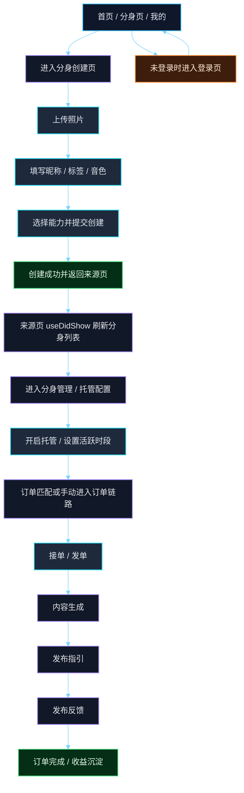
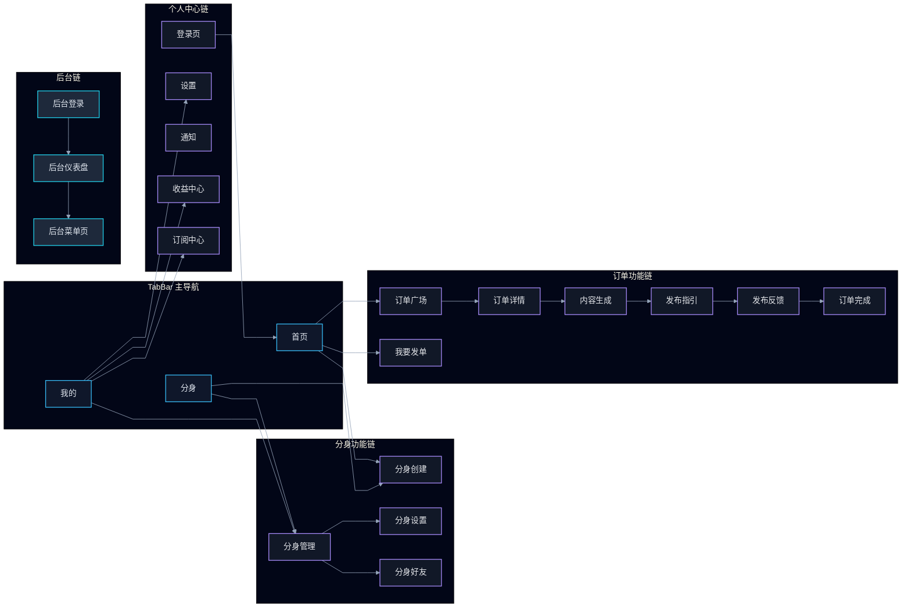
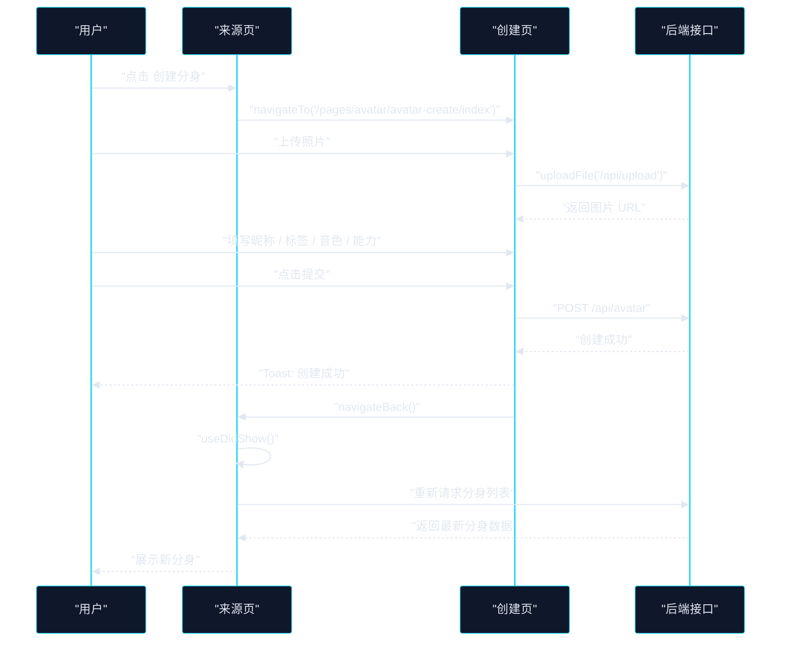
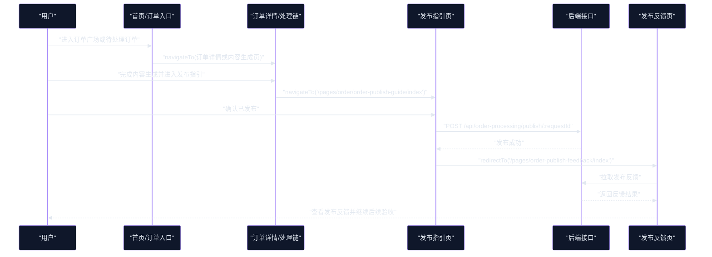

# 界面跳转与业务交互流转梳理

**文档类型**：前端导航与交互架构梳理  
**适用范围**：`src/app.config.ts` 注册页面、TabBar 页面、分身主链路、订单主链路、管理后台主链路  
**更新时间**：2026-05-12

## 1. Premise / Constraints / Boundaries / Endgame

### Premise

- 当前项目基于 Taro，多端共用一套路由配置，页面注册入口以 `src/app.config.ts` 为准。
- 页面跳转主要依赖 `Taro.navigateTo`、`navigateBack`、`switchTab`、`redirectTo`、`reLaunch`。
- 当前业务主线不是单一“资料页跳转”，而是围绕“分身创建 -> 分身托管/接单 -> 内容生成 -> 发布反馈 -> 完成结算”展开。

### Constraints

- `switchTab` 只能用于 TabBar 中注册的页面。
- 非 TabBar 页面应通过 `navigateTo` 进入，通过 `navigateBack` 返回。
- 页面是否刷新，当前大量依赖来源页 `useDidShow`，而不是创建页或结果页主动回传事件。
- 实际已注册页面与代码里硬编码路径必须严格一致，否则会出现无法跳转或跳错页面。

### Boundaries

- 本文只梳理前端页面注册、界面跳转、业务流转、返回刷新和明显的路径异常。
- 不展开后端实现细节，只在影响交互流转时说明接口作用。
- 管理后台只梳理导航方式，不深入业务页面内容。

### Endgame

- 形成一份可作为后续治理基线的“页面跳转单一事实源”。
- 明确用户从入口页进入业务流、执行关键动作、回到结果页的标准路径。
- 标出当前跳转风险点，为后续修正和统一导航策略提供依据。

## 2. 页面注册与导航骨架

### 2.1 页面注册事实源

- 页面注册入口：`src/app.config.ts`
- 默认首页：`pages/index/index`
- TabBar 页面共 3 个：
  - `pages/index/index`
  - `pages/mind-chat/index`
  - `pages/profile/index`

### 2.2 页面分组

| 分组 | 页面范围 | 说明 |
| --- | --- | --- |
| TabBar 主入口 | 首页、分身、我的 | 用户常驻主导航 |
| 订单模块 | `pages/order/**` + 订单反馈/完成页 | 发单、接单、处理、发布、验收 |
| 分身模块 | `pages/avatar/**` + `avatar-profile` + `avatar-orders` | 创建、管理、配置、好友、推荐 |
| 个人中心模块 | `pages/profile/**` + `feedback` | 设置、安全、通知、帮助、关于 |
| 功能模块 | `messages`、`voice-call`、`subscription`、`skills-*` 等 | 支撑业务能力 |
| 管理后台 | `pages/admin/**` | 登录后以替换式跳转为主 |

### 2.3 跳转规则

| API | 用途 | 当前典型场景 |
| --- | --- | --- |
| `navigateTo` | 进入非 TabBar 功能页 | 首页进入创建分身、我的进入设置、订单列表进入详情 |
| `navigateBack` | 返回上一页 | 创建分身成功后返回来源页、详情页返回列表 |
| `switchTab` | 切换 TabBar 页面 | 登录成功回首页 |
| `redirectTo` | 替换当前页面 | 发布完成后进入发布反馈页、管理后台菜单切换 |
| `reLaunch` | 重建路由栈 | 退出登录后回登录页 |

## 3. 核心入口与高频跳转

### 3.1 TabBar 一级入口

| 页面 | 页面角色 | 常见下钻方向 |
| --- | --- | --- |
| `pages/index/index` | 业务总入口 | 创建分身、订单广场、我要发单、技能广场、订单内容创作 |
| `pages/mind-chat/index` | 分身运营入口 | 我的分身、分身广场、新建分身、登录跳转 |
| `pages/profile/index` | 用户中心入口 | 分身管理、收益中心、订阅中心、帮助中心、待确认订单 |

### 3.2 分身创建链路入口

当前至少有 4 个显式创建入口：

- 首页快捷功能 `创建分身`
- 首页 Banner 在无分身时进入创建页
- `pages/avatar/avatar-manage/index` 中的新建分身
- `pages/mind-chat/index` 中的 `新建`

### 3.3 订单主链路入口

- 首页快捷功能 `订单广场`
- 首页快捷功能 `我要发单`
- 个人中心 `我要推广`
- 订单派发弹窗中接单后进入内容生成页

### 3.4 管理后台入口

- `pages/admin/login/index` 登录成功后 `redirectTo` 到 `pages/admin/dashboard/index`
- 后台侧边菜单继续使用 `redirectTo` 在后台页面间切换

## 4. 业务流转图

### 4.1 用户主业务流

### 4.2 页面导航骨架图

## 5. 交互流转图

### 5.1 分身创建交互时序

### 5.2 订单发布交互时序

## 6. 当前主链路拆解

### 6.1 分身创建链路

1. 入口页通过 `navigateTo` 进入 `pages/avatar/avatar-create/index`
2. 创建页是一个三步流程：
   - 第一步：上传照片
   - 第二步：基础设置
   - 第三步：能力选择并提交
3. 创建页会调用：
   - 上传接口：`/api/upload`
   - 创建接口：`POST /api/avatar`
4. 创建成功后当前行为是：
   - 先提示 `Toast`
   - 再 `navigateBack`
   - 不传回创建结果事件
5. 来源页是否能看到新分身，依赖来源页 `useDidShow` 是否重新拉取数据

### 6.2 分身管理链路

1. `pages/avatar/avatar-manage/index` 在页面显示时执行：
   - `fetchAvatars()`
   - `loadSubscriptionInfo()`
2. 创建按钮会先检查订阅额度：
   - 可创建时进入创建页
   - 不可创建时跳转订阅中心
3. 分身管理页继续下钻到：
   - 分身设置
   - 托管开关
   - 活跃时段设置

### 6.3 Mind Chat 链路

1. `pages/mind-chat/index` 同时承担：
   - 我的分身列表
   - 分身广场
2. 页面首次挂载与二次回显都会刷新当前 Tab 数据
3. 当 `activeTab === "my"` 时，提供 `新建` 入口直达创建页
4. 未登录时不加载我的分身，而是引导进入登录页

### 6.4 订单链路

1. 首页可进入订单广场或发单页
2. 接单后可跳到内容生成页
3. 内容生成完成后进入发布指引页
4. 发布确认成功后使用 `redirectTo` 进入发布反馈页
5. 订单反馈、处理、验收等结果页大量通过 `navigateBack` 返回上游页面

### 6.5 登录与后台链路

1. 登录成功后统一 `switchTab('/pages/index/index')`
2. 游客模式也直接 `switchTab` 回首页
3. 后台登录成功后 `redirectTo('/pages/admin/dashboard/index')`
4. 后台内部菜单切换继续使用 `redirectTo`，体现后台是“替换式工作台”而非移动端“堆栈式详情流”

## 7. 当前问题与风险点

### 7.1 路径与注册不一致

- 首页和分身管理页使用了 `/pages/notification/index`，但注册页面中是 `pages/profile/notifications/index`。
- `src/components/guide/NewUserGuide.tsx` 中存在以下路径缺少 `/pages` 前缀：
  - `/avatar/avatar-create/index`
  - `/avatar/avatar-settings/index?tab=hosting`
  - `/order/order-create/index`

### 7.2 `switchTab` 使用风险

- `pages/avatar-recommend/index` 中存在 `switchTab('/pages/order/order-list/index')`，但 `order-list` 不是 TabBar 页面，这类调用存在失败风险。

### 7.3 创建结果回传机制偏弱

- 分身创建成功后只 `navigateBack()`，没有：
  - `eventChannel` 结果通知
  - query 参数回传
  - 独立成功页
- 结果是“创建成功后是否立即可见”依赖来源页实现细节，耦合较高。

### 7.4 数据解包口径不一致

- `avatar-manage` 与 `mind-chat` 对 `/api/avatar` 返回结构的解包兼容逻辑并不一致。
- 这会放大“创建成功但来源页未显示”的排查成本。

## 8. 建议的治理方向

### 8.1 统一导航规范

- 以 `src/app.config.ts` 为唯一注册事实源，清理所有未注册或错误路径。
- 统一约束：
  - TabBar 页只能 `switchTab`
  - 功能页默认 `navigateTo`
  - 结果替换页使用 `redirectTo`

### 8.2 统一结果回流机制

- 为“创建成功、发布成功、验收成功”建立统一回流策略：
  - 优先使用结果页或事件回传
  - 不再仅依赖来源页 `useDidShow`

### 8.3 统一领域主链路

- 将“分身创建 -> 托管 -> 接单/发单 -> 内容生成 -> 发布反馈 -> 完成”定义为单一主链路。
- 页面设计、返回动作、状态刷新都围绕这条主链路收敛。

### 8.4 统一列表解包模型

- 针对 `/api/avatar`、订单列表、通知列表建立统一解包函数或统一响应模型，减少不同页面各自兼容造成的导航后状态不一致。

## 9. 本次梳理涉及的关键文件

- `src/app.config.ts`
- `src/pages/index/index.tsx`
- `src/pages/profile/index.tsx`
- `src/pages/login/index.tsx`
- `src/pages/mind-chat/index.tsx`
- `src/pages/avatar/avatar-create/index.tsx`
- `src/pages/avatar/avatar-manage/index.tsx`
- `src/pages/order/order-publish-guide/index.tsx`
- `src/components/admin/Layout.tsx`
- `src/components/guide/NewUserGuide.tsx`

## 10. 结论

- 当前项目的页面跳转已经具备清晰的主骨架，但“分身创建成功后的回流机制”和“少量路径硬编码不一致”是最直接的体验风险点。
- 从业务角度看，真正需要统一的不是单页跳转，而是“入口页 -> 执行动作 -> 结果页 -> 刷新来源页”的端到端闭环。
- 后续如果继续治理，建议优先修复路径异常，再统一“创建成功/发布成功”的结果回流方案。
